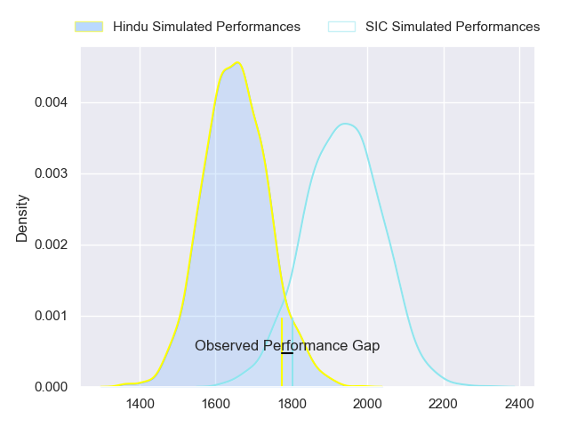
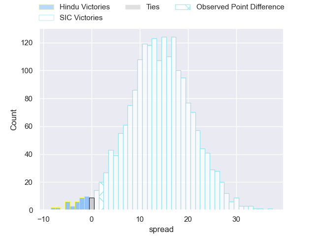
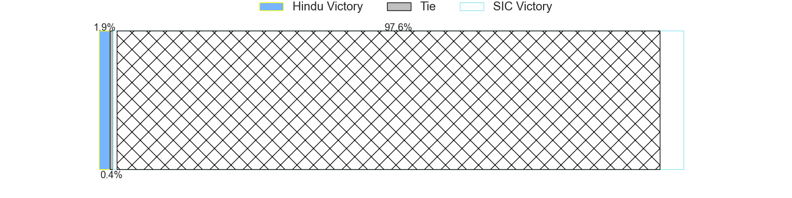
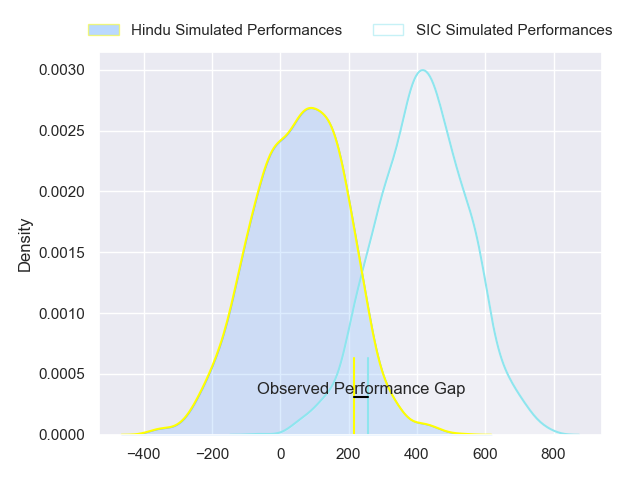
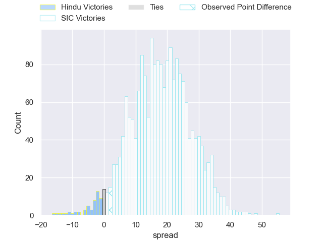

---  
layout: page  
title: Hindu at SIC; 13-15  
date: 2024-05-11 18:00:00 -0500  
categories: "URBA Top 12 2024" match review  
---
# Hindu at SIC; 13-15

# Club Level Predictions

The first set of predictions treats a club as the smallest object, as the club develops its members, organizes a gameplan, and deploys its players as needed for each match. This club model has a prediction of 0.825, which translates to predicting SIC to win by 14.0.

Our Over/Under is 52.5 - and combined with the spread above, we have a predicted scoreline of 19 to 33

Each club has a rating and a rating deviation (similar to a Glicko rating), and expected performances can be generated. This allows for simulated matches and spreads like the ones below.
## Projected Performances - Club Model

## Projected Spreads - Club Model

## Projected Results - Club Model

# Player Level Predictions

Treating teams instead as an entity made up of the currently active players, I have ratings for each player in an altogether different system. These can be combined to form team ratings once teamsheets are announced, weighting starters a bit higher than the reserves. After the match is played, players can be weighted by their minutes on the field, allowing for an accurate measure of the team's composition. With these compiled team ratings, we can make predictions, measure inaccuracy, and update the individual player ratings.
## Prediction without Player Minutes: SIC by 17.9

SIC by 14.0 on a neutral pitch

## Projected Performances - Player Model

## Projected Spreads - Player Model

## Projected Results - Player Model

|   Away Minutes | Away Player                |   Away Percentile |   Number |   Home Percentile | Home Player                  |   Home Minutes |
|---------------:|:---------------------------|------------------:|---------:|------------------:|:-----------------------------|---------------:|
|             80 | Franco Diviesti            |             30.89 |        1 |             84.52 | Marcos Piccinini             |             80 |
|             80 | Agustin Capurro            |             23.36 |        2 |             83.88 | Lucas Rocha                  |             80 |
|             80 | Nicolas Leiva              |             21.43 |        3 |             80.44 | Benjamin Chiappe             |             80 |
|             80 | Carlos Repetto             |             56.08 |        4 |             76.38 | Tomas Borghi                 |             80 |
|             80 | Juan Ignacio Comolli       |             26.33 |        5 |             81.51 | Bautista Viero               |             80 |
|             80 | Santino Amayav             |             21.25 |        6 |             74.9  | Andrea Panzarini             |             80 |
|             80 | Tomas Scallan              |             23.62 |        7 |             77.57 | Franco Delger                |             80 |
|             80 | Nicolas Amaya              |             46.7  |        8 |             48.4  | Alejo Daireaux               |             80 |
|             80 | Lucas Fernandez Miranda    |             23.56 |        9 |             77.84 | Felipe Sascaro               |             80 |
|             80 | Santiago Fernandez         |             96.16 |       10 |             76.97 | Santiago Pavlovsky           |             80 |
|             80 | Federico Graglia           |             32.46 |       11 |             69.66 | Nicanor Acosta               |             80 |
|             80 | Bautista Farise            |             24.61 |       12 |             76.55 | Santos Rubio                 |             80 |
|             80 | Belisario Agulla           |             87.8  |       13 |             65.72 | Carlos Piran                 |             80 |
|             80 | Tomas Amher                |             24.83 |       14 |             78.94 | Franco Moneta                |             80 |
|             80 | Lisandro Rodriguez         |             20.39 |       15 |             77.04 | Jacinto Campbell             |             80 |
|              0 | Benjamin Silveyra          |            nan    |       16 |            nan    | Segundo Rubio                |              0 |
|              0 | Juan Ignacio Martinez Sosa |             32.84 |       17 |            nan    | Ricardo Alberto Macchiavello |              0 |
|              0 | Mariano Leiva              |            nan    |       18 |            nan    | Juan Pedro Olcese            |              0 |
|              0 | Elias Banach               |             19.7  |       19 |            nan    | Pedro Georgalo               |              0 |
|              0 | Juan Ulibarri              |            nan    |       20 |            nan    | Lucas Albanese               |              0 |
|              0 | Lucas Pulido               |            nan    |       21 |            nan    | Ramon Martinez Tomietto      |              0 |
|              0 | Joaquin Diaz Bonilla       |             79.74 |       22 |            nan    | Ciro Ploruti                 |              0 |
|              0 | Valentin Benito            |            nan    |       23 |            nan    | Agustin Sascaro              |              0 |

