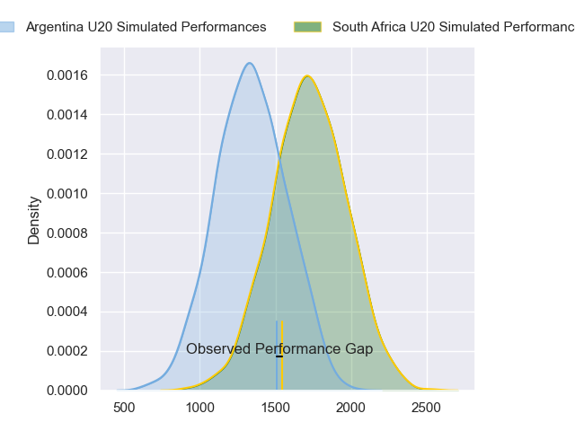
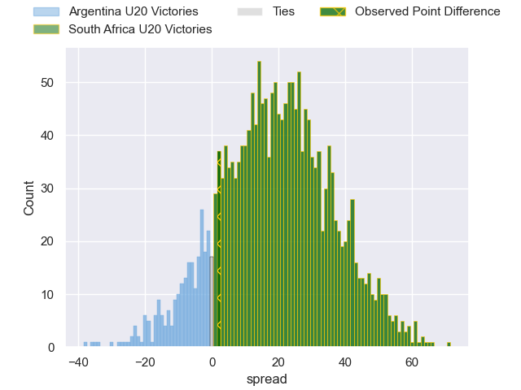
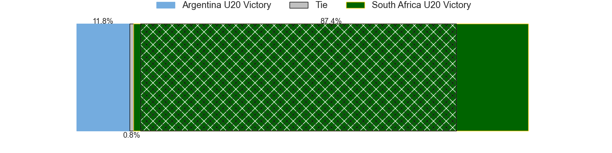
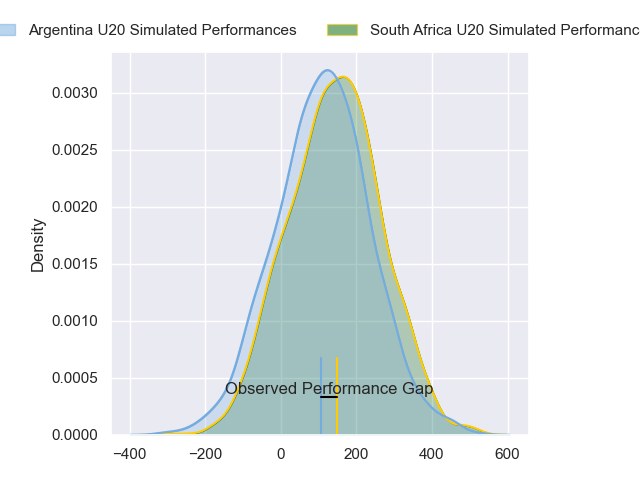
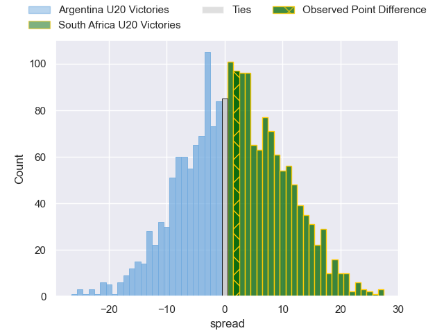

---  
layout: page  
title: Argentina U20 at South Africa U20; 28-30  
date: 2024-05-11 18:00:00 -0500  
categories: "Rugby Championship U20 2024" match review  
---
# Argentina U20 at South Africa U20; 28-30

# Club Level Predictions

The first set of predictions treats a club as the smallest object, as the club develops its members, organizes a gameplan, and deploys its players as needed for each match. This club model has a prediction of 0.861, which translates to predicting South Africa U20 to win by 19.7.

Our Over/Under is 56.5 - and combined with the spread above, we have a predicted scoreline of 18 to 38

Each club has a rating and a rating deviation (similar to a Glicko rating), and expected performances can be generated. This allows for simulated matches and spreads like the ones below.
## Projected Performances - Club Model

## Projected Spreads - Club Model

## Projected Results - Club Model

# Player Level Predictions

Treating teams instead as an entity made up of the currently active players, I have ratings for each player in an altogether different system. These can be combined to form team ratings once teamsheets are announced, weighting starters a bit higher than the reserves. After the match is played, players can be weighted by their minutes on the field, allowing for an accurate measure of the team's composition. With these compiled team ratings, we can make predictions, measure inaccuracy, and update the individual player ratings.
## Prediction without Player Minutes: South Africa U20 by 2.2

South Africa U20 by 0.1 on a neutral pitch

## Projected Performances - Player Model

## Projected Spreads - Player Model

## Projected Results - Player Model

|   Away Minutes | Away Player                  |   Away Percentile |   Number |   Home Percentile | Home Player               |   Home Minutes |
|---------------:|:-----------------------------|------------------:|---------:|------------------:|:--------------------------|---------------:|
|             48 | Diego Correa                 |             53.95 |        1 |             48.41 | Ruan Swart                |           42   |
|             54 | Juan Ignacio Greising Revol  |             46.22 |        2 |             48.36 | Juan Smal                 |           47   |
|             62 | Tomás Rapetti                |             55.66 |        3 |             49.96 | Zachary Porthen           |           80   |
|             80 | Efraín Elías                 |             34.67 |        4 |             50.65 | Thomas Dyer               |           80   |
|             51 | Álvaro García Iandolino      |             61.41 |        5 |             39.3  | JF van Heerden            |           78   |
|             78 | Juan Penoucos                |             58    |        6 |             46.25 | Sibabalwe Mahashe         |           80   |
|             80 | Santos Fernández De Oliveira |             62.94 |        7 |             45.16 | Batho Hlekani             |           70   |
|             51 | Ignacio Torrado              |             34.33 |        8 |             44.35 | Tiaan Jacobs              |           71   |
|             60 | Tomás Di Biase               |             50.96 |        9 |             46.95 | Ezekiel Ngubane           |           47   |
|             60 | Facundo Rodríguez            |             37.95 |       10 |             41.79 | Philip-Albert Van Niekerk |           80   |
|             80 | Franco Rossetto              |             65.02 |       11 |             46.38 | Litelihle Bester          |           16.5 |
|             77 | Tomás Medina                 |             28.71 |       12 |             40.9  | Joshua Boulle             |           80   |
|             80 | Faustino Sánchez Valarolo    |             60.46 |       13 |             42.69 | Jurenzo Julius            |           80   |
|             80 | Timoteo Silva                |             32.17 |       14 |             49.57 | Joel Leotlela             |           80   |
|             80 | Benjamín Elizalde            |             50.86 |       15 |             42.7  | Bruce Sherwood            |           80   |
|             26 | Juan Manuel Vivas            |             50.16 |       16 |             46.88 | Ethan Bester              |           16.5 |
|             32 | Gonzalo Gargallo Bazán       |            nan    |       17 |            nan    | Liyema Ntshanga           |            0   |
|             20 | Gael Galván                  |             41.16 |       18 |            nan    | Casper Badenhorst         |           38   |
|             29 | Luciano Asevedo              |             42.01 |       19 |            nan    | Thabang Mphafi            |           11   |
|             29 | Juan Pedro Bernasconi        |             46.91 |       20 |             41.11 | Divan Fuller              |           10   |
|             20 | Jerónimo Llorens Villanueva  |            nan    |       21 |             48.34 | Asad Moos                 |           33   |
|             20 | Santino Di Lucca             |             57.14 |       22 |             40.51 | Thurlon Williams          |            0   |
|              3 | Tomás Bocco                  |             45.53 |       23 |            nan    | Jc Mars                   |            0   |

