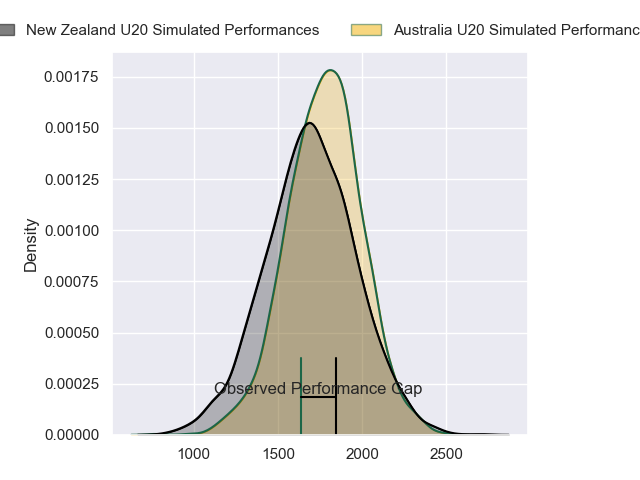
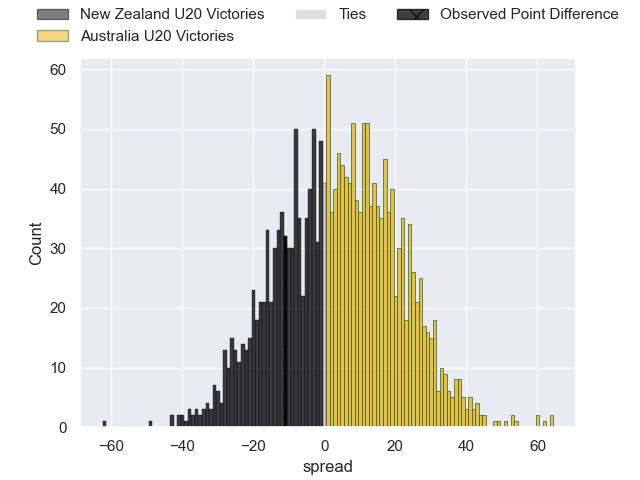
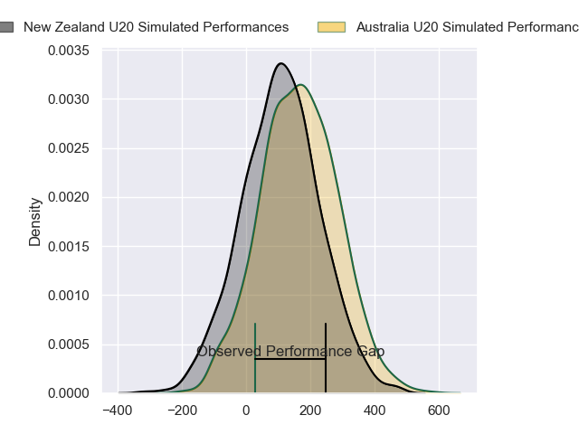
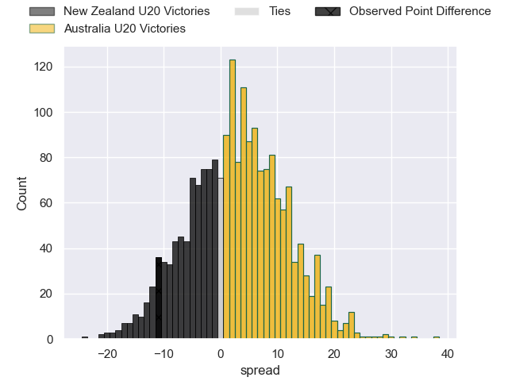
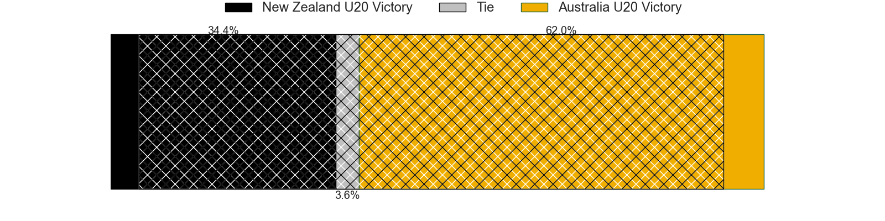

---  
layout: page  
title: New Zealand U20 at Australia U20; 36-25  
date: 2024-05-12 18:00:00 -0500  
categories: "Rugby Championship U20 2024" match review  
---
# New Zealand U20 at Australia U20; 36-25

# Club Level Predictions

The first set of predictions treats a club as the smallest object, as the club develops its members, organizes a gameplan, and deploys its players as needed for each match. This club model has a prediction of 0.591, which translates to predicting Australia U20 to win by 4.2.

Our Over/Under is 77.5 - and combined with the spread above, we have a predicted scoreline of 37 to 41

Each club has a rating and a rating deviation (similar to a Glicko rating), and expected performances can be generated. This allows for simulated matches and spreads like the ones below.
## Projected Performances - Club Model

## Projected Spreads - Club Model

## Projected Results - Club Model

# Player Level Predictions

Treating teams instead as an entity made up of the currently active players, I have ratings for each player in an altogether different system. These can be combined to form team ratings once teamsheets are announced, weighting starters a bit higher than the reserves. After the match is played, players can be weighted by their minutes on the field, allowing for an accurate measure of the team's composition. With these compiled team ratings, we can make predictions, measure inaccuracy, and update the individual player ratings.
## Prediction without Player Minutes: Australia U20 by 3.2

Australia U20 by 1.0 on a neutral pitch

## Projected Performances - Player Model

## Projected Spreads - Player Model

## Projected Results - Player Model

|   Away Minutes | Away Player            |   Away Percentile |   Number |   Home Percentile | Home Player               |   Home Minutes |
|---------------:|:-----------------------|------------------:|---------:|------------------:|:--------------------------|---------------:|
|             49 | Will Martin            |             71.64 |        1 |             79.54 | Angus Bell                |             56 |
|             59 | Vernon Bason           |             71.22 |        2 |             28.78 | Ottavio Tuipulotu         |             45 |
|              9 | Joshua Smith           |             55.01 |        3 |             24.12 | Nick Bloomfield           |             63 |
|             76 | Tom Allen              |             67.14 |        4 |             17.39 | Toby Macpherson           |             80 |
|             80 | Liam Jack              |             71.06 |        5 |             18.79 | Harvey Cordukes           |             80 |
|             40 | Tristyn Cook           |             50.79 |        6 |             15.71 | Aden Ekanayake            |             80 |
|             80 | Johnny Lee             |             60.97 |        7 |             34.09 | Dane Sawers               |             49 |
|             63 | Malachi Wrampling-Alec |             66.74 |        8 |             19.4  | Jack Harley               |             63 |
|             80 | Dylan Pledger          |             69.81 |        9 |             17.45 | Doug Philipson            |             54 |
|             80 | Rico Simpson           |             64.39 |       10 |             43.28 | Harry McLaughlin-Phillips |             80 |
|             80 | Stanley Solomon        |             59.52 |       11 |             15.36 | Will Mcculloch            |             80 |
|             40 | Tofuka Paongo          |             62.99 |       12 |             15.67 | Ronan Leahy               |             80 |
|             80 | Xavi Taele             |             68.66 |       13 |             28.29 | Divad Palu                |             80 |
|             80 | King Maxwell           |             73.33 |       14 |             18.74 | Xavier Rubens             |             49 |
|             49 | Isaac Hutchinson       |             49.14 |       15 |             22.1  | Angus Staniforth          |             80 |
|             21 | Manumaua Letiu         |            nan    |       16 |             25.82 | Bryn Edwards              |             35 |
|             31 | Sika Pole              |            nan    |       17 |            nan    | Lington Ieli              |             24 |
|             31 | Kurene Luamanuvae      |            nan    |       18 |             25.75 | Tevita Alatini            |             17 |
|              9 | Andrew Smith           |             48.02 |       19 |            nan    | Ben Daniels               |             17 |
|             21 | Jeremiah Avei-Collins  |            nan    |       20 |             38.54 | Ben Di Staso              |             31 |
|              0 | Ben O'Donovan          |             44.5  |       21 |             46.77 | Hwi Sharples              |             26 |
|             31 | Sam Coles              |             57.3  |       22 |             25.8  | Joey Fowler               |              0 |
|             40 | Aki Tuivailala         |             39.01 |       23 |            nan    | Boston Fakafanua          |             31 |

