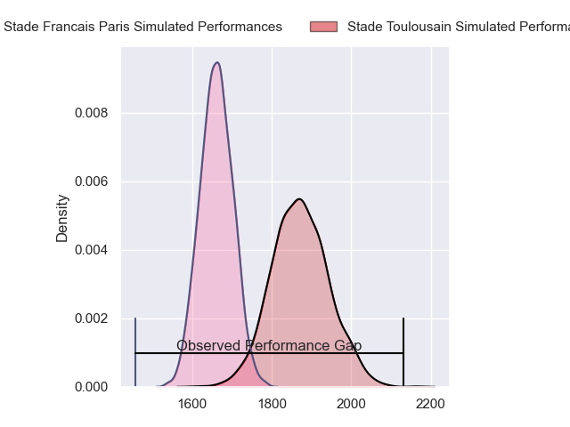
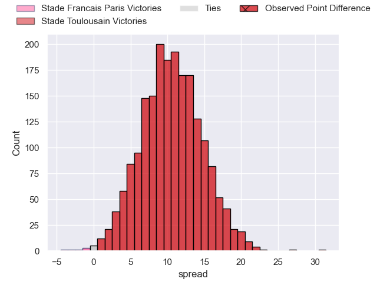
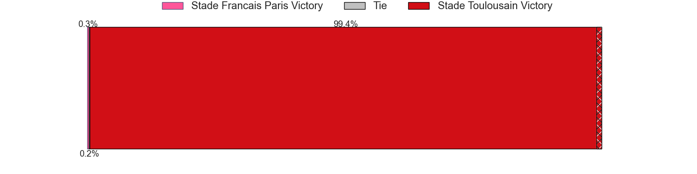
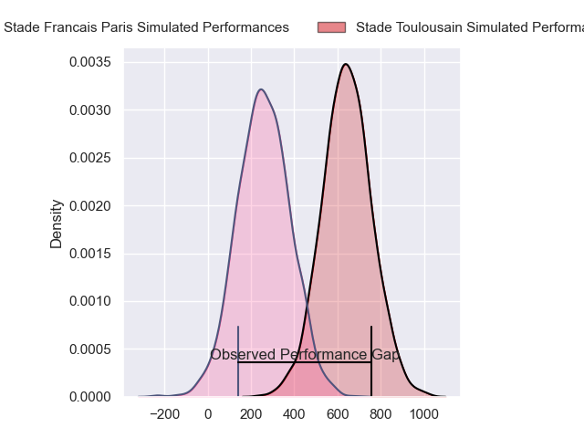
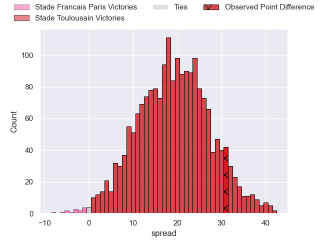
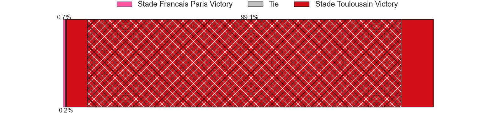

---  
layout: page  
title: Stade Francais Paris at Stade Toulousain; 18-49  
date: 2024-05-12 18:00:00 -0500  
categories: "Top 14 Orange 2023" match review  
---
# Stade Francais Paris at Stade Toulousain; 18-49

# Club Level Predictions

The first set of predictions treats a club as the smallest object, as the club develops its members, organizes a gameplan, and deploys its players as needed for each match. This club model has a prediction of 0.767, which translates to predicting Stade Toulousain to win by 10.4.

Our Over/Under is 40.5 - and combined with the spread above, we have a predicted scoreline of 15 to 26

Each club has a rating and a rating deviation (similar to a Glicko rating), and expected performances can be generated. This allows for simulated matches and spreads like the ones below.
## Projected Performances - Club Model

## Projected Spreads - Club Model

## Projected Results - Club Model

# Player Level Predictions

Treating teams instead as an entity made up of the currently active players, I have ratings for each player in an altogether different system. These can be combined to form team ratings once teamsheets are announced, weighting starters a bit higher than the reserves. After the match is played, players can be weighted by their minutes on the field, allowing for an accurate measure of the team's composition. With these compiled team ratings, we can make predictions, measure inaccuracy, and update the individual player ratings.
## Prediction without Player Minutes: Stade Toulousain by 22.7

Stade Toulousain by 15.2 on a neutral pitch

## Projected Performances - Player Model

## Projected Spreads - Player Model

## Projected Results - Player Model

|   Away Minutes | Away Player             |   Away Percentile |   Number |   Home Percentile | Home Player          |   Home Minutes |
|---------------:|:------------------------|------------------:|---------:|------------------:|:---------------------|---------------:|
|             57 | Clement Castets         |             47.76 |        1 |             95.27 | Cyril Baille         |             51 |
|             61 | Lucas Peyresblanques    |             19.41 |        2 |             99.18 | Julien Marchand      |             51 |
|             49 | Hugo Ndiaye             |             46.37 |        3 |             95.68 | Dorian Aldegheri     |             59 |
|             80 | Paul Gabrillagues       |             37.59 |        4 |             78.99 | Richie Arnold        |             80 |
|             49 | Baptiste Pesenti        |             79.1  |        5 |             92.46 | Thibaud Flament      |             61 |
|             80 | Ryan Chapuis            |              7.51 |        6 |             93.38 | Jack Willis          |             80 |
|             55 | Romain Briatte          |             57.21 |        7 |             72.83 | Mathis Castro        |             51 |
|             57 | Giovanni Habel-Kueffner |             89.77 |        8 |             94.24 | Alexandre Roumat     |             80 |
|             49 | Brad Weber              |             97.03 |        9 |             50.79 | Paul Graou           |             80 |
|             63 | Joris Segonds           |             79.53 |       10 |             96.8  | Juan Cruz Mallia     |             80 |
|             80 | Lester Etien            |             87.63 |       11 |             97.49 | Matthis Lebel        |             57 |
|             80 | Pierre Boudehent        |             52.16 |       12 |             62.46 | Pita Ahki            |             57 |
|             80 | Joe Marchant            |             86.86 |       13 |             88.54 | Pierre-Louis Barassi |             80 |
|             80 | Peniasi Dakuwaqa        |             50.72 |       14 |             94.69 | Ange Capuozzo        |             80 |
|             80 | Kylan Hamdaoui          |             55.36 |       15 |             96.78 | Thomas Ramos         |             80 |
|             19 | Mamoudou Meite          |            nan    |       16 |             93.42 | Peato Mauvaka        |             29 |
|             23 | Moses Alo-Emile         |             74.98 |       17 |             60.15 | Rodrigue Neti        |             29 |
|             31 | JJ van der Mescht       |             88.14 |       18 |             84.72 | Emmanuel Meafou      |             19 |
|             23 | Julien Ory              |             44.57 |       19 |             97.33 | Francois Cros        |             29 |
|             31 | Rory Kockott            |             98.95 |       20 |             99.65 | Antoine Dupont       |              0 |
|             25 | Andy Timo               |             11.76 |       21 |             76.62 | Setareki Bituniyata  |             23 |
|             17 | Leo Barre               |             69.1  |       22 |             77.08 | Dimitri Delibes      |             23 |
|             31 | Giorgi Melikidze        |             92.42 |       23 |             93.97 | David Ainu'u         |             21 |

