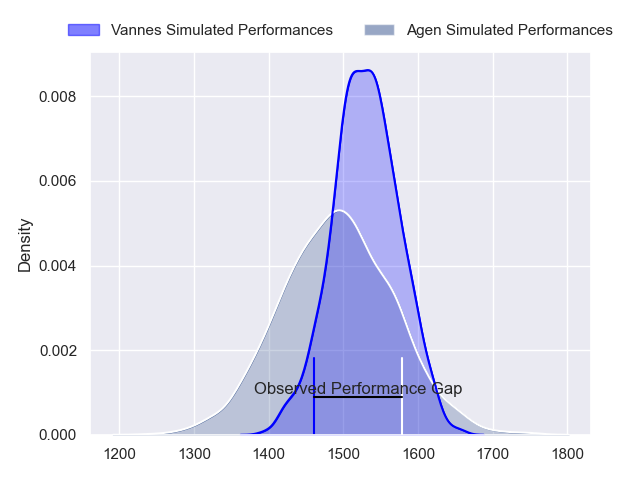
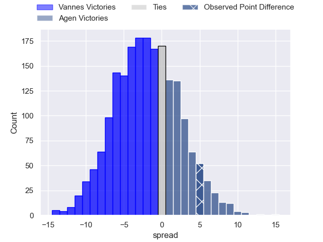
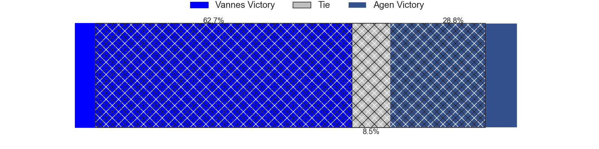
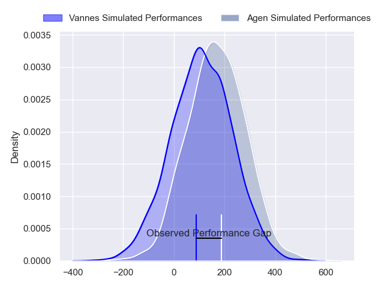
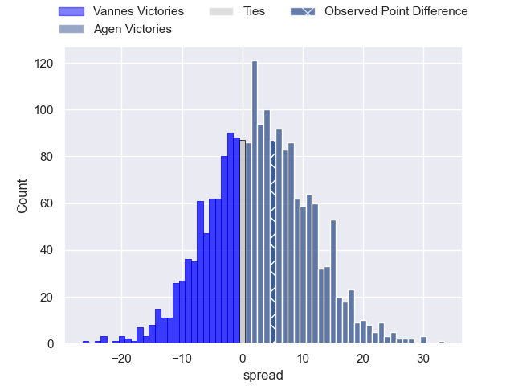

---  
layout: page  
title: Vannes at Agen; 22-27  
date: 2024-05-17 18:00:00 -0500  
categories: "Pro D2 2023" match review  
---
# Vannes at Agen; 22-27

# Club Level Predictions

The first set of predictions treats a club as the smallest object, as the club develops its members, organizes a gameplan, and deploys its players as needed for each match. This club model has a prediction of 0.446, which translates to predicting Vannes to win by 1.9.

Our Over/Under is 55.5 - and combined with the spread above, we have a predicted scoreline of 29 to 27

Each club has a rating and a rating deviation (similar to a Glicko rating), and expected performances can be generated. This allows for simulated matches and spreads like the ones below.
## Projected Performances - Club Model

## Projected Spreads - Club Model

## Projected Results - Club Model

# Player Level Predictions

Treating teams instead as an entity made up of the currently active players, I have ratings for each player in an altogether different system. These can be combined to form team ratings once teamsheets are announced, weighting starters a bit higher than the reserves. After the match is played, players can be weighted by their minutes on the field, allowing for an accurate measure of the team's composition. With these compiled team ratings, we can make predictions, measure inaccuracy, and update the individual player ratings.
## Prediction without Player Minutes: Agen by 1.8

Vannes by 6.4 on a neutral pitch

## Projected Performances - Player Model

## Projected Spreads - Player Model

## Projected Results - Player Model

|   Away Minutes | Away Player           |   Away Percentile |   Number |   Home Percentile | Home Player                   |   Home Minutes |
|---------------:|:----------------------|------------------:|---------:|------------------:|:------------------------------|---------------:|
|             63 | Charles-Henri Berguet |             27.49 |        1 |              9.3  | Florent Guion                 |             50 |
|             60 | Cyril Blanchard       |             47.7  |        2 |             37.05 | Clement Martinez              |             50 |
|             60 | Simon Bourgeois       |             30.83 |        3 |             47.96 | Alex Burin                    |              8 |
|             80 | Louis Bruinsma        |             10.04 |        4 |              7.4  | Joe Maksymiw                  |             80 |
|             80 | Timothé Mezou         |             45.44 |        5 |              1.93 | Evan Olmstead                 |             48 |
|             50 | Eric Marks            |             11.42 |        6 |             94.19 | Antoine Erbani                |             55 |
|             80 | Matthieu Uhila        |             44.29 |        7 |             78.84 | Arnaud Duputs                 |             80 |
|             76 | Karl Chateau          |             22.8  |        8 |             22.38 | Fotu Lokotui                  |             57 |
|             60 | Jules Le Bail         |             46.95 |        9 |             17.45 | Dorian Bellot                 |             80 |
|             80 | Massimo Ortolan       |              4.88 |       10 |             21.23 | Ben Volavola                  |             80 |
|             80 | Enzo Benmegal         |             56.25 |       11 |              6.25 | Inoke Nalaga Kurukuruvakatini |             54 |
|             50 | Youenn Floch          |             37.42 |       12 |             69.39 | Peyo Muscarditz               |             34 |
|             80 | Robin Taccola         |             65.41 |       13 |             34.07 | Jean-Marcelin Buttin          |             80 |
|             80 | Théo Bastardie        |             72.21 |       14 |              1.44 | Loris Tolot                   |             80 |
|             50 | Gwenaël Duplenne      |             98.72 |       15 |             87.18 | Mathieu Lamoulie              |             80 |
|             30 | Jean Cotarmanac'h     |             22.51 |       16 |             30.91 | Beau Farrance                 |             72 |
|             30 | Theo Costosseque      |             33.33 |       17 |             60.04 | Thomas Vincent                |             46 |
|             30 | Théo Beziat           |             67.54 |       18 |             29.11 | Corentin Vernet               |             32 |
|             20 | Louis-Marie Suta      |            nan    |       19 |             60.36 | Hans Lombard-Buret            |             30 |
|             20 | Alexandre Gouaux      |            nan    |       20 |              7.05 | Mike Sosene-Feagai            |             30 |
|             20 | Jérémy Boyadjis       |            nan    |       21 |             30.77 | Iban Etcheverry               |             26 |
|             17 | Thomas Moukoro        |             27.41 |       22 |             58.17 | Vincent Farre                 |             25 |
|              4 | Evredi Iposo          |            nan    |       23 |            nan    | Tomasi Fineanganofo           |             23 |

