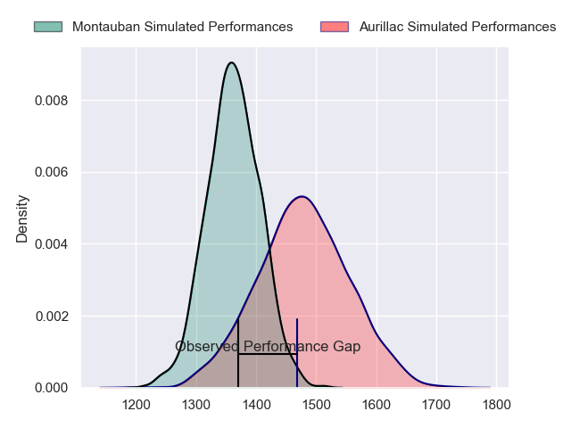
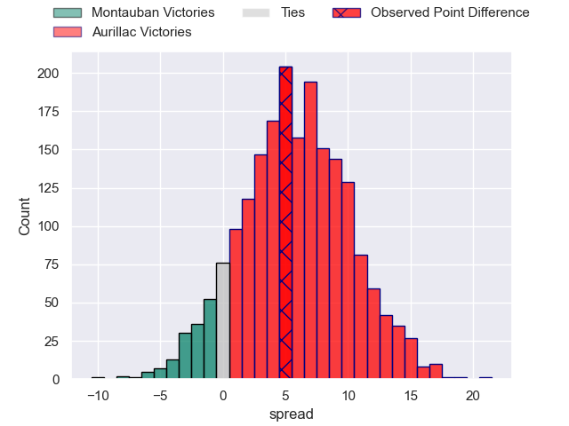
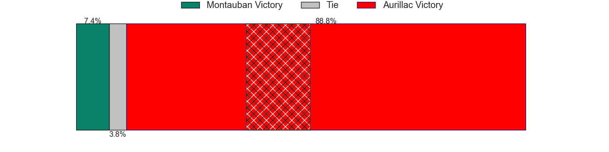
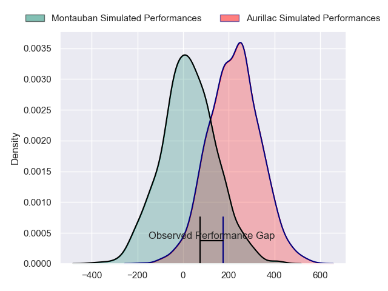
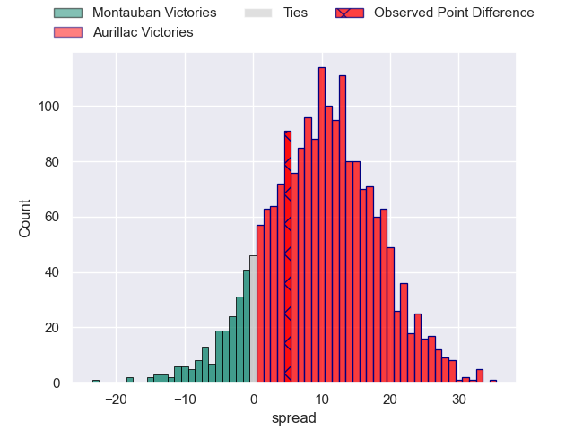
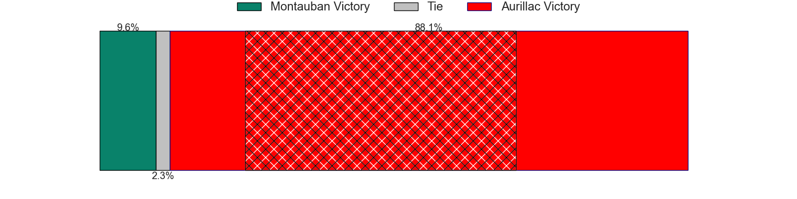

---  
layout: page  
title: Montauban at Aurillac; 22-27  
date: 2024-05-17 18:00:00 -0500  
categories: "Pro D2 2023" match review  
---
# Montauban at Aurillac; 22-27

# Club Level Predictions

The first set of predictions treats a club as the smallest object, as the club develops its members, organizes a gameplan, and deploys its players as needed for each match. This club model has a prediction of 0.659, which translates to predicting Aurillac to win by 5.8.

Our Over/Under is 47.5 - and combined with the spread above, we have a predicted scoreline of 21 to 26

Each club has a rating and a rating deviation (similar to a Glicko rating), and expected performances can be generated. This allows for simulated matches and spreads like the ones below.
## Projected Performances - Club Model

## Projected Spreads - Club Model

## Projected Results - Club Model

# Player Level Predictions

Treating teams instead as an entity made up of the currently active players, I have ratings for each player in an altogether different system. These can be combined to form team ratings once teamsheets are announced, weighting starters a bit higher than the reserves. After the match is played, players can be weighted by their minutes on the field, allowing for an accurate measure of the team's composition. With these compiled team ratings, we can make predictions, measure inaccuracy, and update the individual player ratings.
## Prediction without Player Minutes: Aurillac by 10.4

Aurillac by 2.5 on a neutral pitch

## Projected Performances - Player Model

## Projected Spreads - Player Model

## Projected Results - Player Model

|   Away Minutes | Away Player       |   Away Percentile |   Number |   Home Percentile | Home Player           |   Home Minutes |
|---------------:|:------------------|------------------:|---------:|------------------:|:----------------------|---------------:|
|             47 | Malino Vanai      |              0.33 |        1 |             10.44 | Robert Rodgers        |             41 |
|             52 | Kevin Firmin      |              5.25 |        2 |             13.61 | Luka Nioradze         |             49 |
|             80 | Mirian Burduli    |              2.04 |        3 |             40.54 | Tim Daniel-Meissen    |             31 |
|             80 | Tjuee Uanivi      |              5.07 |        4 |             46.75 | Martial Rolland       |             80 |
|             47 | Dimitri Vaotoa    |             27.18 |        5 |             78.6  | Cam Dodson            |             69 |
|             80 | Kyllian Ringuet   |             36.81 |        6 |             54.92 | Aleksandre Burduli    |             63 |
|             65 | Karl Wilkins      |             11.71 |        7 |             75.3  | Hugo Huurman          |             80 |
|             49 | Corentin Coularis |             25.1  |        8 |             47.7  | Didier Tison          |             49 |
|             65 | Shaun Venter      |              4.71 |        9 |             36.3  | Mikheil Alania        |             63 |
|             70 | Tedo Abzhandadze  |             74.1  |       10 |             33.55 | Antoine Aucagne       |             80 |
|             80 | Yvan Reilhac      |             41.83 |       11 |             72.69 | AJ Coertzen           |             80 |
|             80 | Dan Goggin        |             81.76 |       12 |             73.58 | Ofa Manuofetoa        |             80 |
|             80 | Simon Renda       |             60.17 |       13 |             66.04 | Juun Pieters          |             80 |
|             70 | Stephane Ahmed    |             90    |       14 |             24.71 | Axel Bevia            |             69 |
|             80 | Jérôme Bosviel    |             81.84 |       15 |             18.59 | Marc Palmier          |             80 |
|             33 | Tietie Tuimauga   |             59.87 |       16 |             67.62 | Giorgi Kartvelishvili |             49 |
|             33 | Lewis Bean        |             22.72 |       17 |             68.03 | Alexandre Plantier    |             39 |
|             31 | Otar Giorgadze    |             58.79 |       18 |              6.9  | Latuka Maituku        |             31 |
|             28 | German Kessler    |             31.31 |       19 |             37.7  | Ronan Loughnane       |             31 |
|             15 | Noa Kanika        |             53.54 |       20 |             47.99 | Boris Hadinegoro      |             17 |
|             15 | Yoan Cottin       |             65.27 |       21 |             15.06 | Théo Cambon           |             17 |
|             10 | Simeon Soenen     |             40.81 |       22 |             16.63 | Mosa'ati Moala        |             11 |
|             10 | Victor Delmas     |             41.52 |       23 |             48.5  | Anderson Neisen       |             11 |

