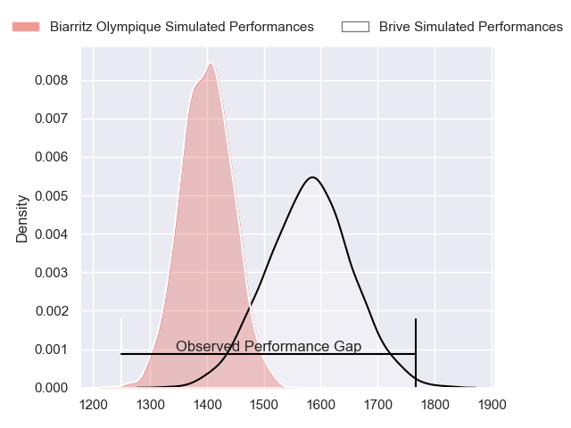
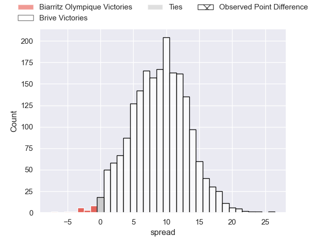
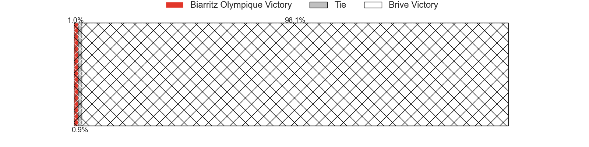
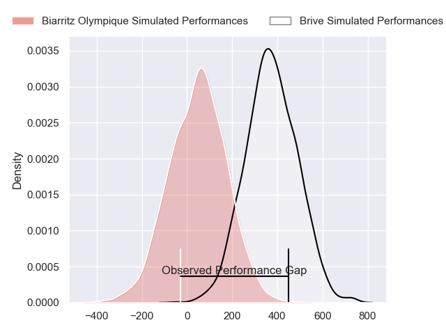
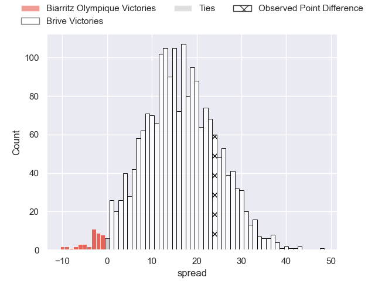
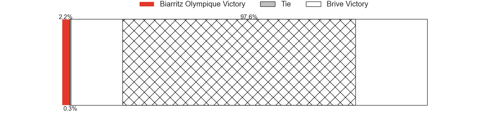

---  
layout: page  
title: Biarritz Olympique at Brive; 10-34  
date: 2024-05-17 18:00:00 -0500  
categories: "Pro D2 2023" match review  
---
# Biarritz Olympique at Brive; 10-34

# Club Level Predictions

The first set of predictions treats a club as the smallest object, as the club develops its members, organizes a gameplan, and deploys its players as needed for each match. This club model has a prediction of 0.734, which translates to predicting Brive to win by 8.9.

Our Over/Under is 58.5 - and combined with the spread above, we have a predicted scoreline of 25 to 34

Each club has a rating and a rating deviation (similar to a Glicko rating), and expected performances can be generated. This allows for simulated matches and spreads like the ones below.
## Projected Performances - Club Model

## Projected Spreads - Club Model

## Projected Results - Club Model

# Player Level Predictions

Treating teams instead as an entity made up of the currently active players, I have ratings for each player in an altogether different system. These can be combined to form team ratings once teamsheets are announced, weighting starters a bit higher than the reserves. After the match is played, players can be weighted by their minutes on the field, allowing for an accurate measure of the team's composition. With these compiled team ratings, we can make predictions, measure inaccuracy, and update the individual player ratings.
## Prediction without Player Minutes: Brive by 18.4

Brive by 10.5 on a neutral pitch

## Projected Performances - Player Model

## Projected Spreads - Player Model

## Projected Results - Player Model

|   Away Minutes | Away Player       |   Away Percentile |   Number |   Home Percentile | Home Player          |   Home Minutes |
|---------------:|:------------------|------------------:|---------:|------------------:|:---------------------|---------------:|
|             46 | Zakaria El Fakir  |             10.19 |        1 |             16.71 | Daniel Brennan       |             40 |
|             40 | Thomas Sauveterre |             70.82 |        2 |             56.39 | Lucas da Silva       |             57 |
|             67 | Mohamed Haouas    |             77.59 |        3 |             79.79 | Vakh Abdaladze       |             40 |
|             75 | Adrian Motoc      |              2.23 |        4 |             72.85 | Renger Van Eerten    |             80 |
|             80 | Charlie Matthews  |             64.84 |        5 |             76.09 | Tevita Ratuva        |             80 |
|             80 | Dave O'Callaghan  |             48.82 |        6 |             86.22 | Retief Marais        |             80 |
|             44 | Johnny Dyer       |              1.67 |        7 |             95.87 | Said Hireche         |             57 |
|             52 | Tornike Jalagonia |             40.17 |        8 |             91    | Ross Moriarty        |             57 |
|             67 | Pierre Pages      |             18.67 |        9 |             67.02 | Leo Carbonneau       |             80 |
|             80 | Billy Searle      |              5.1  |       10 |             92.78 | Stuart Olding        |             57 |
|             80 | Steeve Barry      |             18.46 |       11 |             86.83 | Arthur Bonneval      |             80 |
|             80 | Yann David        |             70.09 |       12 |             92.65 | Sam Johnson          |             80 |
|             80 | Jonathan Joseph   |             84.05 |       13 |             61.49 | Georges Shvelidze    |             80 |
|             80 | Zach Kibirige     |              8.75 |       14 |             77.5  | Mathis Ferté         |             16 |
|             58 | Gervais Cordin    |             35.26 |       15 |             60.68 | Nic Krone            |             80 |
|             40 | Luteru Tolai      |             53.61 |       16 |             42.25 | Tom Raffy            |             64 |
|             36 | Temo Matiu        |             21.97 |       17 |            nan    | Nathan Fraissenon    |             40 |
|             34 | Giorgi Nutsubidze |              3.34 |       18 |             12.22 | Marcel van der Merwe |             40 |
|             28 | Charlie Francoz   |              5.22 |       19 |             42.13 | Benjamin Boudou      |             23 |
|             22 | Vincent Martin    |             12.6  |       20 |             32.02 | Julien Delannoy      |             23 |
|             13 | Lasha Tabidze     |             65.61 |       21 |             60.46 | Taniela Sadrugu      |             23 |
|             13 | Antoine Domercq   |             36.13 |       22 |             52.36 | Guillaume Galletier  |             23 |
|              5 | Thomas Hebert     |             27.17 |       23 |            nan    | nan                  |            nan |

