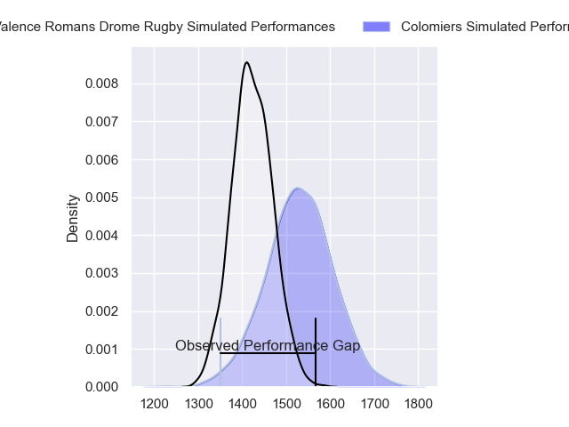
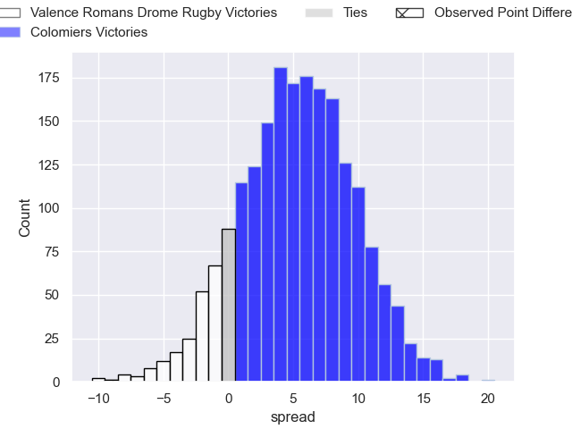
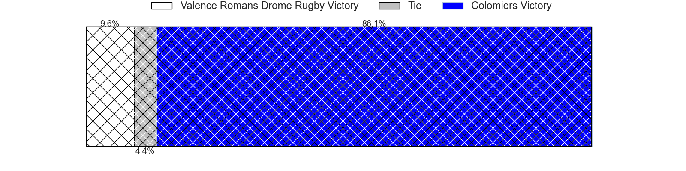
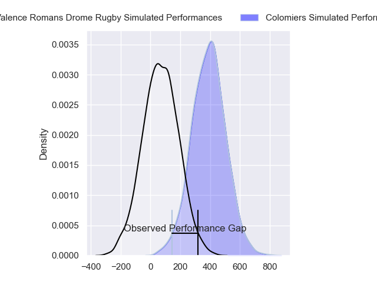
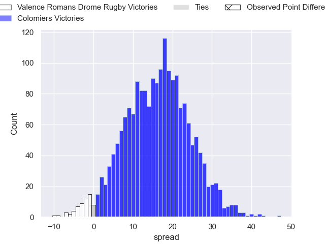
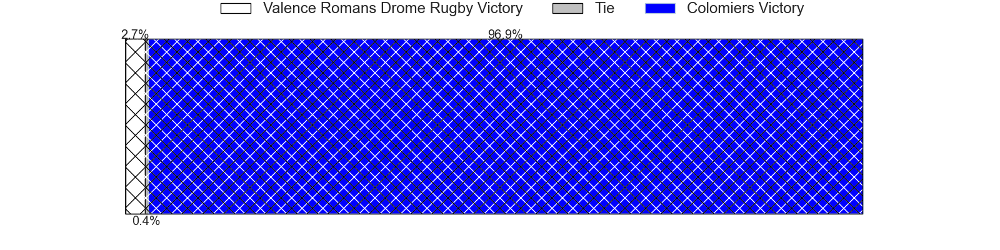

---  
layout: page  
title: Valence Romans Drome Rugby at Colomiers; 23-14  
date: 2024-05-17 18:00:00 -0500  
categories: "Pro D2 2023" match review  
---
# Valence Romans Drome Rugby at Colomiers; 23-14

# Club Level Predictions

The first set of predictions treats a club as the smallest object, as the club develops its members, organizes a gameplan, and deploys its players as needed for each match. This club model has a prediction of 0.648, which translates to predicting Colomiers to win by 5.4.

Our Over/Under is 50.5 - and combined with the spread above, we have a predicted scoreline of 22 to 28

Each club has a rating and a rating deviation (similar to a Glicko rating), and expected performances can be generated. This allows for simulated matches and spreads like the ones below.
## Projected Performances - Club Model

## Projected Spreads - Club Model

## Projected Results - Club Model

# Player Level Predictions

Treating teams instead as an entity made up of the currently active players, I have ratings for each player in an altogether different system. These can be combined to form team ratings once teamsheets are announced, weighting starters a bit higher than the reserves. After the match is played, players can be weighted by their minutes on the field, allowing for an accurate measure of the team's composition. With these compiled team ratings, we can make predictions, measure inaccuracy, and update the individual player ratings.
## Prediction without Player Minutes: Colomiers by 16.9

Colomiers by 9.0 on a neutral pitch

## Projected Performances - Player Model

## Projected Spreads - Player Model

## Projected Results - Player Model

|   Away Minutes | Away Player           |   Away Percentile |   Number |   Home Percentile | Home Player        |   Home Minutes |
|---------------:|:----------------------|------------------:|---------:|------------------:|:-------------------|---------------:|
|             60 | Andrea Pontanier      |             79.85 |        1 |             11.34 | Thomas Dubois      |             50 |
|             73 | Cyril Deligny         |              4.43 |        2 |              7.87 | Andrew Ready       |             50 |
|             54 | Gareth Milasinovich   |             54.32 |        3 |             41.92 | Hugo Pirlet        |             50 |
|             80 | Éloi Massot           |              7.1  |        4 |             62.37 | Maxime Granouillet |             80 |
|             54 | Darrell Dyer          |             88.24 |        5 |             24.14 | Alexandre Manukula |             41 |
|             59 | Adrien Roux           |             48.33 |        6 |             20.18 | Anthony Coletta    |             80 |
|             80 | Mathieu Vachon        |              0.2  |        7 |             28.05 | Jorick Dastugue    |             80 |
|             80 | Ioane Iashagashvili   |             91.84 |        8 |             68.83 | Romain Bezian      |             12 |
|             56 | Léopold Dupas         |             69.46 |        9 |             84.64 | Edoardo Gori       |             50 |
|             80 | Lucas Meret           |             49.89 |       10 |             37.15 | Maxime Javaux      |             50 |
|             51 | Noe Perret-Tourlonias |             46.06 |       11 |             88.94 | Rodrigo Marta      |             80 |
|             80 | Mathieu Guillomot     |             12.47 |       12 |            100    | Baptiste Serrano   |             80 |
|             80 | Ben Neiceru           |             89.62 |       13 |             12.05 | Fabien Perrin      |             56 |
|             80 | Adam Vargas           |             97.6  |       14 |              3.27 | Valentin Saurs     |             80 |
|             51 | Joris Moura           |             86.32 |       15 |             13.25 | Max Auriac         |             80 |
|             29 | George Worth          |             30.56 |       16 |             33.89 | Paolo Parpagiola   |             68 |
|             29 | Esteban Tercq         |             35.12 |       17 |             48.99 | Jean Thomas        |             39 |
|             26 | Mathis Roume          |             34.01 |       18 |             72.19 | Hugo Djehi         |             30 |
|             26 | Yassine Maamry        |             47.57 |       19 |             77.08 | Guillaume Tartas   |             30 |
|             24 | Tim Menzel            |             83.94 |       20 |             51.31 | Ugo Seguela        |             30 |
|             21 | Sven Bernat Girlando  |             72.59 |       21 |             82.38 | Michael Simutoga   |             30 |
|             20 | Anthony Aléo          |             63.38 |       22 |              0.64 | Brett Herron       |             30 |
|              7 | Chris Talakai         |             35.07 |       23 |             68.34 | Dorian Laborde     |             24 |

