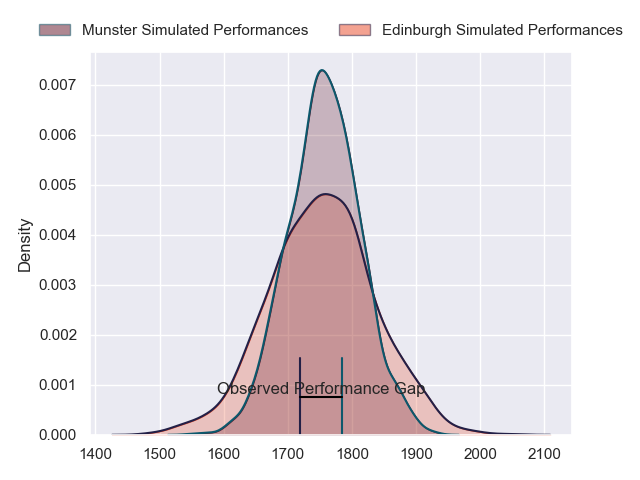
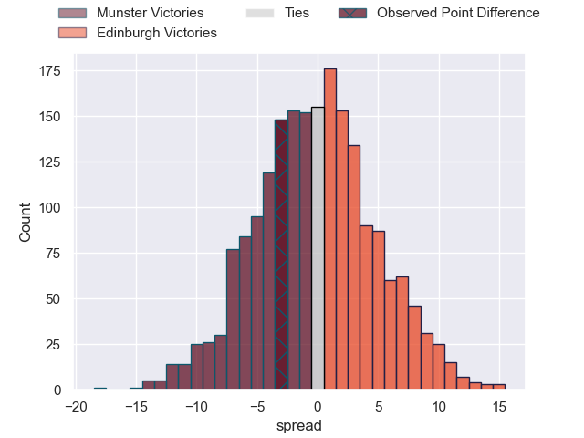
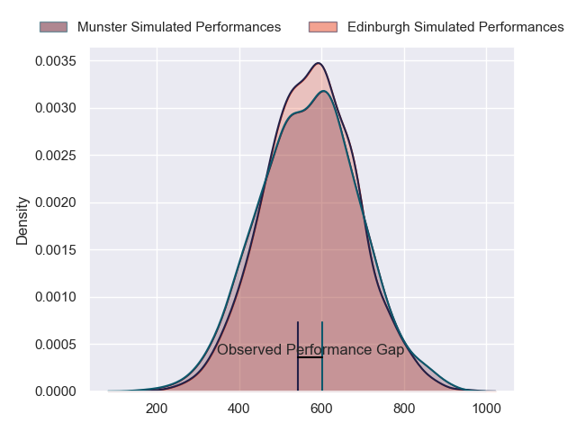
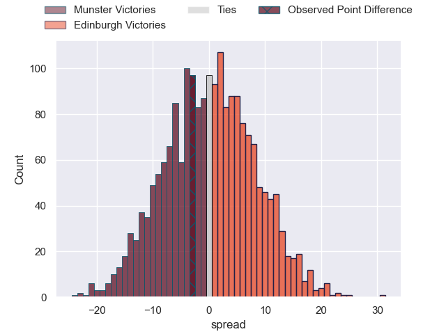

---  
layout: page  
title: Munster at Edinburgh; 29-26  
date: 2024-05-17 18:00:00 -0500  
categories: "United Rugby Championship 2023" match review  
---
# Munster at Edinburgh; 29-26

# Club Level Predictions

The first set of predictions treats a club as the smallest object, as the club develops its members, organizes a gameplan, and deploys its players as needed for each match. This club model has a prediction of 0.492, which translates to predicting Munster to win by 0.3.

Our Over/Under is 28.5 - and combined with the spread above, we have a predicted scoreline of 14 to 14

Each club has a rating and a rating deviation (similar to a Glicko rating), and expected performances can be generated. This allows for simulated matches and spreads like the ones below.
## Projected Performances - Club Model

## Projected Spreads - Club Model

## Projected Results - Club Model

# Player Level Predictions

Treating teams instead as an entity made up of the currently active players, I have ratings for each player in an altogether different system. These can be combined to form team ratings once teamsheets are announced, weighting starters a bit higher than the reserves. After the match is played, players can be weighted by their minutes on the field, allowing for an accurate measure of the team's composition. With these compiled team ratings, we can make predictions, measure inaccuracy, and update the individual player ratings.
## Prediction without Player Minutes: Edinburgh by 4.3

Munster by 2.3 on a neutral pitch

## Projected Performances - Player Model

## Projected Spreads - Player Model

## Projected Results - Player Model

|   Away Minutes | Away Player      |   Away Percentile |   Number |   Home Percentile | Home Player         |   Home Minutes |
|---------------:|:-----------------|------------------:|---------:|------------------:|:--------------------|---------------:|
|             80 | Jeremy Loughman  |             97.39 |        1 |             92.58 | Pierre Schoeman     |             59 |
|             66 | Niall Scannell   |             95.9  |        2 |             85.9  | Ewan Ashman         |             59 |
|             51 | Oli Jager        |             92.74 |        3 |             99.1  | WP Nel              |             59 |
|             44 | Fineen Wycherley |             34.08 |        4 |             81.95 | Sam Skinner         |             59 |
|             80 | Tadhg Beirne     |             99.29 |        5 |             95.54 | Grant Gilchrist     |             71 |
|             80 | Jack O'Donoghue  |             88.19 |        6 |            100    | Jamie Ritchie       |             80 |
|             51 | Alex Kendellen   |             86.12 |        7 |             58.96 | Hamish Watson       |             63 |
|             71 | Gavin Coombes    |             85.15 |        8 |             76.36 | Viliame Mata        |             80 |
|             80 | Craig Casey      |             86.91 |        9 |             79.76 | Ben Vellacott       |             64 |
|             80 | Jack Crowley     |             64.54 |       10 |             82.59 | Ben Healy           |             80 |
|             80 | Shane Daly       |             97.69 |       11 |             86.06 | Duhan van der Merwe |             80 |
|             59 | Alex Nankivell   |             95.28 |       12 |             92.77 | James Lang          |             80 |
|             80 | Antoine Frisch   |             93.08 |       13 |             67.71 | Mark Bennett        |             64 |
|             80 | Calvin Nash      |             95    |       14 |             86.15 | Matt Currie         |             80 |
|             23 | Mike Haley       |             91.24 |       15 |             94.44 | Wes Goosen          |             59 |
|             14 | Eoghan Clarke    |            nan    |       16 |             55.74 | Dave Cherry         |             21 |
|              0 | Mark Donnelly    |            nan    |       17 |             13.38 | Boan Venter         |             21 |
|             29 | John Ryan        |             93.88 |       18 |             62.32 | Javan Sebastian     |             21 |
|             36 | RG Snyman        |             99.39 |       19 |             88.54 | Marshall Sykes      |             30 |
|             29 | Thomas Ahern     |             55.98 |       20 |             91.42 | Luke Crosbie        |             17 |
|             21 | Conor Murray     |             98.6  |       21 |             89.01 | Ali Price           |             16 |
|             57 | Rory Scannell    |             94.97 |       22 |            nan    | Cameron Scott       |             21 |
|              9 | Brian Gleeson    |            nan    |       23 |              7.65 | Chris Dean          |             16 |

