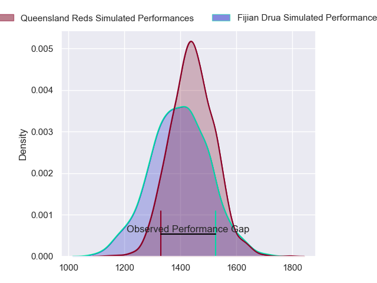
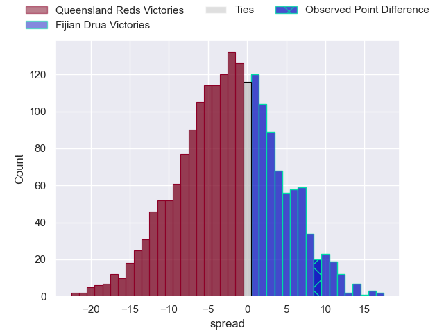
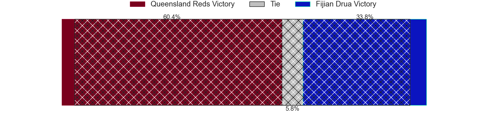
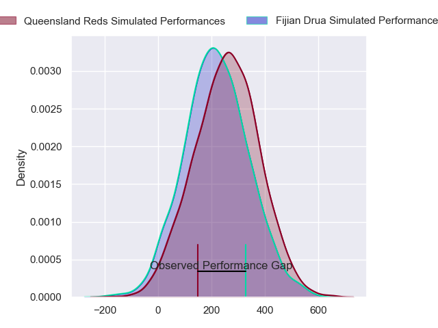
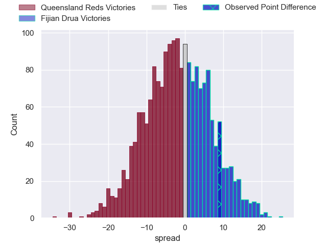

---  
layout: page  
title: Queensland Reds at Fijian Drua; 19-28  
date: 2024-05-17 18:00:00 -0500  
categories: "Super Rugby Pacific 2024" match review  
---
# Queensland Reds at Fijian Drua; 19-28

# Club Level Predictions

The first set of predictions treats a club as the smallest object, as the club develops its members, organizes a gameplan, and deploys its players as needed for each match. This club model has a prediction of 0.439, which translates to predicting Queensland Reds to win by 2.2.

Our Over/Under is 52.5 - and combined with the spread above, we have a predicted scoreline of 27 to 25

Each club has a rating and a rating deviation (similar to a Glicko rating), and expected performances can be generated. This allows for simulated matches and spreads like the ones below.
## Projected Performances - Club Model

## Projected Spreads - Club Model

## Projected Results - Club Model

# Player Level Predictions

Treating teams instead as an entity made up of the currently active players, I have ratings for each player in an altogether different system. These can be combined to form team ratings once teamsheets are announced, weighting starters a bit higher than the reserves. After the match is played, players can be weighted by their minutes on the field, allowing for an accurate measure of the team's composition. With these compiled team ratings, we can make predictions, measure inaccuracy, and update the individual player ratings.
## Prediction without Player Minutes: Queensland Reds by 0.7

Queensland Reds by 3.2 on a neutral pitch

## Projected Performances - Player Model

## Projected Spreads - Player Model

## Projected Results - Player Model

|   Away Minutes | Away Player          |   Away Percentile |   Number |   Home Percentile | Home Player             |   Home Minutes |
|---------------:|:---------------------|------------------:|---------:|------------------:|:------------------------|---------------:|
|             43 | Peni Ravai Kovekalou |             51.71 |        1 |             62.72 | Jone Koroiduadua        |             54 |
|             51 | Josh Nasser          |             77.87 |        2 |             90.16 | Tevita Ikanivere        |             73 |
|             51 | Zane Nonggorr        |             77.16 |        3 |             42.66 | Mesake Doge             |             54 |
|             82 | Ryan Smith           |             34.48 |        4 |             73.53 | Mesake Vocevoce         |             70 |
|             43 | Cormac Daly          |             54.77 |        5 |             77.18 | Isoa Nasilasila         |             82 |
|             82 | Liam Wright          |             96.95 |        6 |             82.38 | Etonia Waqa             |             63 |
|             82 | Fraser McReight      |             93.8  |        7 |             10.73 | Kitione Salawa          |             82 |
|             71 | John Bryant          |             41.84 |        8 |             74.9  | Elia Canakaivata        |             82 |
|             82 | Tate McDermott       |             77.84 |        9 |             25.13 | Simione Kuruvoli        |             59 |
|             50 | Lawson Creighton     |             14.44 |       10 |             43.31 | Isaiah Armstrong-Ravula |             82 |
|             59 | Floyd Aubrey         |             35.19 |       11 |             32.69 | Epeli Momo              |             82 |
|             82 | Hunter Paisami       |             75.05 |       12 |             44.44 | Waqa Nalaga             |             43 |
|             82 | Taj Annan            |             19.08 |       13 |             82.49 | Iosefo Masi             |             82 |
|             66 | Suliasi Vunivalu     |             38.75 |       14 |             84.62 | Selestino Ravutaumada   |             82 |
|             82 | Jock Campbell        |             65.81 |       15 |             68.16 | Ilaisa Droasese         |             82 |
|             31 | George Blake         |            nan    |       16 |             40.66 | Mesu Dolokoto           |              9 |
|             39 | Sef Fa'agase         |             76.67 |       17 |            nan    | Emosi Tuqiri            |             28 |
|             31 | Jeff Toomaga-Allen   |             94.62 |       18 |            nan    | Samu Tawake             |             28 |
|             39 | Seru Uru             |             70.79 |       19 |             58.22 | Te Ahiwaru Cirikidaveta |             12 |
|             11 | Joe Brial            |            nan    |       20 |             60.73 | Vilive Miramira         |             19 |
|             16 | Kalani Thomas        |             67.19 |       21 |             58.64 | Peni Matawalu           |             23 |
|             32 | James O'Connor       |             92.45 |       22 |             49.37 | Kemu Valetini           |             39 |
|             23 | Tim Ryan             |             51.92 |       23 |             34.62 | Taniela Rakuro          |              0 |

