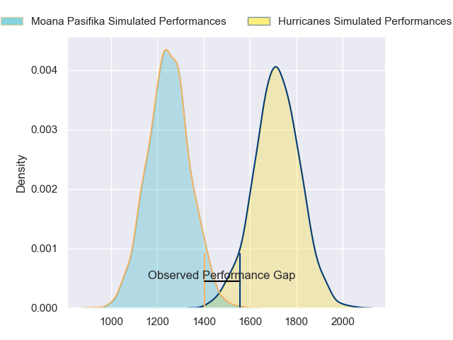
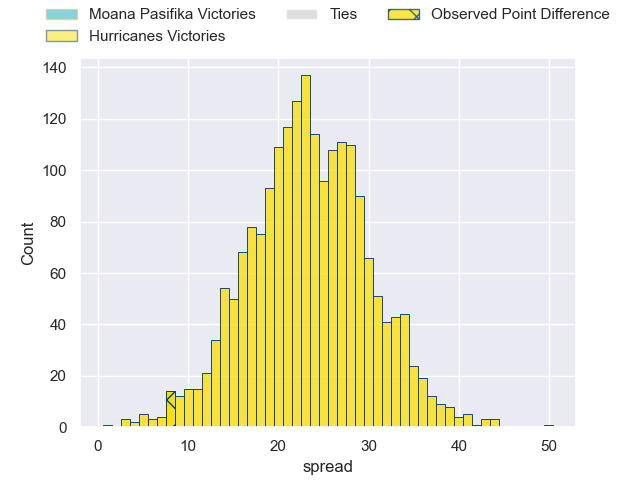
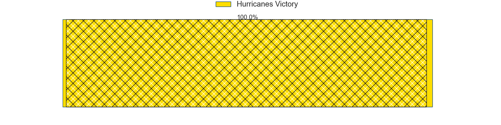
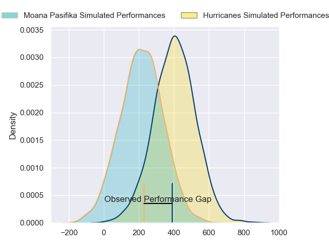
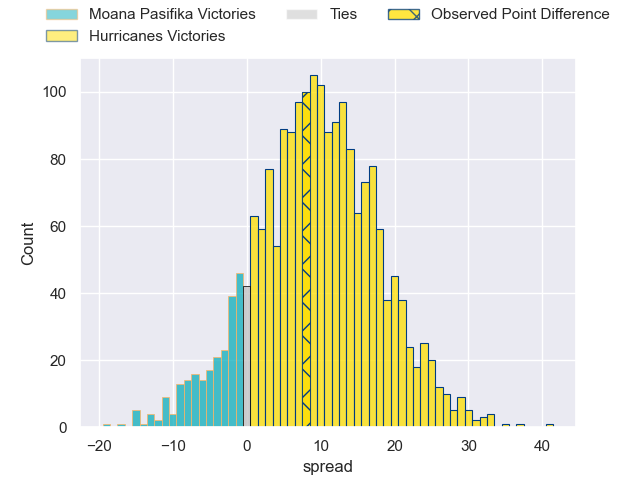
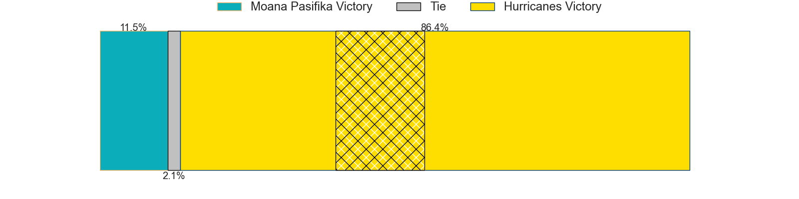

---  
layout: page  
title: Moana Pasifika at Hurricanes; 24-32  
date: 2024-05-17 18:00:00 -0500  
categories: "Super Rugby Pacific 2024" match review  
---
# Moana Pasifika at Hurricanes; 24-32

# Club Level Predictions

The first set of predictions treats a club as the smallest object, as the club develops its members, organizes a gameplan, and deploys its players as needed for each match. This club model has a prediction of 0.931, which translates to predicting Hurricanes to win by 23.5.

Our Over/Under is 70.5 - and combined with the spread above, we have a predicted scoreline of 24 to 47

Each club has a rating and a rating deviation (similar to a Glicko rating), and expected performances can be generated. This allows for simulated matches and spreads like the ones below.
## Projected Performances - Club Model

## Projected Spreads - Club Model

## Projected Results - Club Model

# Player Level Predictions

Treating teams instead as an entity made up of the currently active players, I have ratings for each player in an altogether different system. These can be combined to form team ratings once teamsheets are announced, weighting starters a bit higher than the reserves. After the match is played, players can be weighted by their minutes on the field, allowing for an accurate measure of the team's composition. With these compiled team ratings, we can make predictions, measure inaccuracy, and update the individual player ratings.
## Prediction without Player Minutes: Hurricanes by 11.8

Hurricanes by 7.4 on a neutral pitch

## Projected Performances - Player Model

## Projected Spreads - Player Model

## Projected Results - Player Model

|   Away Minutes | Away Player           |   Away Percentile |   Number |   Home Percentile | Home Player          |   Home Minutes |
|---------------:|:----------------------|------------------:|---------:|------------------:|:---------------------|---------------:|
|             69 | Abraham Pole          |              8.81 |        1 |             91.11 | Pouri Rakete-Stones  |             48 |
|             62 | Samiuela Moli         |              3.44 |        2 |             36.07 | Raymond Tuputupu     |             49 |
|             62 | Sione Mafileo         |             36.87 |        3 |             52.2  | Siale Lauaki         |             49 |
|             62 | Tom Savage            |             89.76 |        4 |             79.11 | Justin Sangster      |             80 |
|             80 | Allan Craig           |             10.24 |        5 |             49.9  | Ben Grant            |             71 |
|             80 | Jacob Norris          |             85.33 |        6 |             93.21 | Brad Shields         |             80 |
|             80 | Sione Havili Talitui  |             79.53 |        7 |             94    | Du'Plessis Kirifi    |             49 |
|             65 | Lotu Inisi            |              7.32 |        8 |             84.94 | Devan Flanders       |             80 |
|             80 | Jonathan Taumateine   |             41.19 |        9 |             95.46 | Richard Judd         |             66 |
|             63 | William Havili        |             21.87 |       10 |             70.7  | Aidan Morgan         |             80 |
|             80 | Neria Fomai           |             88.56 |       11 |             96.54 | Kini Naholo          |             80 |
|             80 | Julian Savea          |             97.59 |       12 |             31.34 | Peter Umaga-Jensen   |             63 |
|             62 | Pepesana Patafilo     |             61.43 |       13 |             36.37 | Bailyn Sullivan      |             80 |
|             69 | Fine Inisi            |              4.62 |       14 |             43.85 | Dan Sinkinson        |             72 |
|             80 | Danny Toala           |              5.56 |       15 |             10.04 | Harry Godfrey        |             80 |
|             18 | Sama Malolo           |             42.62 |       16 |             37.21 | James O'Reilly       |             31 |
|             11 | Tevita Langi          |             38.91 |       17 |             97.47 | Xavier Numia         |             32 |
|             18 | Sekope Kepu           |             85.73 |       18 |             52.04 | Pasilio Tosi         |             31 |
|             18 | Ola Tauelangi         |             34.89 |       19 |             97.36 | Isaia Walker-Leawere |              9 |
|             15 | Alamanda Motuga       |             31.4  |       20 |             95.96 | Peter Lakai          |             31 |
|             11 | Aisea Halo            |             23.91 |       21 |             32.98 | Jordi Viljoen        |             14 |
|             17 | Christian Leali'ifano |             76.65 |       22 |             87.53 | Riley Higgins        |             17 |
|             18 | Anzelo Tuitavuki      |             15.38 |       23 |             87.21 | Salesi Rayasi        |              8 |

