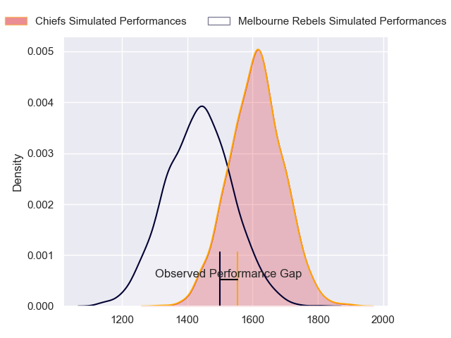
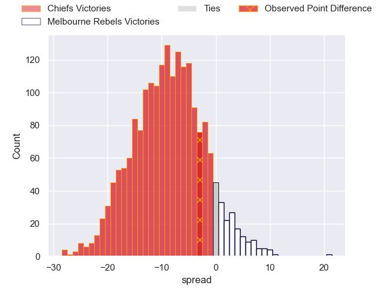
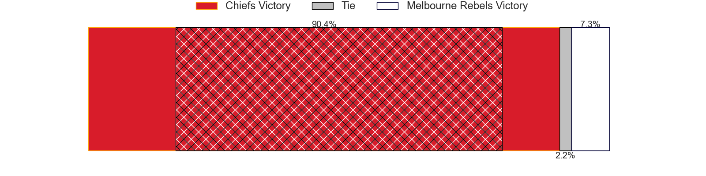
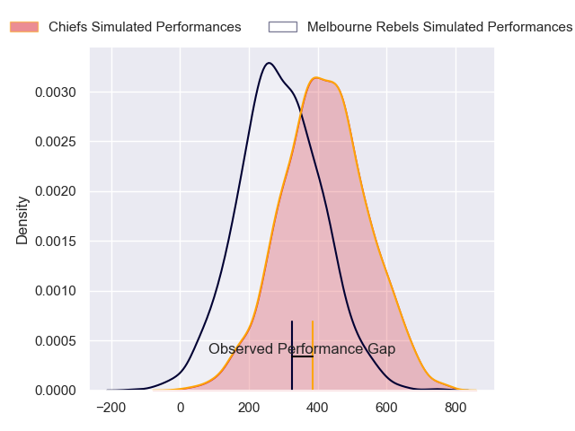
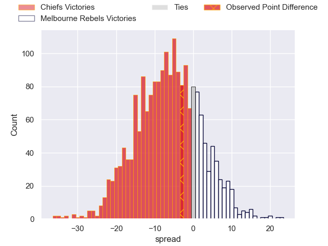

---  
layout: page  
title: Chiefs at Melbourne Rebels; 26-23  
date: 2024-05-17 18:00:00 -0500  
categories: "Super Rugby Pacific 2024" match review  
---
# Chiefs at Melbourne Rebels; 26-23

# Club Level Predictions

The first set of predictions treats a club as the smallest object, as the club develops its members, organizes a gameplan, and deploys its players as needed for each match. This club model has a prediction of 0.271, which translates to predicting Chiefs to win by 8.9.

Our Over/Under is 41.5 - and combined with the spread above, we have a predicted scoreline of 25 to 16

Each club has a rating and a rating deviation (similar to a Glicko rating), and expected performances can be generated. This allows for simulated matches and spreads like the ones below.
## Projected Performances - Club Model

## Projected Spreads - Club Model

## Projected Results - Club Model

# Player Level Predictions

Treating teams instead as an entity made up of the currently active players, I have ratings for each player in an altogether different system. These can be combined to form team ratings once teamsheets are announced, weighting starters a bit higher than the reserves. After the match is played, players can be weighted by their minutes on the field, allowing for an accurate measure of the team's composition. With these compiled team ratings, we can make predictions, measure inaccuracy, and update the individual player ratings.
## Prediction without Player Minutes: Chiefs by 6.9

Chiefs by 10.5 on a neutral pitch

## Projected Performances - Player Model

## Projected Spreads - Player Model

## Projected Results - Player Model

|   Away Minutes | Away Player          |   Away Percentile |   Number |   Home Percentile | Home Player         |   Home Minutes |
|---------------:|:---------------------|------------------:|---------:|------------------:|:--------------------|---------------:|
|             53 | Aidan Ross           |             98.94 |        1 |             88.92 | Matt Gibbon         |             79 |
|             53 | Samisoni Taukei'aho  |             95.41 |        2 |             49.67 | Jordan Uelese       |             79 |
|             53 | George Dyer          |             86.88 |        3 |             58.6  | Sam Talakai         |             59 |
|             59 | Manaaki Selby-Rickit |             23.61 |        4 |             79.33 | Tuaina Taii Tualima |             80 |
|             80 | Tupou Vaa'i          |             93.41 |        5 |             65.25 | Josh Canham         |             80 |
|             80 | Simon Parker         |             61.12 |        6 |             16.54 | Josh Kemeny         |             25 |
|             69 | Kaylum Boshier       |             58.07 |        7 |             46.56 | Brad Wilkin         |             59 |
|             80 | Luke Jacobson        |             90.17 |        8 |             26.99 | Vaiolini Ekuasi     |             31 |
|             59 | Cortez Ratima        |             75.39 |        9 |             96.51 | Ryan Louwrens       |             79 |
|             80 | Damian McKenzie      |             98.3  |       10 |             67.94 | Carter Gordon       |             72 |
|             80 | Etene Nanai-Seturo   |             74.9  |       11 |             21.35 | Glen Vaihu          |             80 |
|             70 | Quinn Tupaea         |             93.39 |       12 |             66.63 | Nick Jooste         |             80 |
|             80 | Anton Lienert-Brown  |             94.44 |       13 |             96.43 | Filipo Daugunu      |             80 |
|             80 | Emoni Narawa         |             92.69 |       14 |             53.56 | Lachie Anderson     |             80 |
|             53 | Shaun Stevenson      |             85.68 |       15 |             22.65 | Jake Strachan       |             80 |
|             27 | Bradley Slater       |             85.25 |       16 |            nan    | Ethan Dobbins       |              1 |
|             27 | Jared Proffit        |             27.3  |       17 |            nan    | Cabous Eloff        |              1 |
|             27 | Reuben O'Neill       |             44.91 |       18 |             50.37 | Pone Fa'amausili    |             21 |
|             21 | Naitoa Ah Kuoi       |             95.74 |       19 |             49.65 | Angelo Smith        |             21 |
|             11 | Wallace Sititi       |             53.35 |       20 |             65.94 | Maciu Nabolakasi    |             49 |
|             21 | Xavier Roe           |             57.07 |       21 |              4.6  | Rob Leota           |             55 |
|             10 | Josh Ioane           |             49.15 |       22 |             39.62 | Jack Maunder        |              1 |
|             27 | Rameka Poihipi       |             76.29 |       23 |             53.93 | Lukas Ripley        |              8 |

