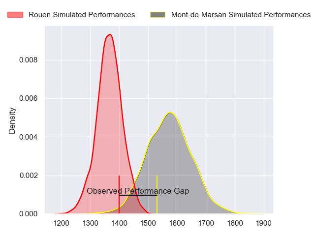
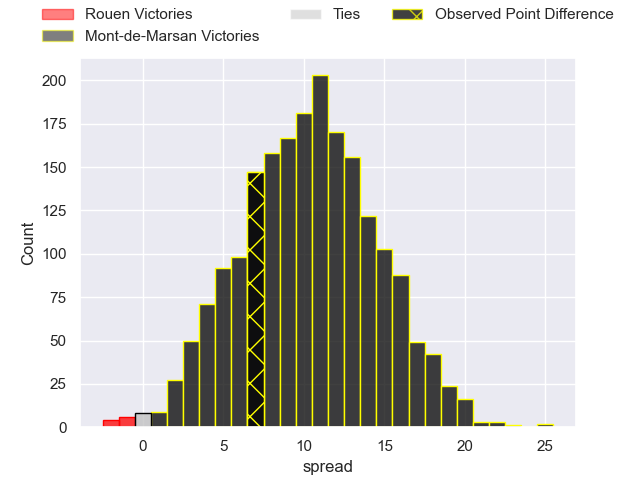
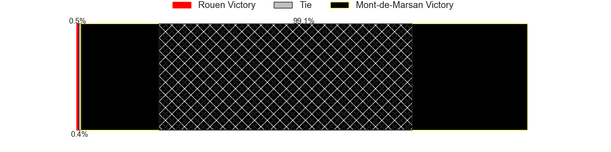
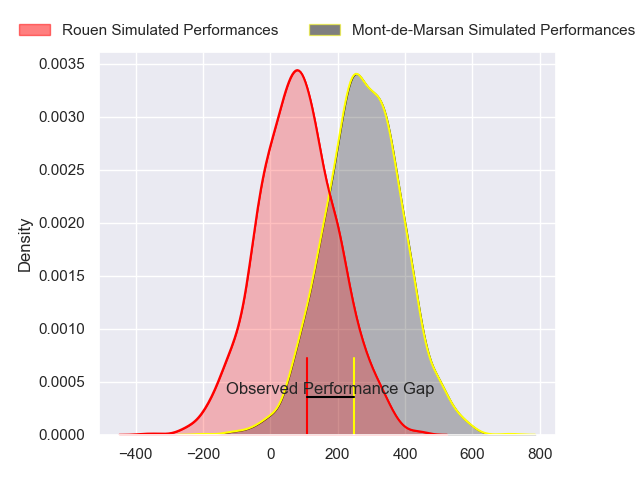
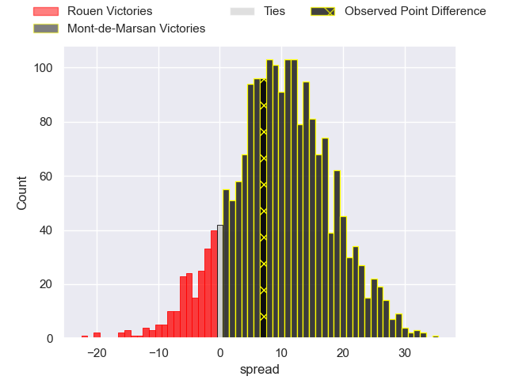
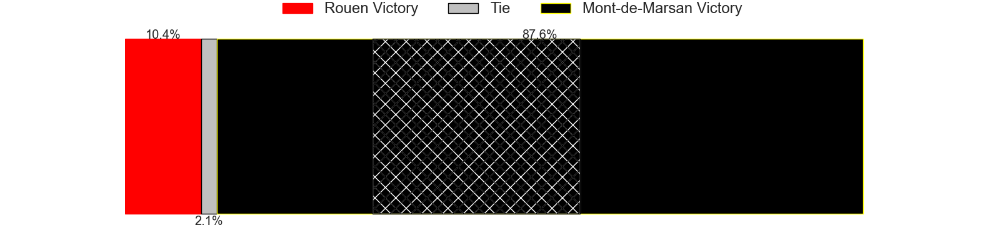

---  
layout: page  
title: Rouen at Mont-de-Marsan; 31-38  
date: 2024-05-17 18:00:00 -0500  
categories: "Pro D2 2023" match review  
---
# Rouen at Mont-de-Marsan; 31-38

# Club Level Predictions

The first set of predictions treats a club as the smallest object, as the club develops its members, organizes a gameplan, and deploys its players as needed for each match. This club model has a prediction of 0.767, which translates to predicting Mont-de-Marsan to win by 10.5.

Our Over/Under is 61.5 - and combined with the spread above, we have a predicted scoreline of 25 to 36

Each club has a rating and a rating deviation (similar to a Glicko rating), and expected performances can be generated. This allows for simulated matches and spreads like the ones below.
## Projected Performances - Club Model

## Projected Spreads - Club Model

## Projected Results - Club Model

# Player Level Predictions

Treating teams instead as an entity made up of the currently active players, I have ratings for each player in an altogether different system. These can be combined to form team ratings once teamsheets are announced, weighting starters a bit higher than the reserves. After the match is played, players can be weighted by their minutes on the field, allowing for an accurate measure of the team's composition. With these compiled team ratings, we can make predictions, measure inaccuracy, and update the individual player ratings.
## Prediction without Player Minutes: Mont-de-Marsan by 9.4

Mont-de-Marsan by 1.5 on a neutral pitch

## Projected Performances - Player Model

## Projected Spreads - Player Model

## Projected Results - Player Model

|   Away Minutes | Away Player        |   Away Percentile |   Number |   Home Percentile | Home Player               |   Home Minutes |
|---------------:|:-------------------|------------------:|---------:|------------------:|:--------------------------|---------------:|
|             62 | Elias El Ansari    |             36.05 |        1 |              5.46 | Jean-Luc Innocente        |             62 |
|             55 | Jeremie Maurouard  |              4.59 |        2 |             97.21 | Torsten van Jaarsveld     |             58 |
|             62 | Soso Bekoshvili    |             81.32 |        3 |              3.43 | Anthony Alves             |             52 |
|             80 | Jean Leleu         |             25.86 |        4 |             73.73 | Romain Durand             |             80 |
|             67 | Will Witty         |             61.36 |        5 |             10.34 | Myles Edwards             |             45 |
|             26 | Lucas Costa        |             59.65 |        6 |             47.54 | Aurélien Lisena           |             80 |
|             80 | Samuel Maximin     |             58.46 |        7 |             80.31 | Leo Banos                 |             55 |
|             80 | Abdelkarim Fofana  |             69.25 |        8 |             52.51 | Veresa Tuqovu Ramototabua |             80 |
|             52 | Florent Campeggia  |             67.54 |        9 |             26.35 | Nicolas Darquier          |             50 |
|             80 | Franck Pourteau    |             90.87 |       10 |             14.65 | Joris Pialot              |             41 |
|             80 | Paul Vallee        |             76.73 |       11 |             48.27 | Semi Lagivala             |             45 |
|             80 | JT Jackson         |             45.91 |       12 |             71.59 | Jules Even                |             80 |
|             52 | Opetera Peleseuma  |              9.12 |       13 |             82.6  | Nacani Wakaya             |             80 |
|             41 | Benito Masilevu    |             87.5  |       14 |              9.9  | Simao Broeiro Bento       |             80 |
|             80 | Baptiste Mouchous  |             89.32 |       15 |             39.53 | Théo Cortes               |             80 |
|             54 | Willy N'Diaye      |              3.05 |       16 |             87.69 | Willie du Plessis         |             39 |
|             39 | Pablo Patilla      |             44.23 |       17 |             52.13 | Jules Dussutour           |             35 |
|             28 | Pete Lydon         |             84.4  |       18 |             46.33 | Gatien Masse              |             35 |
|             28 | Maxime Sidobre     |             76.96 |       19 |             35.08 | Kevin Viallard            |             30 |
|             25 | Efi Ma'afu         |             35.74 |       20 |             78.3  | Gheorghe Gajion           |             28 |
|             18 | Antoine Fournier   |             71.62 |       21 |             81.5  | William Wavrin            |             25 |
|             18 | Cody Thomas        |             46    |       22 |             47.54 | Samuel Lagrange           |             22 |
|             13 | John-Charles Astle |             55.27 |       23 |             33.2  | Thomas Bultel             |             18 |

