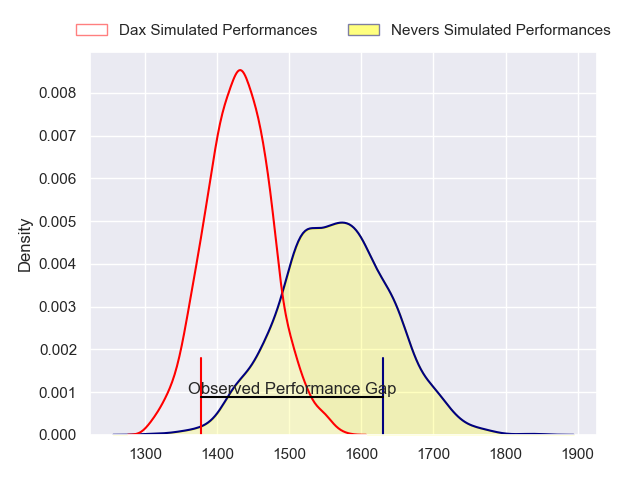
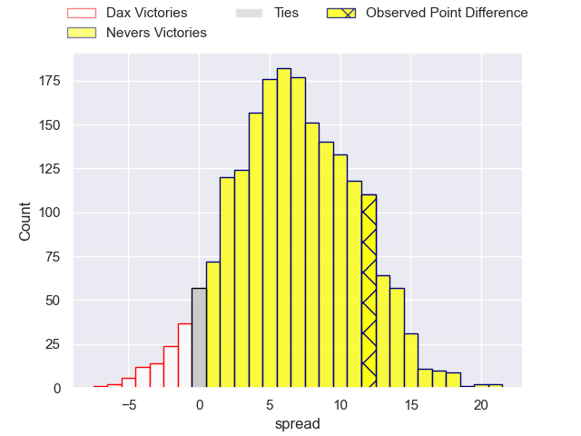
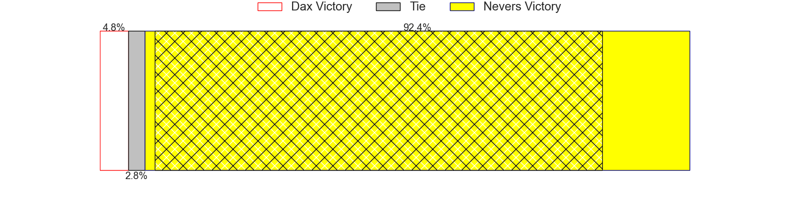
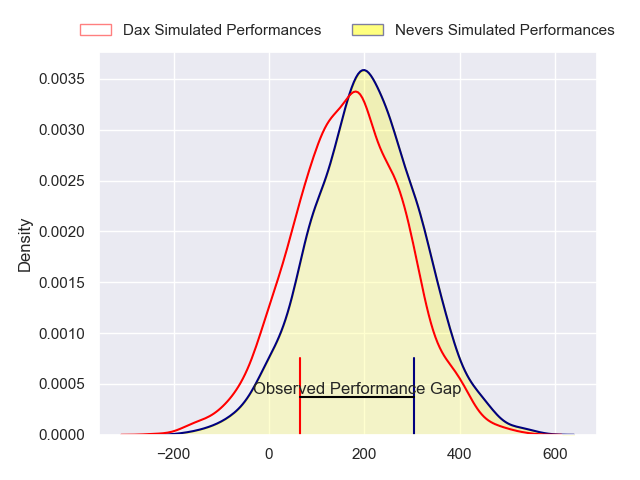
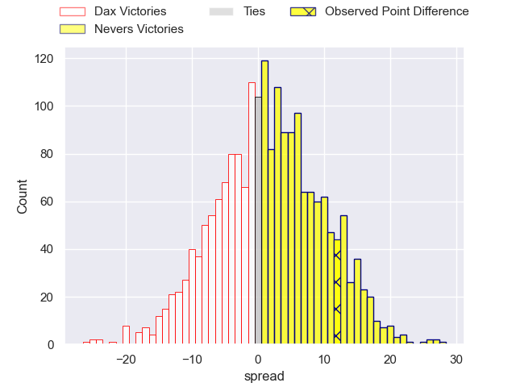
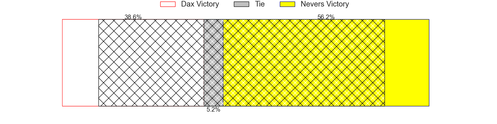

---  
layout: page  
title: Dax at Nevers; 23-35  
date: 2024-05-17 18:00:00 -0500  
categories: "Pro D2 2023" match review  
---
# Dax at Nevers; 23-35

# Club Level Predictions

The first set of predictions treats a club as the smallest object, as the club develops its members, organizes a gameplan, and deploys its players as needed for each match. This club model has a prediction of 0.681, which translates to predicting Nevers to win by 6.7.

Our Over/Under is 43.5 - and combined with the spread above, we have a predicted scoreline of 18 to 25

Each club has a rating and a rating deviation (similar to a Glicko rating), and expected performances can be generated. This allows for simulated matches and spreads like the ones below.
## Projected Performances - Club Model

## Projected Spreads - Club Model

## Projected Results - Club Model

# Player Level Predictions

Treating teams instead as an entity made up of the currently active players, I have ratings for each player in an altogether different system. These can be combined to form team ratings once teamsheets are announced, weighting starters a bit higher than the reserves. After the match is played, players can be weighted by their minutes on the field, allowing for an accurate measure of the team's composition. With these compiled team ratings, we can make predictions, measure inaccuracy, and update the individual player ratings.
## Prediction without Player Minutes: Nevers by 2.4

Dax by 1.4 on a neutral pitch

## Projected Performances - Player Model

## Projected Spreads - Player Model

## Projected Results - Player Model

|   Away Minutes | Away Player           |   Away Percentile |   Number |   Home Percentile | Home Player              |   Home Minutes |
|---------------:|:----------------------|------------------:|---------:|------------------:|:-------------------------|---------------:|
|             48 | David Lolohea         |             17.62 |        1 |             66.07 | Tornike Mataradze        |             52 |
|             48 | Louis Barrere         |             15.57 |        2 |             15.25 | Jonathan Maiau           |             35 |
|             48 | Diogo Hasse Ferreira  |             11.99 |        3 |             66.39 | Ilia Kaikatsishvili      |             35 |
|             62 | Josh Furno            |             55.88 |        4 |              5.48 | Christiaan van der Merwe |             80 |
|             80 | Jean-Baptiste Singer  |             14.5  |        5 |             98.48 | Will Skelton             |             55 |
|             80 | Jean-Baptiste Barrère |             45.37 |        6 |             90.75 | Hugues Bastide           |             80 |
|             53 | Arnaud Aletti         |             81.69 |        7 |             31.79 | Kevin Noah               |             33 |
|             80 | Sam Wasley            |             34.94 |        8 |             87.87 | Jason-Colin Fraser       |              4 |
|             59 | Sylvère Reteau        |             80.45 |        9 |             13.09 | Hugo Bouyssou            |             65 |
|             59 | Hugo Cerisier         |             78.56 |       10 |             80.89 | Yohan Le Bourhis         |             80 |
|             80 | Jope Naceava          |             85.19 |       11 |              5.48 | Thomas Zenon             |             80 |
|             59 | Ilikena Bolakoro      |             89.41 |       12 |             66.88 | Mattéo Faucher           |             59 |
|             80 | Bastien Daguerre      |             68.24 |       13 |             57.65 | Arthur Mathiron          |             80 |
|             80 | Maxime Oltmann        |             12.5  |       14 |             65.77 | Christian Ambadiang      |             80 |
|             80 | Théo Duprat           |             64.74 |       15 |             83.12 | Kylian Jaminet           |             80 |
|             32 | Louis Mary            |             82.46 |       16 |             83.46 | Julien Kazubek           |             76 |
|             32 | Iban Hiriart-Urruty   |             82.62 |       17 |             81.3  | Luka Plataret            |             47 |
|             32 | Nephi Leatigaga       |             39.64 |       18 |             41.15 | Quentin Beaudaux         |             45 |
|             27 | Ratu Nacika           |             41.14 |       19 |            nan    | Aselo Ikahehegi          |             45 |
|             21 | Paul Ravier           |             79.58 |       20 |             70.47 | Kamaliele Tufele         |             28 |
|             21 | Romuald Séguy         |             63.06 |       21 |             33.98 | Lado Chachanidze         |             25 |
|             21 | Benjamin Puntous      |             24.95 |       22 |             34.61 | Shaun Reynolds           |             21 |
|             18 | Brice Ferrer          |             59.03 |       23 |              7.68 | Guillaume Manevy         |             15 |

