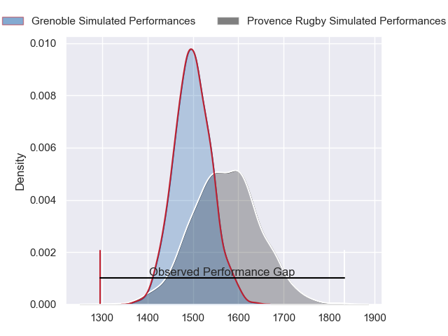
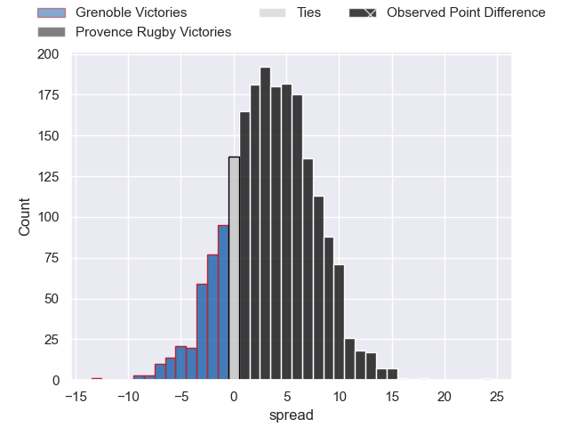
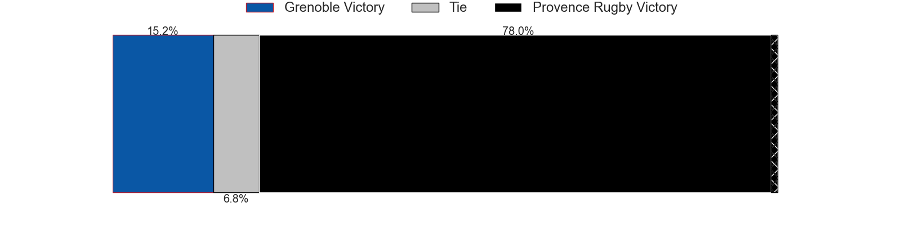
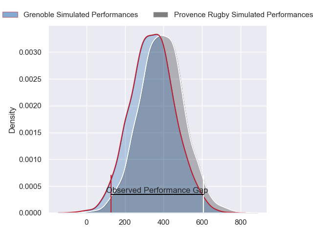
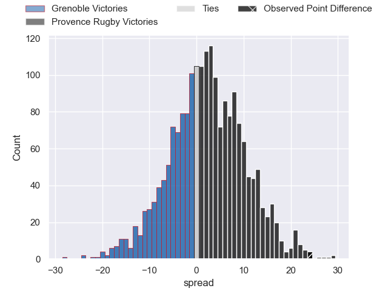
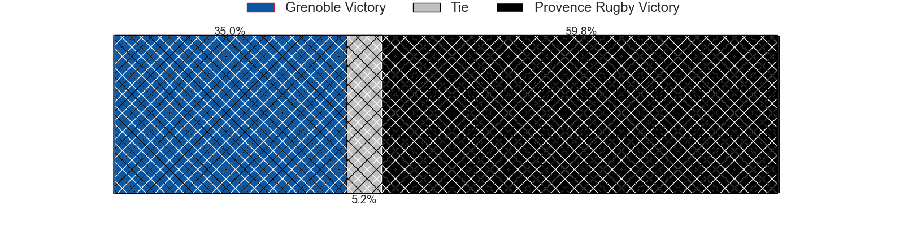

---  
layout: page  
title: Grenoble at Provence Rugby; 20-44  
date: 2024-05-17 18:00:00 -0500  
categories: "Pro D2 2023" match review  
---
# Grenoble at Provence Rugby; 20-44

# Club Level Predictions

The first set of predictions treats a club as the smallest object, as the club develops its members, organizes a gameplan, and deploys its players as needed for each match. This club model has a prediction of 0.608, which translates to predicting Provence Rugby to win by 3.8.

Our Over/Under is 60.5 - and combined with the spread above, we have a predicted scoreline of 28 to 32

Each club has a rating and a rating deviation (similar to a Glicko rating), and expected performances can be generated. This allows for simulated matches and spreads like the ones below.
## Projected Performances - Club Model

## Projected Spreads - Club Model

## Projected Results - Club Model

# Player Level Predictions

Treating teams instead as an entity made up of the currently active players, I have ratings for each player in an altogether different system. These can be combined to form team ratings once teamsheets are announced, weighting starters a bit higher than the reserves. After the match is played, players can be weighted by their minutes on the field, allowing for an accurate measure of the team's composition. With these compiled team ratings, we can make predictions, measure inaccuracy, and update the individual player ratings.
## Prediction without Player Minutes: Provence Rugby by 3.4

Grenoble by 2.4 on a neutral pitch

## Projected Performances - Player Model

## Projected Spreads - Player Model

## Projected Results - Player Model

|   Away Minutes | Away Player         |   Away Percentile |   Number |   Home Percentile | Home Player           |   Home Minutes |
|---------------:|:--------------------|------------------:|---------:|------------------:|:----------------------|---------------:|
|             51 | Luka Goginava       |             65.09 |        1 |             91.03 | Julius Nostadt        |             58 |
|             51 | Mathis Sarragallet  |             47.87 |        2 |             94.1  | Lucas Martin          |             53 |
|             51 | Irakli Aptsiauri    |             85.81 |        3 |             99.84 | Tomas Francis         |             58 |
|             80 | Pierce Phillips     |             75.56 |        4 |             91.68 | Jérôme Dufour         |             80 |
|             39 | Brandon Nansen      |             43    |        5 |             84.58 | Josh Tyrell           |             53 |
|             56 | Jose Madeira        |             88.78 |        6 |             87.2  | Guillaume Piazzoli    |             80 |
|             80 | Steeve Blanc-Mappaz |             81    |        7 |             82.68 | Charly Gambini        |             80 |
|             80 | Thibaut Martel      |             57.95 |        8 |             84.1  | Teimana Harrison      |             53 |
|             59 | Eric Escande        |             92.32 |        9 |             42.58 | Simon Tarel           |             56 |
|             71 | Max Clement         |             69.21 |       10 |             91.72 | Jimmy Gopperth        |             58 |
|             80 | Erwan Dridi         |             75    |       11 |             80.29 | Léo Drouet            |             80 |
|             80 | Bautista Ezcurra    |             96.96 |       12 |             93.82 | Kaveinga Finau        |             80 |
|             80 | Romain Trouilloud   |             77.15 |       13 |             50.21 | Eto Bainivalu         |             53 |
|             80 | Geoffrey Cros       |             71.25 |       14 |             51.06 | Adrien Lapegue-Lafaye |             80 |
|             37 | Julien Farnoux      |             97.44 |       15 |             73.5  | Mathias Colombet      |             80 |
|             43 | Romain Fusier       |             56.71 |       16 |             50.33 | Jean Charles Orioli   |             27 |
|             41 | Thomas Lainault     |             67.44 |       17 |             51.32 | Malohi Suta           |             27 |
|             29 | Zack Gauthier       |             83.28 |       18 |             67.19 | Atila Septar          |             27 |
|             29 | Barnabé Massa       |             85.57 |       19 |            nan    | Jeremie Martin        |             24 |
|             29 | Regis Montagne      |             87.28 |       20 |             90.66 | Enzo Selponi          |             22 |
|             24 | Pio Muarua          |             76.15 |       21 |             48.45 | Nicolas Toth          |             22 |
|             21 | Barnabe Couilloud   |             10.65 |       22 |             81.24 | Paul Mallez           |             22 |
|              9 | Sam Davies          |             88.75 |       23 |             57.11 | Carl Axtens           |             27 |

