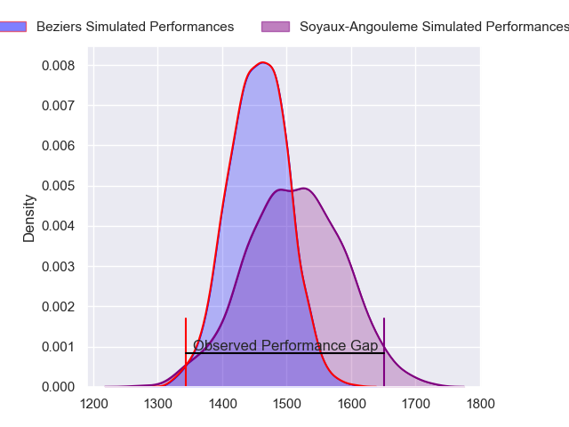
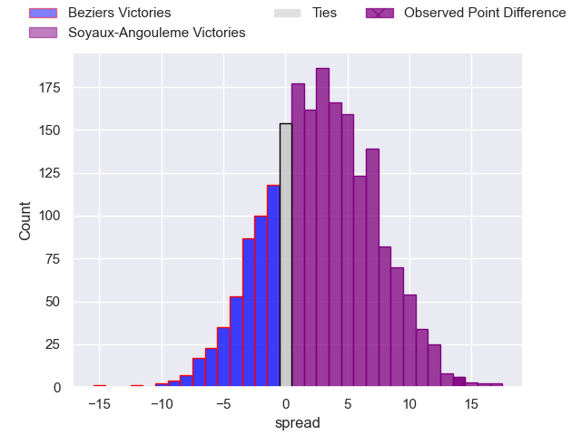
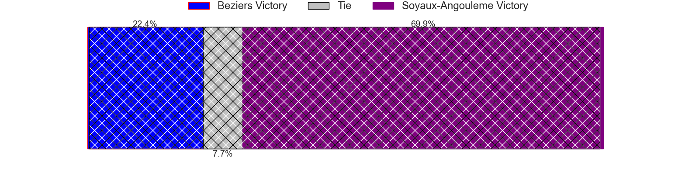
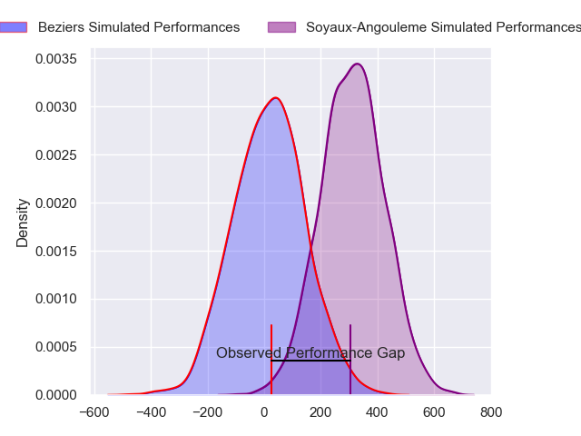
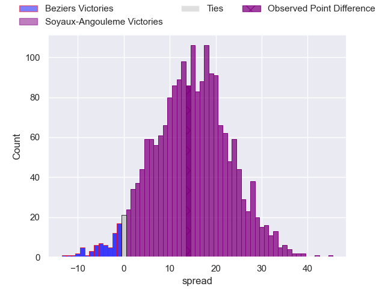
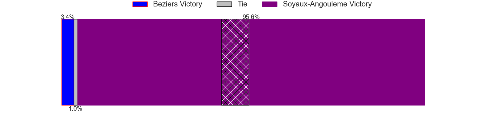

---  
layout: page  
title: Beziers at Soyaux-Angouleme; 16-30  
date: 2024-05-17 18:00:00 -0500  
categories: "Pro D2 2023" match review  
---
# Beziers at Soyaux-Angouleme; 16-30

# Club Level Predictions

The first set of predictions treats a club as the smallest object, as the club develops its members, organizes a gameplan, and deploys its players as needed for each match. This club model has a prediction of 0.578, which translates to predicting Soyaux-Angouleme to win by 2.8.

Our Over/Under is 46.5 - and combined with the spread above, we have a predicted scoreline of 22 to 25

Each club has a rating and a rating deviation (similar to a Glicko rating), and expected performances can be generated. This allows for simulated matches and spreads like the ones below.
## Projected Performances - Club Model

## Projected Spreads - Club Model

## Projected Results - Club Model

# Player Level Predictions

Treating teams instead as an entity made up of the currently active players, I have ratings for each player in an altogether different system. These can be combined to form team ratings once teamsheets are announced, weighting starters a bit higher than the reserves. After the match is played, players can be weighted by their minutes on the field, allowing for an accurate measure of the team's composition. With these compiled team ratings, we can make predictions, measure inaccuracy, and update the individual player ratings.
## Prediction without Player Minutes: Soyaux-Angouleme by 14.9

Soyaux-Angouleme by 10.8 on a neutral pitch

## Projected Performances - Player Model

## Projected Spreads - Player Model

## Projected Results - Player Model

|   Away Minutes | Away Player        |   Away Percentile |   Number |   Home Percentile | Home Player        |   Home Minutes |
|---------------:|:-------------------|------------------:|---------:|------------------:|:-------------------|---------------:|
|             52 | Youssef Amrouni    |             34.39 |        1 |             22.09 | Khatchik Vartanov  |             47 |
|             80 | Yanis Boulassel    |             18.36 |        2 |             83.11 | Rayne Barka        |             52 |
|             52 | Luka Tchelidze     |             64.87 |        3 |             34.47 | Yassine Boutemane  |             52 |
|             80 | Gillian Benoy      |              6.38 |        4 |             62.82 | Maxence Lemardelet |             80 |
|             52 | Pierre Gayraud     |             11.45 |        5 |             88.96 | Sikeli Nabou       |             58 |
|             80 | William van Bost   |             24.51 |        6 |              7.48 | Gautier Gibouin    |             80 |
|             52 | Joaquim Selma      |             26.67 |        7 |             90.35 | Nicolas Martins    |             62 |
|             54 | Thomas Hoarau      |             16.95 |        8 |             65.9  | Alexander Masibaka |             52 |
|             80 | Mitch Short        |             32.29 |        9 |              6.98 | Adrien Bau         |             58 |
|             80 | Victor Dreuille    |             12.74 |       10 |             86.41 | Ben Botica         |             80 |
|             80 | Nicolas Plazy      |             76.35 |       11 |             63.46 | Marvin Lestremau   |             80 |
|             80 | Maxime Vacquier    |             34.73 |       12 |             90.66 | George Tilsley     |             80 |
|             26 | Maxime Espeut      |             47.32 |       13 |             90.03 | Ledua Mau          |             80 |
|             80 | Pierre Courtaud    |             16.35 |       14 |             71.06 | Jules Dubecq       |             62 |
|             80 | Harry Glynn        |             25.21 |       15 |             69.87 | Pierre Lafitte     |             80 |
|             54 | Maxime Mazzella    |             31.54 |       16 |             96.66 | Sami Zouhair       |             33 |
|             28 | Giorgi Akhaladze   |             19.89 |       17 |             10    | Motu Matu'u        |             28 |
|             28 | Hans N'kinsi       |              4.86 |       18 |             23.2  | Ian Kitwanga       |             28 |
|             28 | Clement Ancely     |             75.2  |       19 |             16.54 | Seydou Diakité     |             28 |
|             28 | Jon Zabala Arrieta |             72.78 |       20 |             42.23 | Manu Saubusse      |             22 |
|             26 | Antoine Payrastre  |            nan    |       21 |              4.05 | Matthew Dalton     |             22 |
|            nan | nan                |            nan    |       22 |             69.81 | Enzo Morand-Bruyat |             18 |
|            nan | nan                |            nan    |       23 |             51.38 | Rémi Brosset       |             18 |

