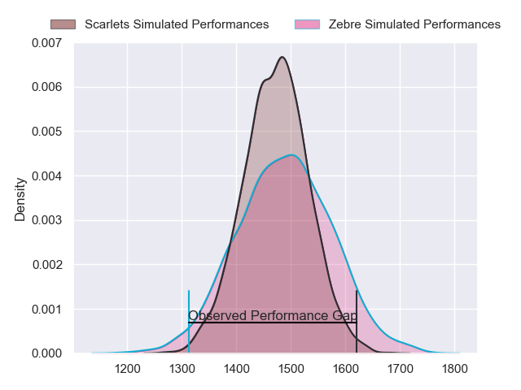
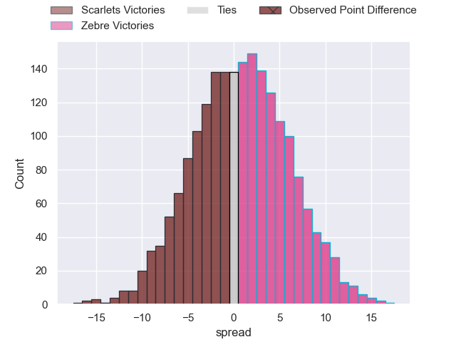
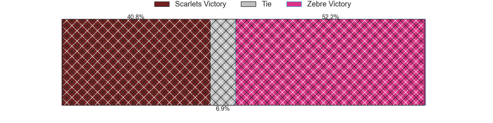
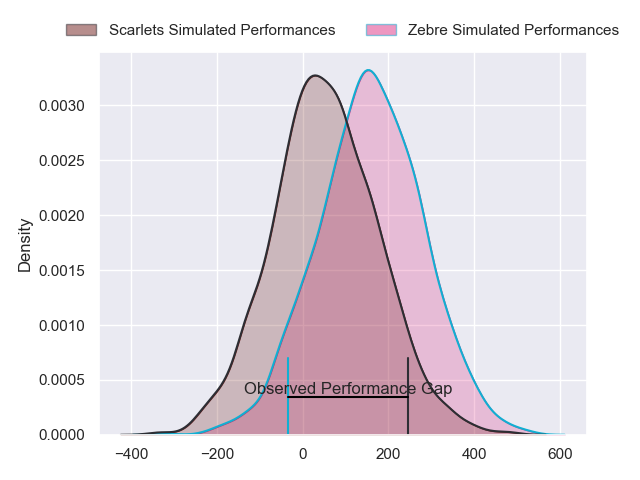
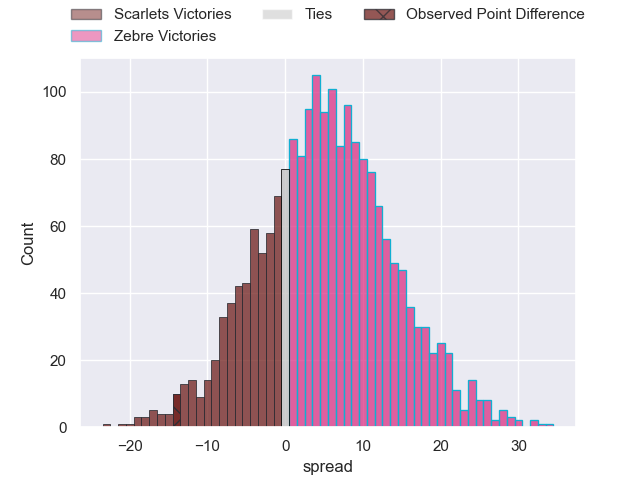
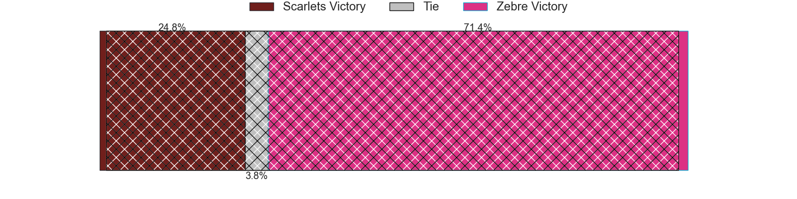

---  
layout: page  
title: Scarlets at Zebre; 32-18  
date: 2024-05-17 18:00:00 -0500  
categories: "United Rugby Championship 2023" match review  
---
# Scarlets at Zebre; 32-18

# Club Level Predictions

The first set of predictions treats a club as the smallest object, as the club develops its members, organizes a gameplan, and deploys its players as needed for each match. This club model has a prediction of 0.52, which translates to predicting Zebre to win by 0.7.

Our Over/Under is 39.5 - and combined with the spread above, we have a predicted scoreline of 20 to 20

Each club has a rating and a rating deviation (similar to a Glicko rating), and expected performances can be generated. This allows for simulated matches and spreads like the ones below.
## Projected Performances - Club Model

## Projected Spreads - Club Model

## Projected Results - Club Model

# Player Level Predictions

Treating teams instead as an entity made up of the currently active players, I have ratings for each player in an altogether different system. These can be combined to form team ratings once teamsheets are announced, weighting starters a bit higher than the reserves. After the match is played, players can be weighted by their minutes on the field, allowing for an accurate measure of the team's composition. With these compiled team ratings, we can make predictions, measure inaccuracy, and update the individual player ratings.
## Prediction without Player Minutes: Zebre by 7.4

Zebre by 3.0 on a neutral pitch

## Projected Performances - Player Model

## Projected Spreads - Player Model

## Projected Results - Player Model

|   Away Minutes | Away Player      |   Away Percentile |   Number |   Home Percentile | Home Player            |   Home Minutes |
|---------------:|:-----------------|------------------:|---------:|------------------:|:-----------------------|---------------:|
|             59 | Kemsley Mathias  |             73.11 |        1 |             49.71 | Danilo Fischetti       |             69 |
|             69 | Ryan Elias       |             93.77 |        2 |             15.08 | Giampietro Ribaldi     |             69 |
|             53 | Harri O'Connor   |              9.13 |        3 |             15.73 | Muhamed Hasa           |             62 |
|             80 | Alex Craig       |             23.71 |        4 |              1.62 | Leonard Krumov         |             80 |
|             80 | Morgan Jones     |              4.66 |        5 |             22.09 | Andrea Zambonin        |             69 |
|             78 | Taine Plumtree   |             76.77 |        6 |             27.56 | Giacomo Ferrari        |             80 |
|             80 | Dan Davis        |             76.97 |        7 |             30.02 | Davide Ruggeri         |             80 |
|             59 | Carwyn Tuipulotu |             49.58 |        8 |             17.57 | Giovanni Licata        |             59 |
|             54 | Gareth Davies    |             45.55 |        9 |             22.69 | Gonzalo Garcia         |             62 |
|             54 | Ioan Lloyd       |              5.73 |       10 |             21.66 | Giovanni Montemauri    |             80 |
|             80 | Ryan Conbeer     |             20.48 |       11 |             19.62 | Lorenzo Pani           |             80 |
|             80 | Eddie James      |             35.36 |       12 |             65.69 | Enrico Lucchin         |             11 |
|             80 | Johnny Williams  |             81.43 |       13 |             89.09 | Luca Morisi            |             80 |
|             77 | Tomi Lewis       |             86.35 |       14 |              2.5  | Jacopo Trulla          |             80 |
|             80 | Ioan Nicholas    |             10.68 |       15 |             91.03 | Geronimo Prisciantelli |              5 |
|             11 | Shaun Evans      |              4.26 |       16 |            nan    | Tommaso Di Bartolomeo  |             11 |
|             21 | Wyn Jones        |             58.84 |       17 |            nan    | Alessio Sanavia        |             11 |
|             27 | Sam Wainwright   |             15.32 |       18 |             16.87 | Juan Pitinari          |             18 |
|             21 | Jarrod Taylor    |            nan    |       19 |              4.96 | Dave Sisi              |             21 |
|              2 | Ben Williams     |            nan    |       20 |             88.45 | Matteo Canali          |             11 |
|             26 | Kieran Hardy     |             66.84 |       21 |             33.86 | Thomas Dominguez       |             18 |
|             26 | Sam Costelow     |             46.28 |       22 |             68.84 | Fetuli Paea            |             75 |
|              3 | Macs Page        |            nan    |       23 |             34.35 | Bautista Stavile       |             69 |

