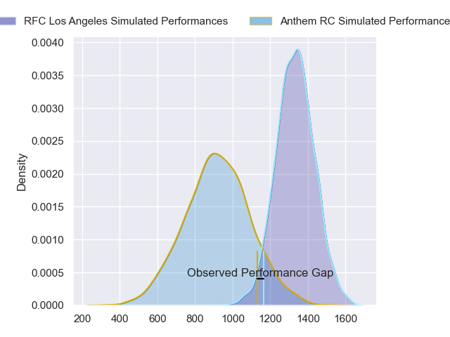
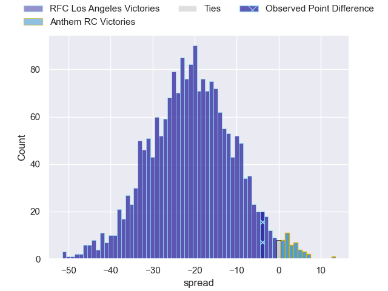
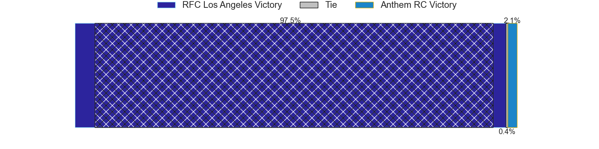
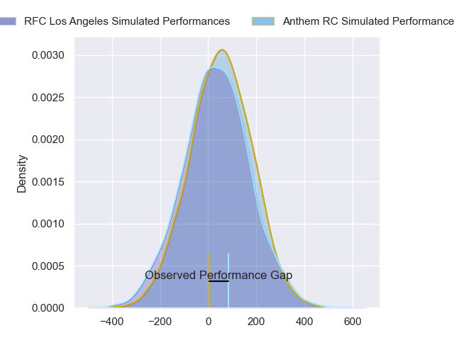
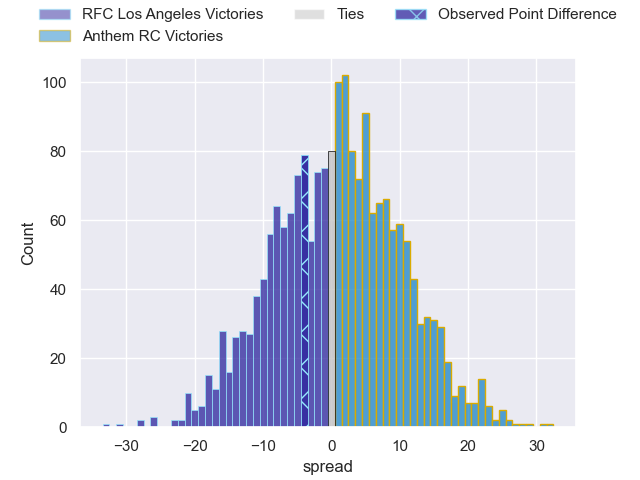

---  
layout: page  
title: RFC Los Angeles at Anthem RC; 33-29  
date: 2024-05-18 18:00:00 -0500  
categories: "Major League Rugby 2024" match review  
---
# RFC Los Angeles at Anthem RC; 33-29

# Club Level Predictions

The first set of predictions treats a club as the smallest object, as the club develops its members, organizes a gameplan, and deploys its players as needed for each match. This club model has a prediction of 0.095, which translates to predicting RFC Los Angeles to win by 20.6.

Our Over/Under is 46.5 - and combined with the spread above, we have a predicted scoreline of 34 to 13

Each club has a rating and a rating deviation (similar to a Glicko rating), and expected performances can be generated. This allows for simulated matches and spreads like the ones below.
## Projected Performances - Club Model

## Projected Spreads - Club Model

## Projected Results - Club Model

# Player Level Predictions

Treating teams instead as an entity made up of the currently active players, I have ratings for each player in an altogether different system. These can be combined to form team ratings once teamsheets are announced, weighting starters a bit higher than the reserves. After the match is played, players can be weighted by their minutes on the field, allowing for an accurate measure of the team's composition. With these compiled team ratings, we can make predictions, measure inaccuracy, and update the individual player ratings.
## Prediction without Player Minutes: Anthem RC by 1.2

RFC Los Angeles by 1.0 on a neutral pitch

## Projected Performances - Player Model

## Projected Spreads - Player Model

## Projected Results - Player Model

|   Away Minutes | Away Player           |   Away Percentile |   Number |   Home Percentile | Home Player           |   Home Minutes |
|---------------:|:----------------------|------------------:|---------:|------------------:|:----------------------|---------------:|
|             80 | Dane Zander           |             58.76 |        1 |             25.75 | Jake Turnbull         |             80 |
|             80 | Ben Strang            |             40.82 |        2 |              4.92 | Connor Robinson       |             80 |
|             80 | Conor Young           |             31.21 |        3 |              5.54 | Joe Apikotoa          |             80 |
|             80 | Reegan O'Gorman       |             39.92 |        4 |             17.53 | Reagan Leslie         |             80 |
|             80 | Theo Vukasinovic      |             53.09 |        5 |             13.48 | Lucas Gramlick        |             80 |
|             80 | Michael Amiras        |             37.7  |        6 |              9.35 | Shneil Singh          |             80 |
|             80 | Matt Heaton           |             43.5  |        7 |             13.29 | Albert O'Shannessey   |             80 |
|             80 | Jason Damm            |             29.92 |        8 |             24.69 | Michael Ma'Afu        |             80 |
|             80 | Niall Saunders        |             50.79 |        9 |             23.21 | Siaosi Nai            |             80 |
|             80 | Jordan Chait          |             48.41 |       10 |             17.41 | Cliven Loubser        |             80 |
|             80 | Jack Shaw             |             43.56 |       11 |              8.94 | Te Rangatira Waitokia |             80 |
|             80 | James Stokes          |             49.42 |       12 |              7.03 | Junior Gafa           |             80 |
|             80 | Seth Purdey           |             36.31 |       13 |             34.84 | Mateo Gadsden         |             80 |
|             80 | Brooklyn Hardaker     |             21.73 |       14 |             10.96 | Cael Hodgson          |             80 |
|             80 | Andrew Coe            |             74.36 |       15 |             11.97 | Tomasi Alosio         |             80 |
|              0 | Bruce Kauika-Petersen |             46.07 |       16 |            nan    | Jack Manzo            |              0 |
|              0 | Wilton Rebolo         |              8.15 |       17 |            nan    | Ivan Pula             |              0 |
|              0 | Sam Buckley           |            nan    |       18 |            nan    | Mika Felix            |              0 |
|              0 | Max Katjijeko         |             45.57 |       19 |            nan    | Logan Weidner         |              0 |
|              0 | Semi Kunatani         |             19.46 |       20 |            nan    | Sione Latu            |              0 |
|              0 | Tas Smith             |             27.92 |       21 |            nan    | Sean Yacoubian        |              0 |
|              0 | Matt Anticev          |             16.77 |       22 |            nan    | Sebastian Zaridze     |              0 |
|              0 | Austin White          |             24.57 |       23 |            nan    | Shane Barry           |              0 |

