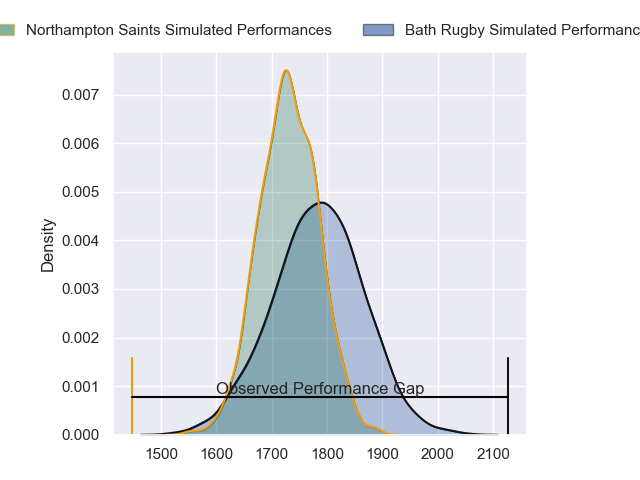
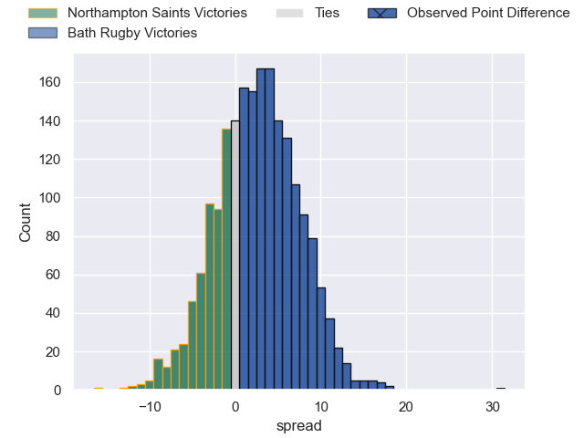
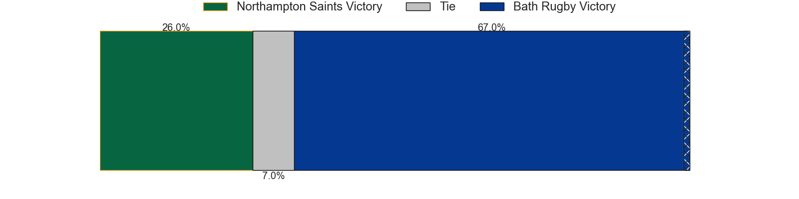
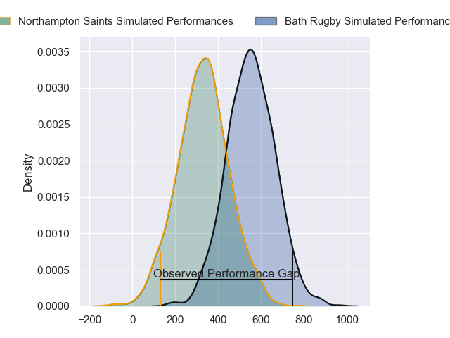
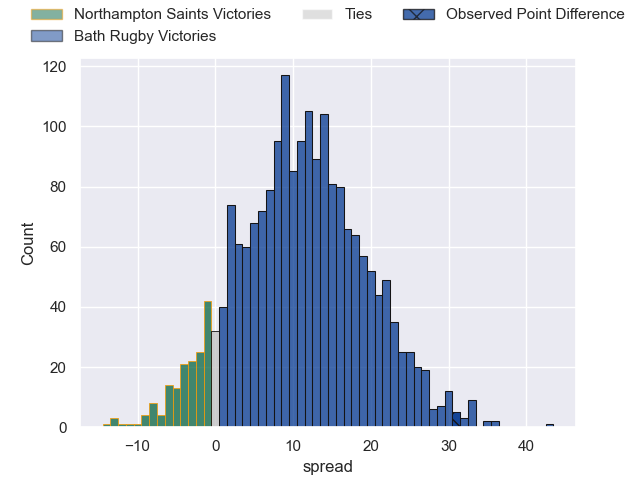
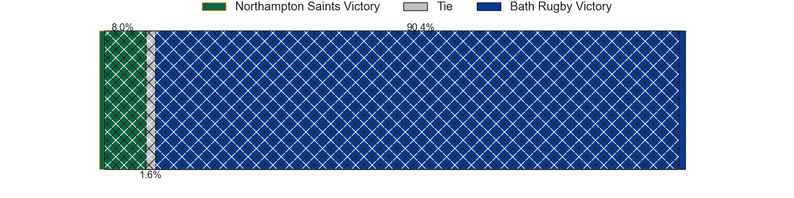

---  
layout: page  
title: Northampton Saints at Bath Rugby; 12-43  
date: 2024-05-18 18:00:00 -0500  
categories: "Gallagher Premiership 2023" match review  
---
# Northampton Saints at Bath Rugby; 12-43

# Club Level Predictions

The first set of predictions treats a club as the smallest object, as the club develops its members, organizes a gameplan, and deploys its players as needed for each match. This club model has a prediction of 0.571, which translates to predicting Bath Rugby to win by 2.5.

Our Over/Under is 52.5 - and combined with the spread above, we have a predicted scoreline of 25 to 28

Each club has a rating and a rating deviation (similar to a Glicko rating), and expected performances can be generated. This allows for simulated matches and spreads like the ones below.
## Projected Performances - Club Model

## Projected Spreads - Club Model

## Projected Results - Club Model

# Player Level Predictions

Treating teams instead as an entity made up of the currently active players, I have ratings for each player in an altogether different system. These can be combined to form team ratings once teamsheets are announced, weighting starters a bit higher than the reserves. After the match is played, players can be weighted by their minutes on the field, allowing for an accurate measure of the team's composition. With these compiled team ratings, we can make predictions, measure inaccuracy, and update the individual player ratings.
## Prediction without Player Minutes: Bath Rugby by 14.0

Bath Rugby by 6.0 on a neutral pitch

## Projected Performances - Player Model

## Projected Spreads - Player Model

## Projected Results - Player Model

|   Away Minutes | Away Player         |   Away Percentile |   Number |   Home Percentile | Home Player     |   Home Minutes |
|---------------:|:--------------------|------------------:|---------:|------------------:|:----------------|---------------:|
|             51 | Emmanuel Iyogun     |             49.27 |        1 |             91.19 | Beno Obano      |             57 |
|             51 | Sam Matavesi        |             84.43 |        2 |             98.03 | Tom Dunn        |             57 |
|             51 | Elliot Millar-Mills |             74.23 |        3 |             95.84 | Thomas du Toit  |             57 |
|             51 | Temo Mayanavanua    |             91.08 |        4 |             94.62 | Quinn Roux      |             57 |
|             80 | Tom Lockett         |             38.84 |        5 |             71.81 | Charlie Ewels   |             80 |
|             80 | Angus Scott-Young   |             62.2  |        6 |             87.99 | Ted Hill        |             80 |
|             55 | Lewis Ludlam        |             66.54 |        7 |             92.32 | Sam Underhill   |             66 |
|             80 | Sam Graham          |             98.33 |        8 |             18.83 | Josh Bayliss    |             61 |
|             55 | Tom James           |             24.08 |        9 |             83.42 | Ben Spencer     |             63 |
|             80 | Rory Hutchinson     |             83.86 |       10 |             99.58 | Finn Russell    |             59 |
|             63 | Ollie Sleightholme  |             95.19 |       11 |             19.04 | Will Muir       |             80 |
|             55 | Burger Odendaal     |             86.16 |       12 |             53.67 | Cameron Redpath |             80 |
|             80 | Tom Litchfield      |             55.97 |       13 |             85.74 | Ollie Lawrence  |             80 |
|             80 | Tom Seabrook        |              9.04 |       14 |             94.23 | Joe Cokanasiga  |             80 |
|             80 | James Ramm          |             75.43 |       15 |             97.22 | Matt Gallagher  |             80 |
|             29 | Robbie Smith        |            nan    |       16 |             58.03 | Niall Annett    |             23 |
|             29 | Tarek Haffar        |            nan    |       17 |             55.06 | Juan Schoeman   |             23 |
|             29 | Paul Hill           |             98.53 |       18 |             35.32 | Will Stuart     |             23 |
|             29 | Chunya Munga        |             83.47 |       19 |             87.83 | Elliott Stooke  |             23 |
|             25 | Tom Pearson         |             97.83 |       20 |             75.1  | Alfie Barbeary  |             19 |
|             25 | Archie McParland    |             51.13 |       21 |             77.66 | Louis Schreuder |             17 |
|             17 | Charlie Savala      |             34.39 |       22 |             40.13 | Orlando Bailey  |             21 |
|             25 | Toby Thame          |            nan    |       23 |             97.24 | Miles Reid      |             14 |

