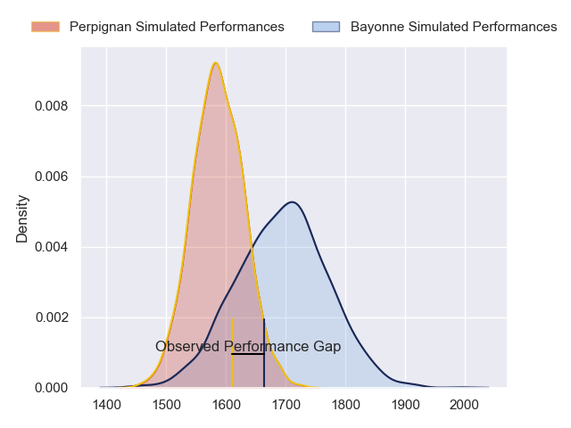
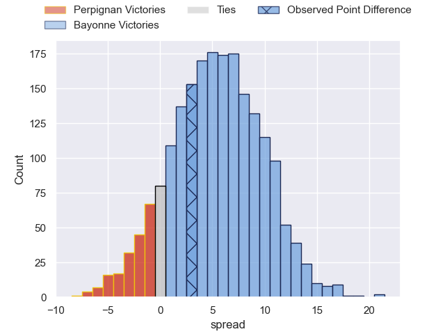
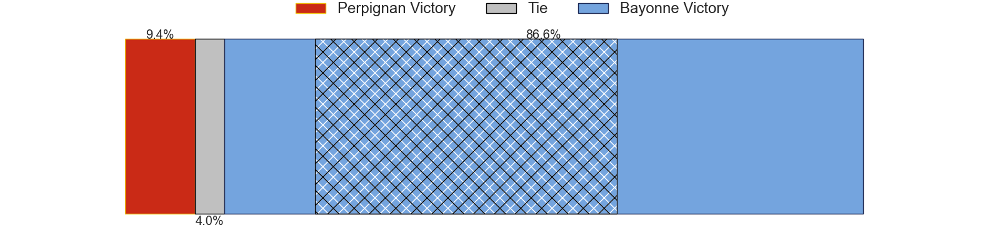
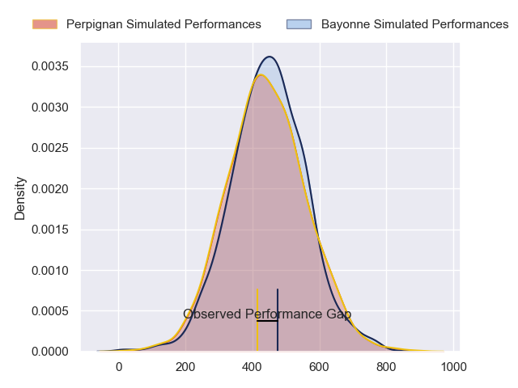
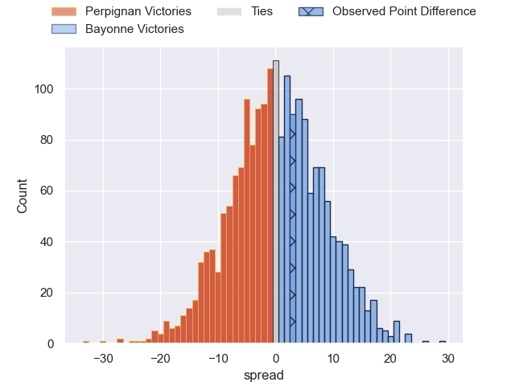

---  
layout: page  
title: Perpignan at Bayonne; 20-23  
date: 2024-05-18 18:00:00 -0500  
categories: "Top 14 Orange 2023" match review  
---
# Perpignan at Bayonne; 20-23

# Club Level Predictions

The first set of predictions treats a club as the smallest object, as the club develops its members, organizes a gameplan, and deploys its players as needed for each match. This club model has a prediction of 0.649, which translates to predicting Bayonne to win by 5.4.

Our Over/Under is 45.5 - and combined with the spread above, we have a predicted scoreline of 20 to 25

Each club has a rating and a rating deviation (similar to a Glicko rating), and expected performances can be generated. This allows for simulated matches and spreads like the ones below.
## Projected Performances - Club Model

## Projected Spreads - Club Model

## Projected Results - Club Model

# Player Level Predictions

Treating teams instead as an entity made up of the currently active players, I have ratings for each player in an altogether different system. These can be combined to form team ratings once teamsheets are announced, weighting starters a bit higher than the reserves. After the match is played, players can be weighted by their minutes on the field, allowing for an accurate measure of the team's composition. With these compiled team ratings, we can make predictions, measure inaccuracy, and update the individual player ratings.
## Prediction without Player Minutes: Bayonne by 1.0

Perpignan by 7.2 on a neutral pitch

## Projected Performances - Player Model

## Projected Spreads - Player Model

## Projected Results - Player Model

|   Away Minutes | Away Player           |   Away Percentile |   Number |   Home Percentile | Home Player           |   Home Minutes |
|---------------:|:----------------------|------------------:|---------:|------------------:|:----------------------|---------------:|
|             53 | Sacha Lotrian         |             57.46 |        1 |             62.59 | Matis Perchaud        |             50 |
|             60 | Ignacio Ruiz          |             88.69 |        2 |             96.23 | Facundo Bosch         |             72 |
|             60 | Pietro Ceccarelli     |             73.27 |        3 |             83.62 | Luke Tagi             |             58 |
|             58 | Marvin Orie           |             92.2  |        4 |             84.09 | Thomas Ceyte          |             75 |
|             63 | Posolo Tuilagi        |             21.58 |        5 |             66.06 | Lucas Paulos          |             63 |
|             30 | Jacobus van Tonder    |             85.73 |        6 |             55.31 | Pierre Huguet         |              6 |
|             80 | Kelian Galletier      |             41.93 |        7 |             89.27 | Baptiste Heguy        |             80 |
|             58 | So'otala Fa'aso'o     |             93.31 |        8 |             93.51 | Remi Bourdeau         |             66 |
|             66 | Tom Ecochard          |             88.13 |        9 |             94.76 | Maxime Machenaud      |             68 |
|             80 | Jake McIntyre         |             92.36 |       10 |             94.69 | Camille Lopez         |             80 |
|             80 | Mathieu Acebes        |             93.85 |       11 |             90.77 | Remy Baget            |             50 |
|             80 | Jeronimo de la Fuente |             99.58 |       12 |             19.62 | Guillaume Martocq     |             75 |
|             50 | Apisai Naqalevu       |             51.52 |       13 |             88.88 | Reece Hodge           |             80 |
|             80 | Tavite Veredamu       |             81.92 |       14 |             59.81 | Arnaud Erbinartegaray |             73 |
|             80 | Tommaso Allan         |             70.51 |       15 |             14.1  | Cheikh Tiberghien     |             80 |
|             20 | Seilala Lam           |             89.34 |       16 |             12.46 | Vincent Giudicelli    |             22 |
|             27 | Xavier Chiocci        |             68.22 |       17 |             54.85 | Swan Cormenier        |             30 |
|             39 | Mathieu Tanguy        |             67.68 |       18 |             89.06 | Arthur Iturria        |             74 |
|             50 | Lucas Bachelier       |             74.8  |       19 |             97.47 | Denis Marchois        |             22 |
|             22 | Lucas Velarte         |             11.09 |       20 |             58.12 | Gela Aprasidze        |             12 |
|             30 | Alivereti Duguivalu   |             21.41 |       21 |             16.88 | Tom Spring            |             30 |
|             14 | Matteo Rodor          |             10.62 |       22 |             80.59 | Sireli Maqala         |             12 |
|             20 | Arthur Joly           |             98.21 |       23 |             26.32 | Tevita Tatafu         |             22 |

