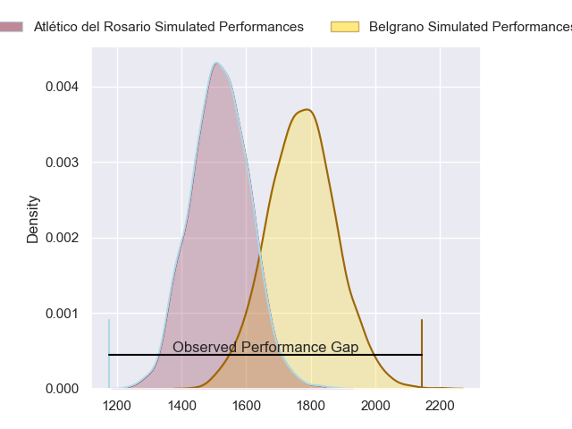
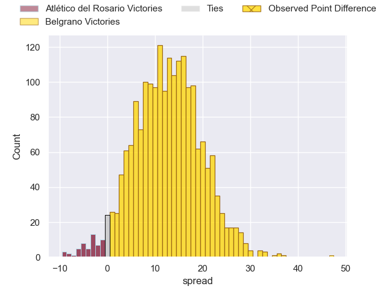
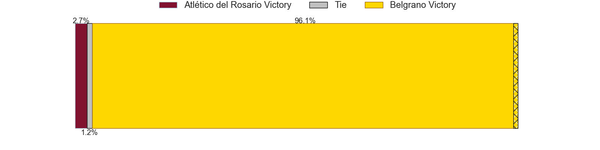
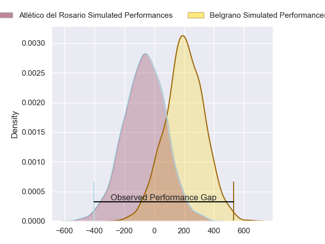
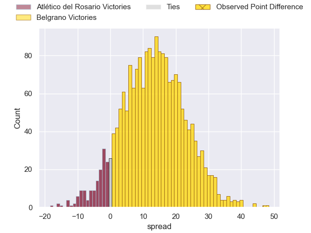
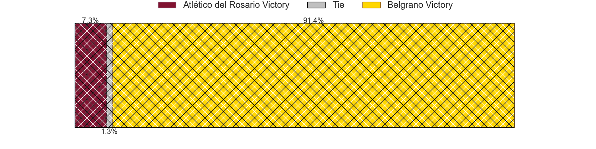

---  
layout: page  
title: Atletico del Rosario at Belgrano; 22-69  
date: 2024-05-18 18:00:00 -0500  
categories: "URBA Top 12 2024" match review  
---
# Atletico del Rosario at Belgrano; 22-69

# Club Level Predictions

The first set of predictions treats a club as the smallest object, as the club develops its members, organizes a gameplan, and deploys its players as needed for each match. This club model has a prediction of 0.803, which translates to predicting Belgrano to win by 12.7.

Our Over/Under is 49.5 - and combined with the spread above, we have a predicted scoreline of 18 to 31

Each club has a rating and a rating deviation (similar to a Glicko rating), and expected performances can be generated. This allows for simulated matches and spreads like the ones below.
## Projected Performances - Club Model

## Projected Spreads - Club Model

## Projected Results - Club Model

# Player Level Predictions

Treating teams instead as an entity made up of the currently active players, I have ratings for each player in an altogether different system. These can be combined to form team ratings once teamsheets are announced, weighting starters a bit higher than the reserves. After the match is played, players can be weighted by their minutes on the field, allowing for an accurate measure of the team's composition. With these compiled team ratings, we can make predictions, measure inaccuracy, and update the individual player ratings.
## Prediction without Player Minutes: Belgrano by 12.5

Belgrano by 8.5 on a neutral pitch

## Projected Performances - Player Model

## Projected Spreads - Player Model

## Projected Results - Player Model

|   Away Minutes | Away Player                 |   Away Percentile |   Number |   Home Percentile | Home Player            |   Home Minutes |
|---------------:|:----------------------------|------------------:|---------:|------------------:|:-----------------------|---------------:|
|             80 | Agustin Fernandez           |              7.1  |        1 |             80.75 | Francisco Ferronato    |             80 |
|             80 | Jeremias Aime               |              5.57 |        2 |             81.48 | Francisco Lusarreta    |             80 |
|             80 | Bruno Montenegro            |             30.42 |        3 |             78.79 | Lisandro Garcia Dragui |             80 |
|             80 | Matias Kremer               |              9.13 |        4 |             80.93 | Luciano Tecca          |             80 |
|             80 | Octavio Capella             |              8.82 |        5 |             67.95 | Mikael Quesada         |             80 |
|             80 | Santiago Casals             |              6.5  |        6 |             76.57 | Joaquin de la Serna    |             80 |
|             80 | Jose Caseres                |             29.63 |        7 |             63.09 | Augusto Vaccarino      |             80 |
|             80 | Lucas Malanos               |              8.79 |        8 |             72.8  | Franco Vega            |             80 |
|             80 | Martin Del Pazo             |             36.65 |        9 |             58.99 | Ignacio Marino         |             80 |
|             80 | Pedro de Aro                |              6.37 |       10 |             52.44 | Juan Aparicio          |             80 |
|             80 | Facundo Gerosa              |             15.29 |       11 |             75.67 | Ignacio Diaz           |             80 |
|             80 | Guido Vidalle               |              8.39 |       12 |             72.48 | Ramon Arana            |             80 |
|             80 | Valentino Aime              |             12.26 |       13 |             72.48 | Tomas Etchepare        |             80 |
|             80 | Nicolas Cripovich           |             32.5  |       14 |             66.44 | Tobias Bernabe         |             80 |
|             80 | Pedro Bisio                 |              5.98 |       15 |             70.73 | Juan Lando             |             80 |
|              0 | Matias Malanos              |            nan    |       16 |            nan    | Jose Saporitti         |              0 |
|              0 | Roberto Almeira             |            nan    |       17 |            nan    | Justo Duranona         |              0 |
|              0 | Jose Carro                  |            nan    |       18 |            nan    | Mateo Gasparotti       |              0 |
|              0 | Ignacio Sapino              |            nan    |       19 |            nan    | Valentin Chiodi        |              0 |
|              0 | Jose Ignacio Ferrer         |            nan    |       20 |            nan    | Octavio Carroll        |              0 |
|              0 | Felipe Paloma               |            nan    |       21 |            nan    | Francisco Gradin       |              0 |
|              0 | Ramiro Musio                |            nan    |       22 |             68.76 | Theo Blaksley          |              0 |
|              0 | Maximiliano Nicoli Fiscella |             14.81 |       23 |            nan    | Juan Brescia           |              0 |

