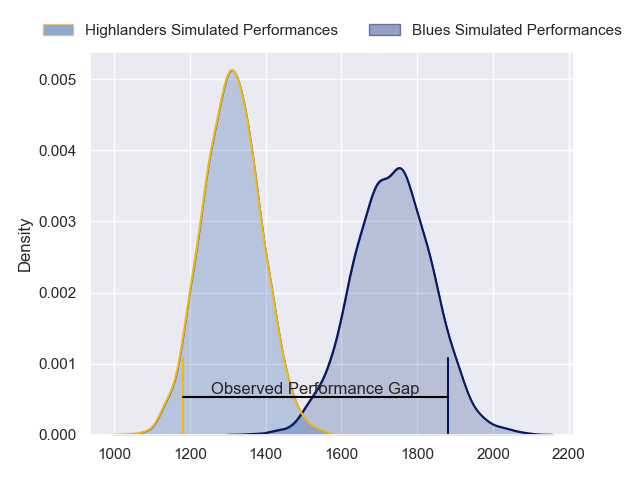
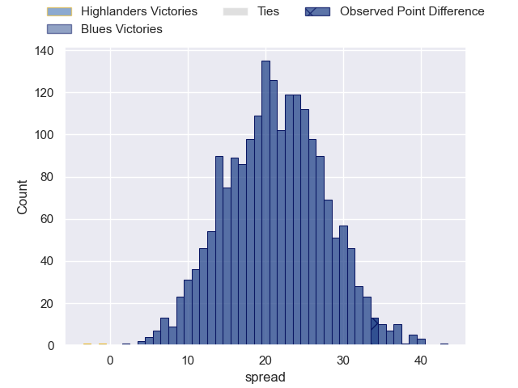
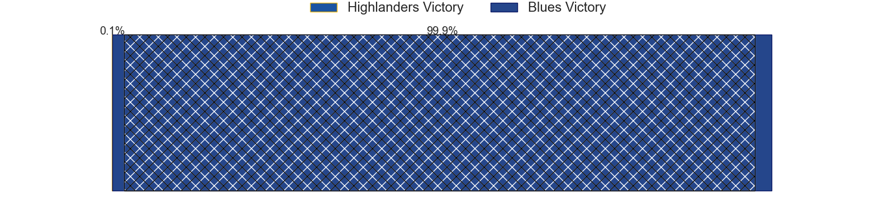
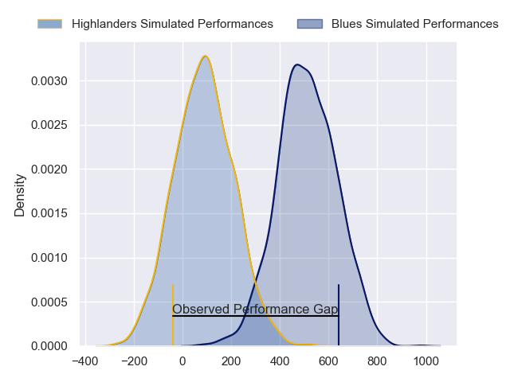
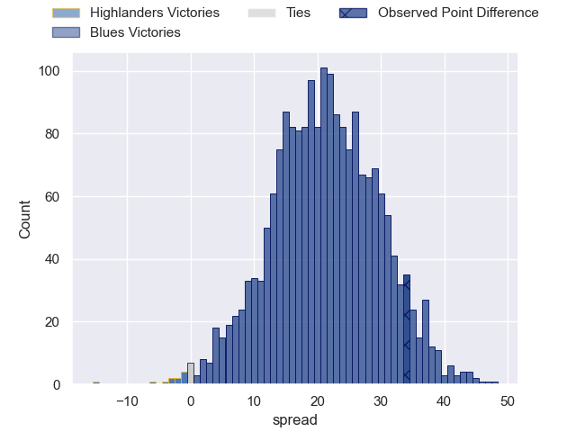
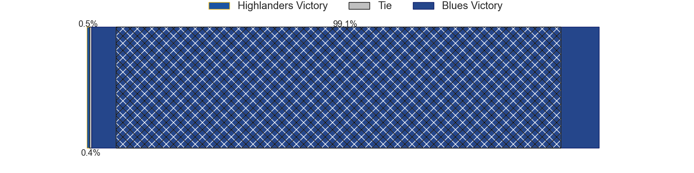

---  
layout: page  
title: Highlanders at Blues; 13-47  
date: 2024-05-18 18:00:00 -0500  
categories: "Super Rugby Pacific 2024" match review  
---
# Highlanders at Blues; 13-47

# Club Level Predictions

The first set of predictions treats a club as the smallest object, as the club develops its members, organizes a gameplan, and deploys its players as needed for each match. This club model has a prediction of 0.915, which translates to predicting Blues to win by 21.3.

Our Over/Under is 59.5 - and combined with the spread above, we have a predicted scoreline of 19 to 40

Each club has a rating and a rating deviation (similar to a Glicko rating), and expected performances can be generated. This allows for simulated matches and spreads like the ones below.
## Projected Performances - Club Model

## Projected Spreads - Club Model

## Projected Results - Club Model

# Player Level Predictions

Treating teams instead as an entity made up of the currently active players, I have ratings for each player in an altogether different system. These can be combined to form team ratings once teamsheets are announced, weighting starters a bit higher than the reserves. After the match is played, players can be weighted by their minutes on the field, allowing for an accurate measure of the team's composition. With these compiled team ratings, we can make predictions, measure inaccuracy, and update the individual player ratings.
## Prediction without Player Minutes: Blues by 23.8

Blues by 19.3 on a neutral pitch

## Projected Performances - Player Model

## Projected Spreads - Player Model

## Projected Results - Player Model

|   Away Minutes | Away Player                   |   Away Percentile |   Number |   Home Percentile | Home Player        |   Home Minutes |
|---------------:|:------------------------------|------------------:|---------:|------------------:|:-------------------|---------------:|
|             55 | Ethan de Groot                |             61.04 |        1 |             99.19 | Ofa Tu'ungafasi    |             66 |
|             49 | Henry Bell                    |             26.39 |        2 |             91.8  | Kurt Eklund        |             65 |
|             49 | Jermaine Ainsley              |             72.37 |        3 |             97.31 | Angus Ta'avao      |             70 |
|             61 | Mitchell Dunshea              |             88.75 |        4 |             96.76 | Laghlan McWhannell |             73 |
|             80 | Fabian Holland                |             75.18 |        5 |             46.61 | Sam Darry          |             75 |
|             80 | Oliver Haig                   |             64.17 |        6 |             69.98 | Adrian Choat       |             80 |
|             80 | Sean Withy                    |             13.98 |        7 |             99.31 | Dalton Papalii     |             80 |
|             49 | Nikora Broughton              |             27.62 |        8 |             96.86 | Akira Ioane        |             62 |
|             55 | Folau Fakatava                |             66.32 |        9 |             82.2  | Sam Nock           |             61 |
|             43 | Cameron Millar                |             69.64 |       10 |             93.21 | Harry Plummer      |             80 |
|             80 | Martin Bogado                 |             71.92 |       11 |             67.31 | Caleb Clarke       |             80 |
|             80 | Jake Te Hiwi                  |             20.88 |       12 |             79.96 | Corey Evans        |             70 |
|             41 | Tanielu Tele'a                |             47.01 |       13 |             79.64 | AJ Lam             |             80 |
|             80 | Timoci Tavatavanawai          |             21.63 |       14 |             48.37 | Kade Banks         |             70 |
|             80 | Jacob Ratumaitavuki-Kneepkens |             95.94 |       15 |             75.64 | Cole Forbes        |             80 |
|             31 | Jack Taylor                   |             51.64 |       16 |             86.72 | Soane Vikena       |             15 |
|             25 | Ayden Johnstone               |             95.03 |       17 |            nan    | Mason Tupaea       |             14 |
|             31 | Saula Ma'u                    |             29.01 |       18 |             87.61 | PJ Sheck           |             10 |
|             19 | Will Tucker                   |             12.26 |       19 |             81.05 | Josh Beehre        |             12 |
|             31 | Will Stodart                  |            nan    |       20 |             67.27 | Cameron Suafoa     |             18 |
|             25 | James Arscott                 |              5.58 |       21 |             29.32 | Taufa Funaki       |             19 |
|             39 | Sam Gilbert                   |             13.85 |       22 |            nan    | Meihana Grindlay   |             10 |
|             37 | Finn Hurley                   |            nan    |       23 |            nan    | Caleb Tangitau     |             10 |

