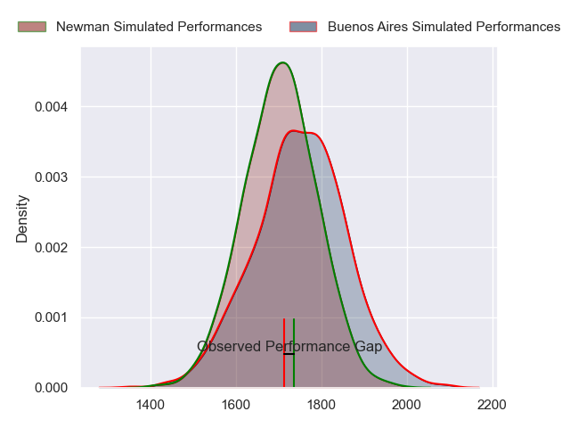
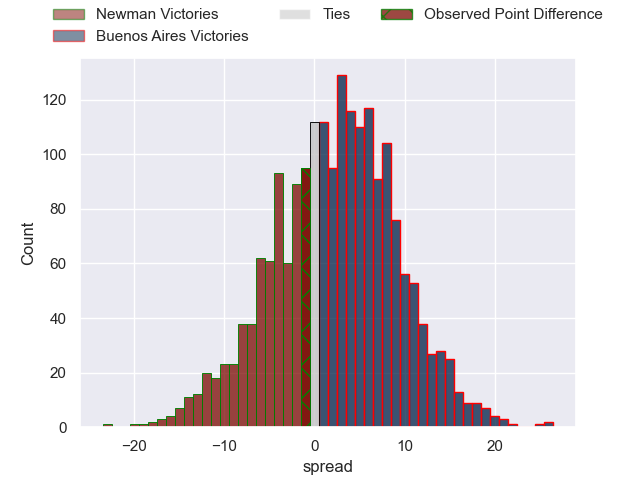
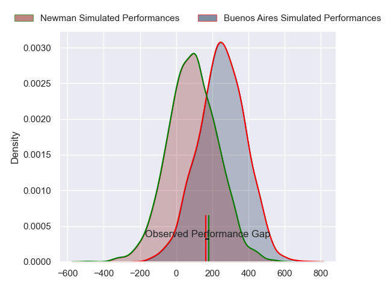
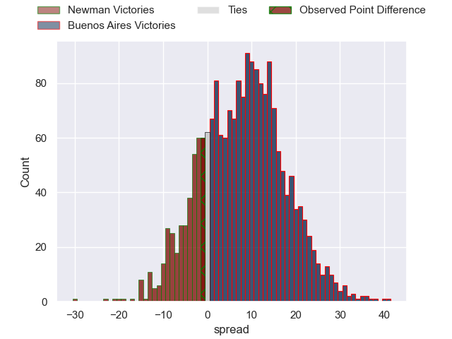

---  
layout: page  
title: Newman at Buenos Aires; 30-29  
date: 2024-05-18 18:00:00 -0500  
categories: "URBA Top 12 2024" match review  
---
# Newman at Buenos Aires; 30-29

# Club Level Predictions

The first set of predictions treats a club as the smallest object, as the club develops its members, organizes a gameplan, and deploys its players as needed for each match. This club model has a prediction of 0.562, which translates to predicting Buenos Aires to win by 2.2.

Our Over/Under is 52.5 - and combined with the spread above, we have a predicted scoreline of 25 to 27

Each club has a rating and a rating deviation (similar to a Glicko rating), and expected performances can be generated. This allows for simulated matches and spreads like the ones below.
## Projected Performances - Club Model

## Projected Spreads - Club Model

## Projected Results - Club Model

# Player Level Predictions

Treating teams instead as an entity made up of the currently active players, I have ratings for each player in an altogether different system. These can be combined to form team ratings once teamsheets are announced, weighting starters a bit higher than the reserves. After the match is played, players can be weighted by their minutes on the field, allowing for an accurate measure of the team's composition. With these compiled team ratings, we can make predictions, measure inaccuracy, and update the individual player ratings.
## Prediction without Player Minutes: Buenos Aires by 7.8

Buenos Aires by 5.0 on a neutral pitch

## Projected Performances - Player Model

## Projected Spreads - Player Model

## Projected Results - Player Model

|   Away Minutes | Away Player               |   Away Percentile |   Number |   Home Percentile | Home Player            |   Home Minutes |
|---------------:|:--------------------------|------------------:|---------:|------------------:|:-----------------------|---------------:|
|             80 | Miguel Prince             |             35.48 |        1 |             31.81 | Tomas Herrador         |             80 |
|             80 | Rodrigo Pueyrredon        |             59.02 |        2 |             66.39 | Tomas Rosasco          |             80 |
|             80 | Bautista Bosch            |             32.14 |        3 |             65.01 | Tomas Gallo            |             80 |
|             80 | Pablo Cardinal            |             69.17 |        4 |             62.17 | Francisco Jose Sluga   |             80 |
|             80 | Alejandro Urtubey         |             55.68 |        5 |             62.58 | Pedro Maria Del Carril |             80 |
|             80 | Mateo Montoya             |             24.9  |        6 |             58.76 | Jordi Dieguez          |             80 |
|             80 | Joaquin de la Vega        |             52.85 |        7 |             56.59 | Matias Espina          |             80 |
|             80 | Rodrigo Diaz de Vivar     |             67.15 |        8 |             43.72 | Tomas Etcheverry       |             80 |
|             80 | Felix Branca              |             53.58 |        9 |             61.78 | Mateo Freire           |             80 |
|             80 | Gonzalo Guiterrez Taboada |             50.32 |       10 |             57.32 | Mateo Capalbo          |             80 |
|             80 | Justo Ortiz Basualdo      |             68.65 |       11 |             60.77 | Tomas Acosta Pimentel  |             80 |
|             80 | Tomas Keena               |             48.01 |       12 |             56.13 | Agustin Lamensa Sanudo |             80 |
|             80 | Benjamin Lanfranco        |             35.74 |       13 |             56.13 | Tobias Diaz Borda      |             80 |
|             80 | Leandro Leivas            |             54.04 |       14 |             59.33 | Alfonso Latorre        |             80 |
|             80 | Santiago Marolda          |             48.29 |       15 |             55.34 | Julian Quetglas Bojar  |             80 |
|              0 | James Wright              |            nan    |       16 |             42.95 | Tomas Ruiz             |              0 |
|              0 | Fermin Perkins            |             63.95 |       17 |             74.63 | Pablo Gaston Vaca      |              0 |
|              0 | Luciano Borio             |             66.72 |       18 |            nan    | Blas Armando Coria     |              0 |
|              0 | Tomas Ureta               |             29.01 |       19 |             44.19 | Lucas Etcheverry       |              0 |
|              0 | Faustino Santarelli       |            nan    |       20 |            nan    | Tomas Alvarez Bayon    |              0 |
|              0 | Pablo Tezanos Pinto       |            nan    |       21 |            nan    | Juan Monasterio        |              0 |
|              0 | Carlos Menendez           |            nan    |       22 |            nan    | Tomas Bunge            |              0 |
|              0 | Silvestre Casa            |             54.51 |       23 |             46.63 | Benjamin Handley       |              0 |

