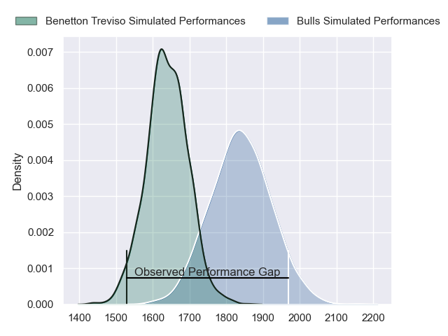
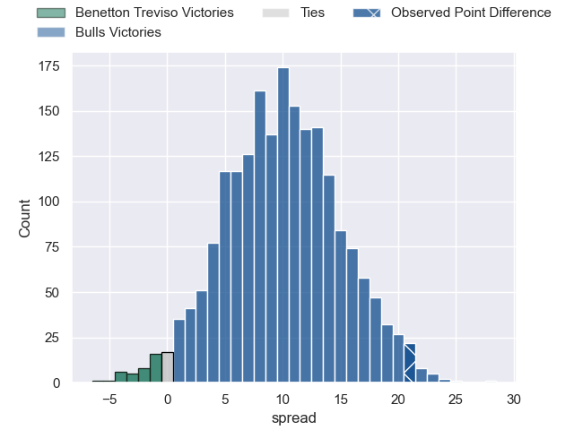
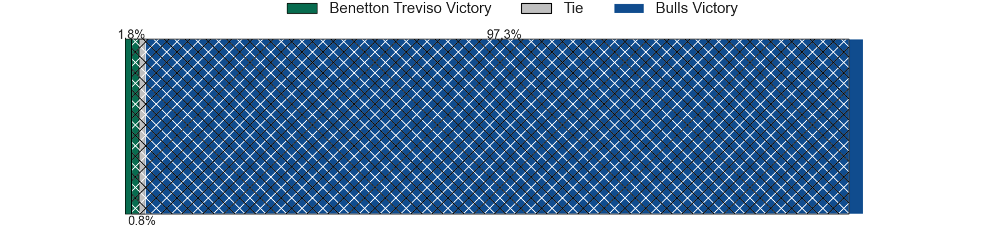
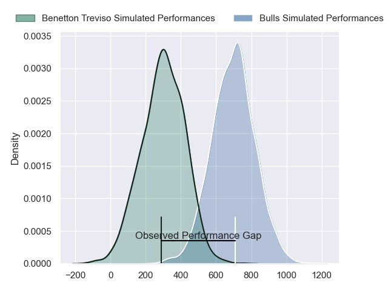
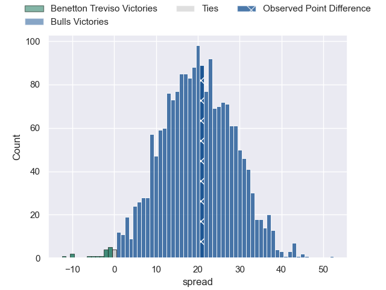

---  
layout: page  
title: Benetton Treviso at Bulls; 35-56  
date: 2024-05-18 18:00:00 -0500  
categories: "United Rugby Championship 2023" match review  
---
# Benetton Treviso at Bulls; 35-56

# Club Level Predictions

The first set of predictions treats a club as the smallest object, as the club develops its members, organizes a gameplan, and deploys its players as needed for each match. This club model has a prediction of 0.757, which translates to predicting Bulls to win by 10.0.

Our Over/Under is 61.5 - and combined with the spread above, we have a predicted scoreline of 26 to 36

Each club has a rating and a rating deviation (similar to a Glicko rating), and expected performances can be generated. This allows for simulated matches and spreads like the ones below.
## Projected Performances - Club Model

## Projected Spreads - Club Model

## Projected Results - Club Model

# Player Level Predictions

Treating teams instead as an entity made up of the currently active players, I have ratings for each player in an altogether different system. These can be combined to form team ratings once teamsheets are announced, weighting starters a bit higher than the reserves. After the match is played, players can be weighted by their minutes on the field, allowing for an accurate measure of the team's composition. With these compiled team ratings, we can make predictions, measure inaccuracy, and update the individual player ratings.
## Prediction without Player Minutes: Bulls by 20.1

Bulls by 15.5 on a neutral pitch

## Projected Performances - Player Model

## Projected Spreads - Player Model

## Projected Results - Player Model

|   Away Minutes | Away Player         |   Away Percentile |   Number |   Home Percentile | Home Player         |   Home Minutes |
|---------------:|:--------------------|------------------:|---------:|------------------:|:--------------------|---------------:|
|             55 | Thomas Gallo        |             88.83 |        1 |             93.97 | Gerhard Steenekamp  |             71 |
|             61 | Gianmarco Lucchesi  |             87.7  |        2 |             99.51 | Akker van der Merwe |             51 |
|             55 | Simone Ferrari      |             95.76 |        3 |             99.35 | Wilco Louw          |             71 |
|             47 | Scott Scrafton      |             59.88 |        4 |             15.2  | Ruan Vermaak        |             71 |
|             80 | Eli Snyman          |             81.66 |        5 |             89.46 | Ruan Nortje         |             80 |
|             80 | Alessandro Izekor   |             56.3  |        6 |             91.54 | Marco van Staden    |             80 |
|             47 | Sebastian Negri     |             89.67 |        7 |             92.91 | Elrigh Louw         |             80 |
|             80 | Lorenzo Cannone     |             91.21 |        8 |             30.13 | Cameron Hanekom     |             32 |
|             59 | Andy Uren           |             15.53 |        9 |             95.11 | Embrose Papier      |             77 |
|             48 | Leonardo Marin      |             67.09 |       10 |             84.93 | Johan Goosen        |             59 |
|             80 | Onisi Ratave        |             35.96 |       11 |             98.56 | Kurt-Lee Arendse    |             80 |
|             80 | Juan Ignacio Brex   |             94.23 |       12 |             96.64 | Harold Vorster      |             71 |
|             22 | Tommaso Menoncello  |             87.62 |       13 |             94.86 | David Kriel         |             80 |
|             80 | Ignacio Mendy       |             18.56 |       14 |             99.33 | Canan Moodie        |             80 |
|             80 | Rhyno Smith         |             89.96 |       15 |             97.65 | Willie le Roux      |             80 |
|             19 | Bautista Bernasconi |            nan    |       16 |             96.39 | Johan Grobbelaar    |             29 |
|             25 | Destiny Aminu       |            nan    |       17 |             80.11 | Simphiwe Matanzima  |              9 |
|             25 | Tiziano Pasquali    |             85.66 |       18 |            nan    | Francois Klopper    |              9 |
|             33 | Edoardo Iachizzi    |             72.75 |       19 |             82.07 | Reinhardt Ludwig    |              9 |
|             33 | Toa Halafihi        |             66.53 |       20 |             94.29 | Nizaam Carr         |             48 |
|             21 | Alessandro Garbisi  |             70.86 |       21 |            nan    | Keagan Johannes     |              3 |
|             32 | Tomas Albornoz      |             78.98 |       22 |             34.82 | Chris William Smith |             21 |
|             58 | Marco Zanon         |             62.22 |       23 |             35.48 | Sebastian de Klerk  |              9 |

