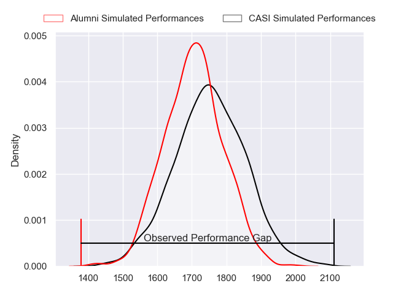
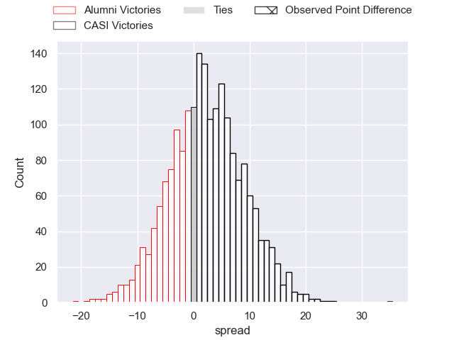
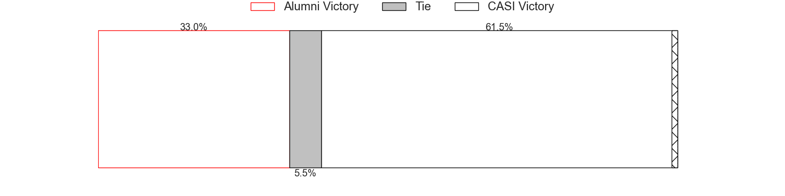
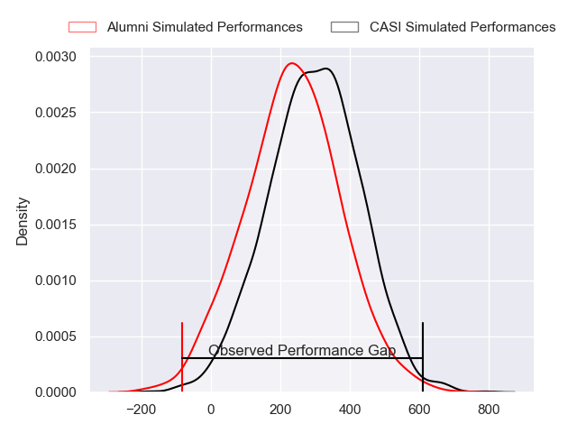
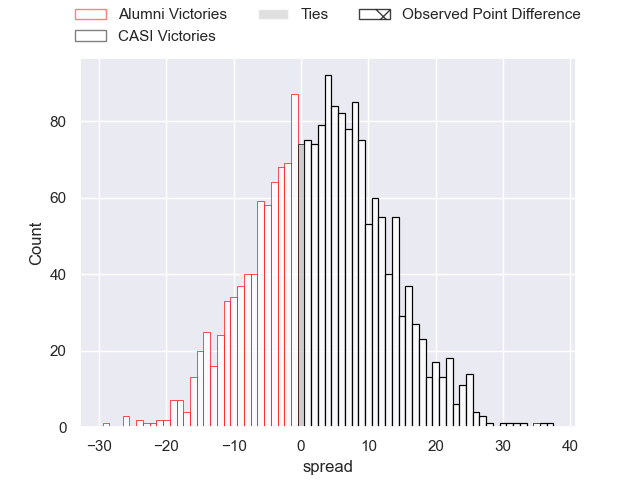
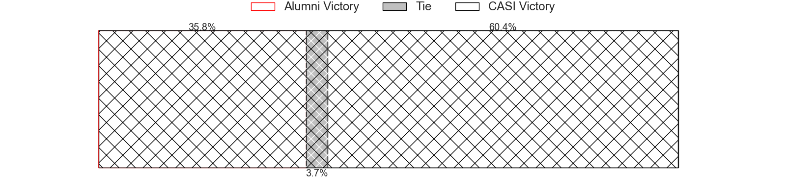

---  
layout: page  
title: Alumni at CASI; 20-55  
date: 2024-05-18 18:00:00 -0500  
categories: "URBA Top 12 2024" match review  
---
# Alumni at CASI; 20-55

# Club Level Predictions

The first set of predictions treats a club as the smallest object, as the club develops its members, organizes a gameplan, and deploys its players as needed for each match. This club model has a prediction of 0.566, which translates to predicting CASI to win by 2.4.

Our Over/Under is 52.5 - and combined with the spread above, we have a predicted scoreline of 25 to 27

Each club has a rating and a rating deviation (similar to a Glicko rating), and expected performances can be generated. This allows for simulated matches and spreads like the ones below.
## Projected Performances - Club Model

## Projected Spreads - Club Model

## Projected Results - Club Model

# Player Level Predictions

Treating teams instead as an entity made up of the currently active players, I have ratings for each player in an altogether different system. These can be combined to form team ratings once teamsheets are announced, weighting starters a bit higher than the reserves. After the match is played, players can be weighted by their minutes on the field, allowing for an accurate measure of the team's composition. With these compiled team ratings, we can make predictions, measure inaccuracy, and update the individual player ratings.
## Prediction without Player Minutes: CASI by 3.7

Alumni by 0.3 on a neutral pitch

## Projected Performances - Player Model

## Projected Spreads - Player Model

## Projected Results - Player Model

|   Away Minutes | Away Player         |   Away Percentile |   Number |   Home Percentile | Home Player                |   Home Minutes |
|---------------:|:--------------------|------------------:|---------:|------------------:|:---------------------------|---------------:|
|             82 | Federico Lucca      |             71.88 |        1 |             84.68 | Joaquin Britto             |             82 |
|             82 | Tomas Bivort        |             71.15 |        2 |             88.2  | Juan Torres Obeid          |             82 |
|             82 | Ezequiel Oliva      |             48.33 |        3 |             87.45 | Juan Ignacio Nieto Sanchez |             82 |
|             82 | Manuel Mora         |             69.3  |        4 |             65.65 | Agustin Posleman           |             82 |
|             82 | Santiago Alduncin   |             60.89 |        5 |             84.3  | Leo Mazzini                |             82 |
|             82 | Ignacio Cubilla     |             65.55 |        6 |             83.32 | Eugenio Sartori            |             82 |
|             82 | Juan Anderson       |             66.83 |        7 |             83.32 | Joaquin Saenz de Miera     |             82 |
|             82 | Juan Cruz Alvarinas |             30.96 |        8 |             63.6  | Benjamin Rocca Rivarola    |             82 |
|             82 | Tomas Passerotti    |             66.14 |        9 |             82.37 | Luca Canzani               |             82 |
|             82 | Juan Berreta        |             27.18 |       10 |             80.68 | Felipe Hileman             |             82 |
|             82 | Cruz Gonzalez       |             32.12 |       11 |             68.17 | Benjamin Belaga            |             82 |
|             82 | Franco Battezzati   |             62.33 |       12 |             80.95 | Bruno Devoto               |             82 |
|             82 | Alejo Chavez        |             63.06 |       13 |             80.95 | Jeronimo Solveyra          |             82 |
|             82 | Ramon Fuentes       |             68.27 |       14 |             83.75 | Santiago David             |             82 |
|             82 | Tomas Corneille     |             53.63 |       15 |             80.56 | Juan Akemeier              |             82 |
|              0 | Juan Bottoni        |            nan    |       16 |            nan    | Facundo Andreotti          |              0 |
|              0 | Maximo Castillo     |            nan    |       17 |            nan    | Felix Paolucci             |              0 |
|              0 | Nicolas Frene       |            nan    |       18 |            nan    | Hugo Garcia                |              0 |
|              0 | Federico Canovas    |            nan    |       19 |             49.14 | Ignacio Torrado            |              0 |
|              0 | Nicolas Promanzio   |             57.65 |       20 |            nan    | Jeronimo Martorelli        |              0 |
|              0 | Agustin Sanchez     |            nan    |       21 |            nan    | Tomas Phelan               |              0 |
|              0 | Filipo Testoni      |            nan    |       22 |            nan    | Felipe Phelan              |              0 |
|              0 | Matias Del Franco   |            nan    |       23 |            nan    | Tobias Casaurang           |              0 |

