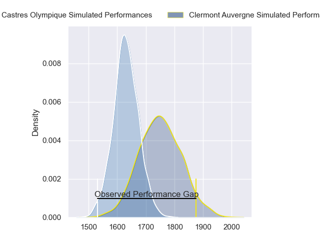
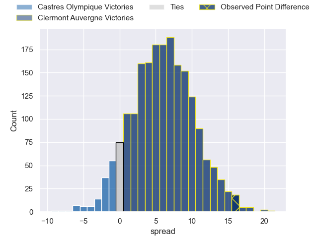
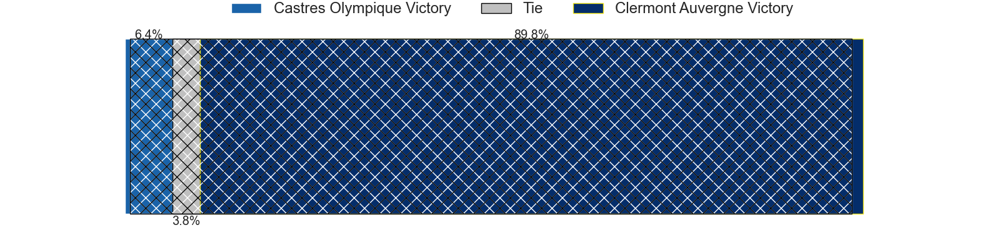
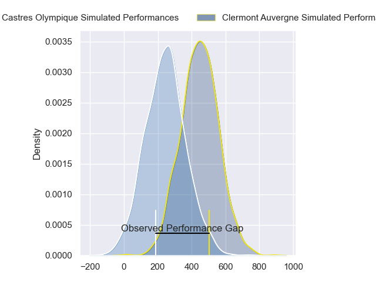
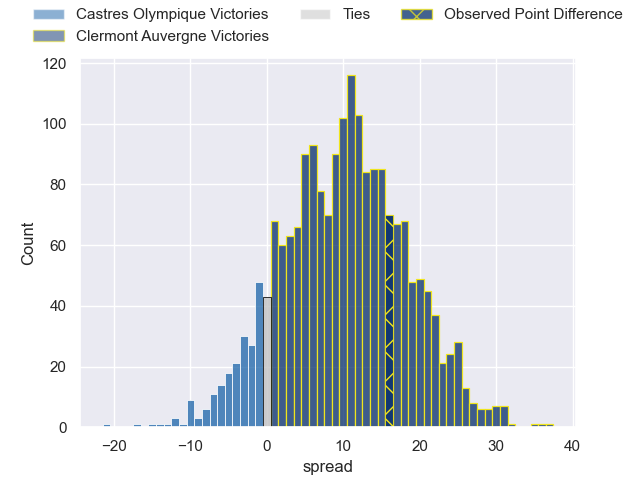
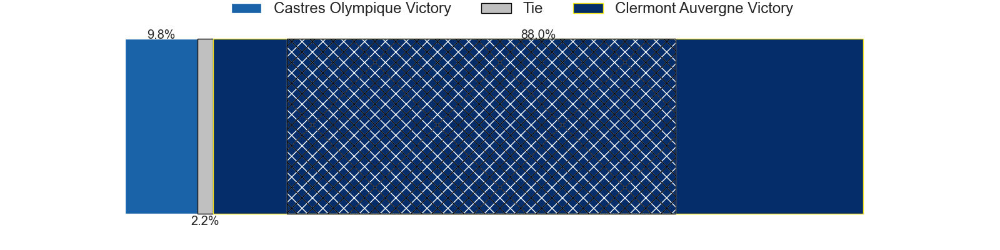

---  
layout: page  
title: Castres Olympique at Clermont Auvergne; 20-36  
date: 2024-05-18 18:00:00 -0500  
categories: "Top 14 Orange 2023" match review  
---
# Castres Olympique at Clermont Auvergne; 20-36

# Club Level Predictions

The first set of predictions treats a club as the smallest object, as the club develops its members, organizes a gameplan, and deploys its players as needed for each match. This club model has a prediction of 0.66, which translates to predicting Clermont Auvergne to win by 5.8.

Our Over/Under is 49.5 - and combined with the spread above, we have a predicted scoreline of 22 to 28

Each club has a rating and a rating deviation (similar to a Glicko rating), and expected performances can be generated. This allows for simulated matches and spreads like the ones below.
## Projected Performances - Club Model

## Projected Spreads - Club Model

## Projected Results - Club Model

# Player Level Predictions

Treating teams instead as an entity made up of the currently active players, I have ratings for each player in an altogether different system. These can be combined to form team ratings once teamsheets are announced, weighting starters a bit higher than the reserves. After the match is played, players can be weighted by their minutes on the field, allowing for an accurate measure of the team's composition. With these compiled team ratings, we can make predictions, measure inaccuracy, and update the individual player ratings.
## Prediction without Player Minutes: Clermont Auvergne by 10.7

Clermont Auvergne by 3.1 on a neutral pitch

## Projected Performances - Player Model

## Projected Spreads - Player Model

## Projected Results - Player Model

|   Away Minutes | Away Player                |   Away Percentile |   Number |   Home Percentile | Home Player          |   Home Minutes |
|---------------:|:---------------------------|------------------:|---------:|------------------:|:---------------------|---------------:|
|             52 | Lois Guerois-Galisson      |             45.84 |        1 |             74.47 | Giorgi Beria         |             30 |
|             52 | Loris Zarantonello         |             32.79 |        2 |             55.57 | Yohan Beheregaray    |             30 |
|             52 | Henry Thomas               |             33.93 |        3 |             90.78 | Rabah Slimani        |             46 |
|             51 | Leone Nakarawa             |             94.42 |        4 |             94.93 | Rob Simmons          |             84 |
|             84 | Tom Staniforth             |             54.26 |        5 |             17.75 | Paul Jedrasiak       |             59 |
|             75 | Baptiste Delaporte         |             77.56 |        6 |             91.93 | Pita Gus Sowakula    |             84 |
|             66 | Nick Champion de Crespigny |             32.78 |        7 |             90.94 | Marcos Kremer        |             84 |
|             60 | Yann Peysson               |             72.18 |        8 |             93.1  | Fritz Lee            |             53 |
|             70 | Jeremy Fernandez           |             16.4  |        9 |             72.25 | Baptiste Jauneau     |             52 |
|             51 | Louis Le Brun              |             76.01 |       10 |             86.84 | Benjamin Urdapilleta |             76 |
|             84 | Filipo Nakosi              |             81.06 |       11 |             87.6  | Joris Jurand         |             84 |
|             84 | Adrea Cocagi               |             86.06 |       12 |             94.55 | George Moala         |             59 |
|             84 | Adrien Seguret             |             16.14 |       13 |             81.87 | Leon Darricarrere    |             66 |
|             84 | Nathanael Hulleu           |             78.65 |       14 |             91.83 | Bautista Delguy      |             84 |
|             84 | Julien Dumora              |             77.14 |       15 |             87.82 | Alex Newsome         |             84 |
|             32 | Gaetan Barlot              |             80.66 |       16 |             62.3  | Etienne Fourcade     |             54 |
|             32 | Antoine Tichit             |             88.09 |       17 |             87.11 | Etienne Falgoux      |             54 |
|             33 | Florent Vanverberghe       |             64.6  |       18 |             89.66 | Thibaud Lanen        |             25 |
|             18 | Ryno Pieterse              |             66.43 |       19 |             69.09 | Anthime Hemery       |             31 |
|             33 | Abraham Papali'i           |             40.38 |       20 |             86.21 | Sebastien Bezy       |             32 |
|             14 | Gauthier Doubrere          |             47.47 |       21 |            nan    | Theo Giral           |              8 |
|             33 | Vilimoni Botitu            |             36.58 |       22 |             75.37 | Julien Heriteau      |             43 |
|             32 | Aurelien Azar              |             51.55 |       23 |             75.94 | Cristian Ojovan      |             38 |

