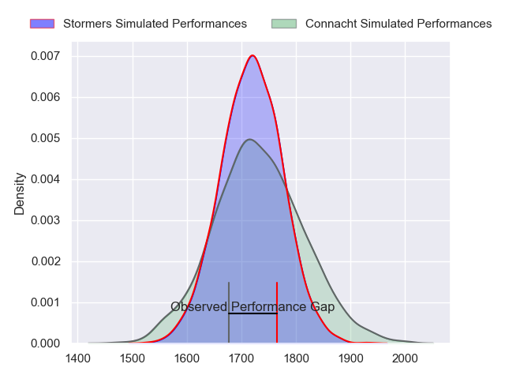
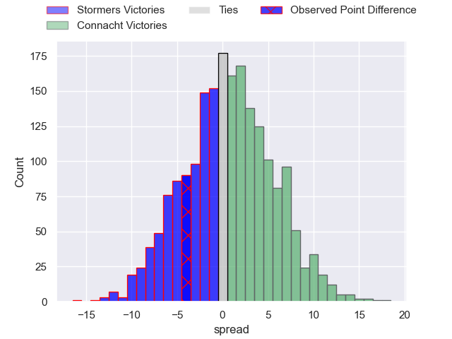
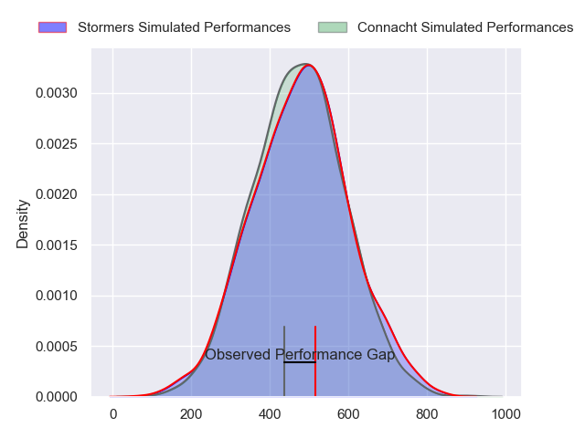
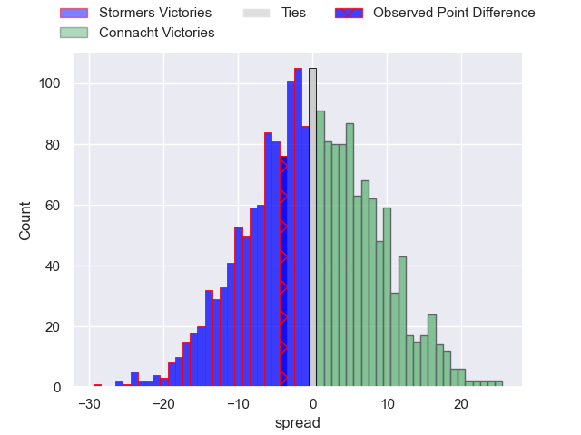

---  
layout: page  
title: Stormers at Connacht; 16-12  
date: 2024-05-18 18:00:00 -0500  
categories: "United Rugby Championship 2023" match review  
---
# Stormers at Connacht; 16-12

# Club Level Predictions

The first set of predictions treats a club as the smallest object, as the club develops its members, organizes a gameplan, and deploys its players as needed for each match. This club model has a prediction of 0.523, which translates to predicting Connacht to win by 0.8.

Our Over/Under is 49.5 - and combined with the spread above, we have a predicted scoreline of 24 to 25

Each club has a rating and a rating deviation (similar to a Glicko rating), and expected performances can be generated. This allows for simulated matches and spreads like the ones below.
## Projected Performances - Club Model

## Projected Spreads - Club Model

## Projected Results - Club Model

# Player Level Predictions

Treating teams instead as an entity made up of the currently active players, I have ratings for each player in an altogether different system. These can be combined to form team ratings once teamsheets are announced, weighting starters a bit higher than the reserves. After the match is played, players can be weighted by their minutes on the field, allowing for an accurate measure of the team's composition. With these compiled team ratings, we can make predictions, measure inaccuracy, and update the individual player ratings.
## Prediction without Player Minutes: Connacht by 2.0

Stormers by 3.4 on a neutral pitch

## Projected Performances - Player Model

## Projected Spreads - Player Model

## Projected Results - Player Model

|   Away Minutes | Away Player          |   Away Percentile |   Number |   Home Percentile | Home Player           |   Home Minutes |
|---------------:|:---------------------|------------------:|---------:|------------------:|:----------------------|---------------:|
|             77 | Brok Harris          |             99.92 |        1 |             97.23 | Peter Dooley          |             64 |
|             53 | Joseph Dweba         |             73.44 |        2 |             64.26 | Dave Heffernan        |             71 |
|             52 | Frans Malherbe       |             88.75 |        3 |             96.74 | Finlay Bealham        |             52 |
|             80 | Salmaan Moerat       |             78.82 |        4 |             95.44 | Joe Joyce             |             69 |
|             66 | Ruben van Heerden    |             85.41 |        5 |             36.47 | Darragh Murray        |             73 |
|             80 | Evan Roos            |             89.57 |        6 |             56.69 | Cian Prendergast      |             80 |
|             80 | Ben-Jason Dixon      |             68.41 |        7 |             57.68 | Shamus Hurley-Langton |             64 |
|             61 | Hacjivah Dayimani    |             91.63 |        8 |             17.78 | Sean Jansen           |             69 |
|             67 | Herschel Jantjies    |             93.19 |        9 |             78.01 | Caolin Blade          |             69 |
|             80 | Manie Libbok         |             84.29 |       10 |             92.57 | Jack Carty            |             71 |
|             61 | Angelo Davids        |             94.81 |       11 |              6.44 | Byron Ralston         |             80 |
|             80 | Damian Willemse      |             96.75 |       12 |             98.95 | Bundee Aki            |             80 |
|             77 | Daniel du Plessis    |             91.82 |       13 |             71.77 | David Hawkshaw        |             80 |
|             80 | Suleiman Hartzenberg |             77.02 |       14 |             92.02 | John Porch            |             80 |
|             80 | Warrick Gelant       |             98.93 |       15 |             85.9  | Tiernan O'Halloran    |             62 |
|             27 | Andre-Hugo Venter    |             69.51 |       16 |             65.57 | Dylan Tierney-Martin  |              9 |
|              3 | Kwenzo Blose         |            nan    |       17 |             28.36 | Jordan Duggan         |             16 |
|             28 | Neethling Fouche     |             84.43 |       18 |             74.9  | Jack Aungier          |             28 |
|             14 | Adre Smith           |             82.37 |       19 |             68.39 | Oisin Dowling         |             18 |
|             19 | Marcel Theunissen    |             41.63 |       20 |             85.56 | Jarrad Butler         |             27 |
|             13 | Stefan Ungerer       |             18.32 |       21 |             41.54 | Colm Reilly           |             11 |
|              3 | Jean-Luc du Plessis  |             71.46 |       22 |             20.67 | Cathal Forde          |              9 |
|             19 | Sacha Mngomezulu     |             73.77 |       23 |             97.5  | Santiago Cordero      |             18 |

