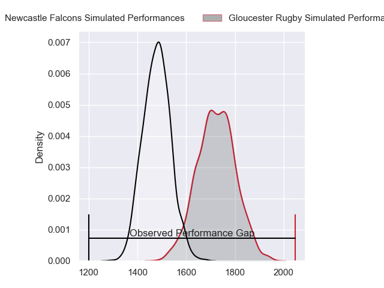
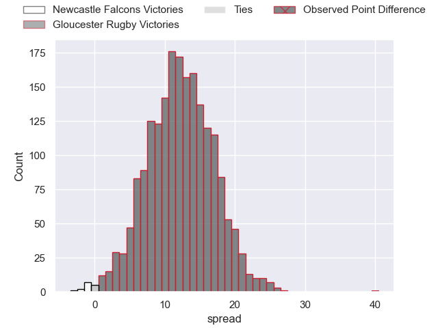
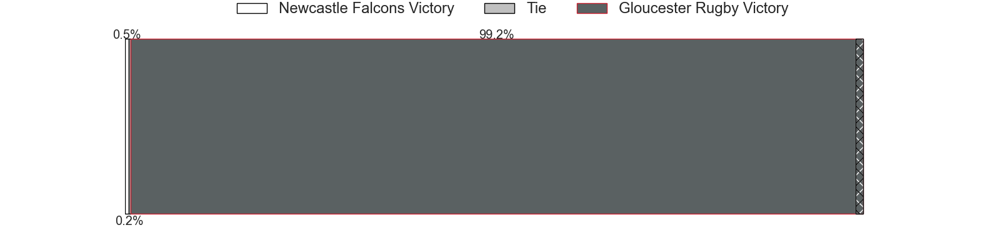
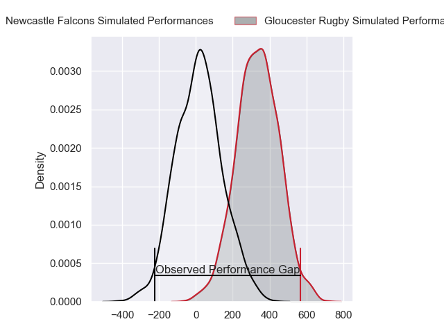
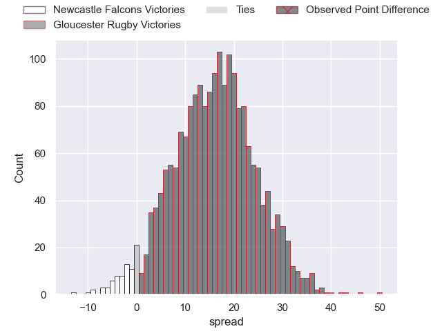
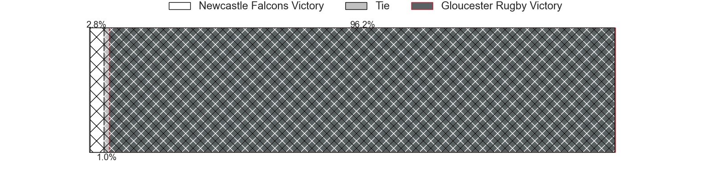

---  
layout: page  
title: Newcastle Falcons at Gloucester Rugby; 14-54  
date: 2024-05-18 18:00:00 -0500  
categories: "Gallagher Premiership 2023" match review  
---
# Newcastle Falcons at Gloucester Rugby; 14-54

# Club Level Predictions

The first set of predictions treats a club as the smallest object, as the club develops its members, organizes a gameplan, and deploys its players as needed for each match. This club model has a prediction of 0.802, which translates to predicting Gloucester Rugby to win by 12.3.

Our Over/Under is 59.5 - and combined with the spread above, we have a predicted scoreline of 24 to 36

Each club has a rating and a rating deviation (similar to a Glicko rating), and expected performances can be generated. This allows for simulated matches and spreads like the ones below.
## Projected Performances - Club Model

## Projected Spreads - Club Model

## Projected Results - Club Model

# Player Level Predictions

Treating teams instead as an entity made up of the currently active players, I have ratings for each player in an altogether different system. These can be combined to form team ratings once teamsheets are announced, weighting starters a bit higher than the reserves. After the match is played, players can be weighted by their minutes on the field, allowing for an accurate measure of the team's composition. With these compiled team ratings, we can make predictions, measure inaccuracy, and update the individual player ratings.
## Prediction without Player Minutes: Gloucester Rugby by 18.9

Gloucester Rugby by 10.6 on a neutral pitch

## Projected Performances - Player Model

## Projected Spreads - Player Model

## Projected Results - Player Model

|   Away Minutes | Away Player       |   Away Percentile |   Number |   Home Percentile | Home Player         |   Home Minutes |
|---------------:|:------------------|------------------:|---------:|------------------:|:--------------------|---------------:|
|             77 | Adam Brocklebank  |              1.47 |        1 |             28.77 | Jamal Ford-Robinson |             52 |
|             61 | Jamie Blamire     |              1.31 |        2 |             81.48 | Sebastian Blake     |             61 |
|             49 | Eduardo Bello     |              0.9  |        3 |             91.04 | Kirill Gotovtsev    |             51 |
|             82 | Tim Cardall       |             47.72 |        4 |             80.24 | Freddie Clarke      |             77 |
|             69 | John Hawkins      |             22.29 |        5 |             85.21 | Freddie Thomas      |             64 |
|             82 | Sam Cross         |             17.03 |        6 |             91.73 | Ruan Ackermann      |             82 |
|             82 | Guy Pepper        |              7.58 |        7 |             66.34 | Lewis Ludlow        |             52 |
|             61 | Callum Chick      |              1.46 |        8 |             56.49 | Zach Mercer         |             82 |
|             53 | Sam Stuart        |              1.4  |        9 |             88.48 | Caolan Englefield   |             61 |
|             53 | Brett Connon      |              8.49 |       10 |             61.15 | Charlie Atkinson    |             82 |
|             82 | Ben Redshaw       |             82.6  |       11 |             83.65 | Ollie Thorley       |             52 |
|             82 | Cameron Hutchison |             64.53 |       12 |             51.94 | Sebastien Atkinson  |             82 |
|             69 | Matias Moroni     |             99.48 |       13 |             79.75 | Chris Harris        |             82 |
|             82 | Adam Radwan       |             26.83 |       14 |             64.81 | Jonny May           |             82 |
|             82 | Louis Brown       |             36.11 |       15 |             57.05 | Josh Hathaway       |             82 |
|             21 | Bryan Byrne       |             81.64 |       16 |             74.1  | Santiago Socino     |             21 |
|              5 | Mark Dormer       |            nan    |       17 |             11.08 | Mayco Vivas         |             30 |
|             33 | Richard Palframan |             57.29 |       18 |             29.83 | Ciaran Knight       |             31 |
|             13 | Adam Scott        |            nan    |       19 |             90.55 | Albert Tuisue       |             18 |
|             21 | Freddie Lockwood  |             64.96 |       20 |             62.34 | Jack Clement        |             30 |
|             29 | James Elliott     |              3.84 |       21 |              8.73 | Stephen Varney      |             21 |
|             29 | Rory Jennings     |             44.6  |       22 |             53.17 | Alex Hearle         |             30 |
|             13 | Oliver Spencer    |             69.57 |       23 |             69.9  | Jake Morris         |              5 |

