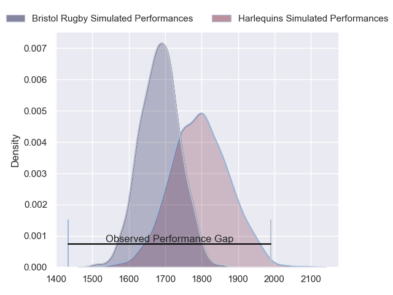
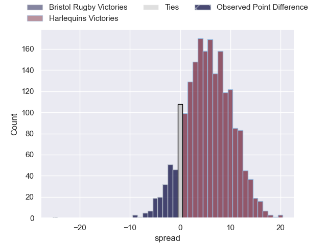
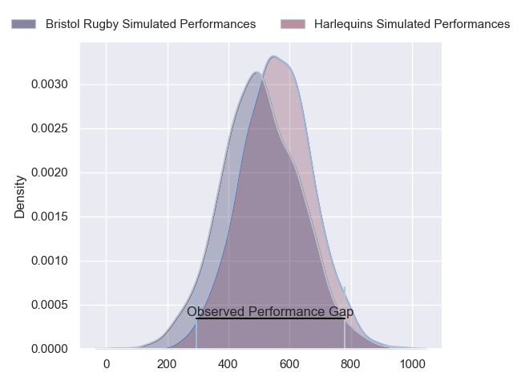
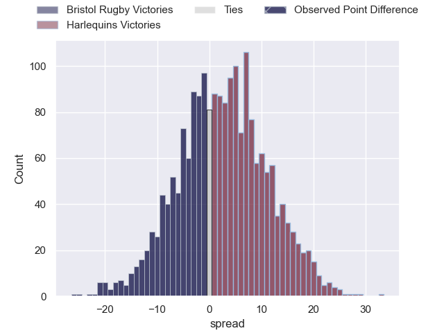
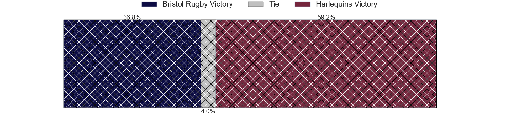

---  
layout: page  
title: Bristol Rugby at Harlequins; 53-28  
date: 2024-05-18 18:00:00 -0500  
categories: "Gallagher Premiership 2023" match review  
---
# Bristol Rugby at Harlequins; 53-28

# Club Level Predictions

The first set of predictions treats a club as the smallest object, as the club develops its members, organizes a gameplan, and deploys its players as needed for each match. This club model has a prediction of 0.651, which translates to predicting Harlequins to win by 5.5.

Our Over/Under is 66.5 - and combined with the spread above, we have a predicted scoreline of 30 to 36

Each club has a rating and a rating deviation (similar to a Glicko rating), and expected performances can be generated. This allows for simulated matches and spreads like the ones below.
## Projected Performances - Club Model

## Projected Spreads - Club Model

## Projected Results - Club Model

# Player Level Predictions

Treating teams instead as an entity made up of the currently active players, I have ratings for each player in an altogether different system. These can be combined to form team ratings once teamsheets are announced, weighting starters a bit higher than the reserves. After the match is played, players can be weighted by their minutes on the field, allowing for an accurate measure of the team's composition. With these compiled team ratings, we can make predictions, measure inaccuracy, and update the individual player ratings.
## Prediction without Player Minutes: Harlequins by 5.9

Bristol Rugby by 1.6 on a neutral pitch

## Projected Performances - Player Model

## Projected Spreads - Player Model

## Projected Results - Player Model

|   Away Minutes | Away Player                |   Away Percentile |   Number |   Home Percentile | Home Player               |   Home Minutes |
|---------------:|:---------------------------|------------------:|---------:|------------------:|:--------------------------|---------------:|
|             37 | Ellis Genge                |             79.36 |        1 |             20.96 | Fin Baxter                |             60 |
|             57 | Harry Thacker              |             88.85 |        2 |              7.7  | Jack Walker               |             72 |
|             57 | Kyle Sinckler              |             93.8  |        3 |             91.68 | Will Collier              |             51 |
|             73 | James Dun                  |             93.81 |        4 |             54.16 | Irne Herbst               |             68 |
|             80 | Joe Batley                 |             88.64 |        5 |             71.4  | Stephan Lewies            |             80 |
|             80 | Steven Luatua              |             99.61 |        6 |             70.08 | Chandler Cunningham-South |             51 |
|             80 | Fitz Harding               |             94.98 |        7 |             71.95 | Will Evans                |             80 |
|             73 | Magnus Bradbury            |             65.06 |        8 |             82.64 | Alex Dombrandt            |             80 |
|             75 | Harry Randall              |             95.29 |        9 |             99.48 | Danny Care                |             51 |
|             37 | Callum Sheedy              |             79.62 |       10 |             80.25 | Marcus Smith              |             80 |
|             80 | Gabriel Ibitoye            |             93.65 |       11 |             51.25 | Oscar Beard               |             80 |
|             80 | James Williams             |             77.67 |       12 |             98.43 | Andre Esterhuizen         |             49 |
|              4 | Benhard Janse van Rensburg |             93.61 |       13 |             72.64 | Luke Northmore            |             80 |
|             80 | Noah Heward                |             89.13 |       14 |             78.75 | Louis Lynagh              |             60 |
|             80 | Max Malins                 |             62.61 |       15 |             57.69 | Tyrone Green              |             80 |
|             23 | Gabriel Oghre              |             67.38 |       16 |             70    | Sam Riley                 |              8 |
|             43 | Jake Woolmore              |             81.57 |       17 |             29.12 | Simon Kerrod              |             20 |
|             23 | Max Lahiff                 |             57.42 |       18 |             94.94 | Dillon Lewis              |             29 |
|              7 | Josh Caulfield             |             16.43 |       19 |             20.69 | George Hammond            |             12 |
|              7 | Benjamin Grondona          |            nan    |       20 |             92.81 | James Chisholm            |             29 |
|              5 | Kieran Marmion             |             89.53 |       21 |             23.04 | Will Porter               |             29 |
|             76 | Virimi Vakatawa            |             94.03 |       22 |             89.17 | Jarrod Evans              |             20 |
|             43 | Ratu Naulago               |             64.13 |       23 |             74.32 | Will Joseph               |             31 |

