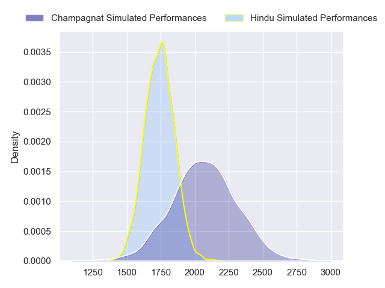
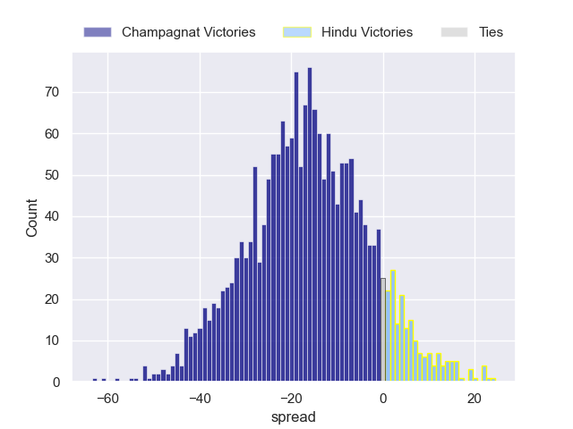
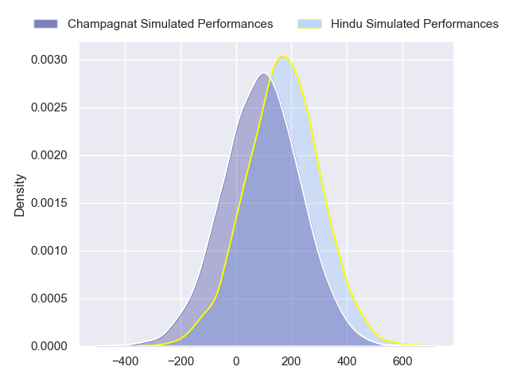
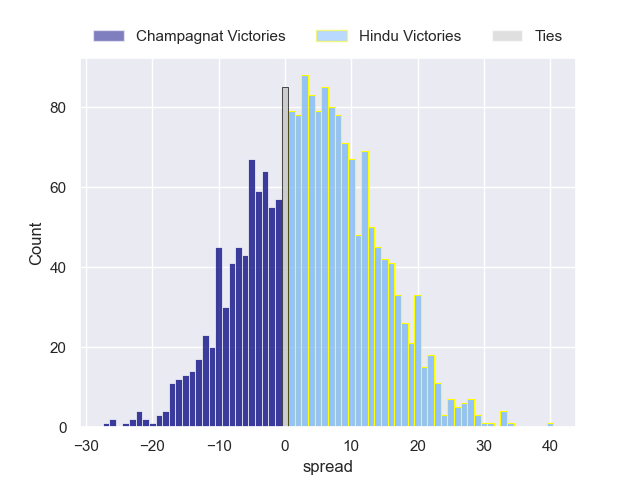
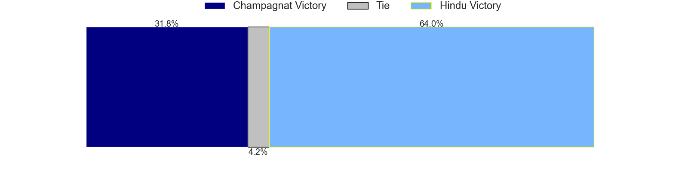

---  
layout: page  
title: Champagnat at Hindu; 19-19  
date: 2024-05-18 18:00:00 -0500  
categories: "URBA Top 12 2024" match review  
---
# Champagnat at Hindu; 19-19

# Club Level Predictions

The first set of predictions treats a club as the smallest object, as the club develops its members, organizes a gameplan, and deploys its players as needed for each match. This club model has a prediction of 0.182, which translates to predicting Champagnat to win by 16.3.

Our Over/Under is 47.5 - and combined with the spread above, we have a predicted scoreline of 32 to 16

Each club has a rating and a rating deviation (similar to a Glicko rating), and expected performances can be generated. This allows for simulated matches and spreads like the ones below.
## Projected Performances - Club Model

## Projected Spreads - Club Model

## Projected Results - Club Model

# Player Level Predictions

Treating teams instead as an entity made up of the currently active players, I have ratings for each player in an altogether different system. These can be combined to form team ratings once teamsheets are announced, weighting starters a bit higher than the reserves. After the match is played, players can be weighted by their minutes on the field, allowing for an accurate measure of the team's composition. With these compiled team ratings, we can make predictions, measure inaccuracy, and update the individual player ratings.
## Prediction without Player Minutes: Hindu by 3.7

Champagnat by 0.2 on a neutral pitch

## Projected Performances - Player Model

## Projected Spreads - Player Model

## Projected Results - Player Model

|   Away Minutes | Away Player                   |   Away Percentile |   Number |   Home Percentile | Home Player             |   Home Minutes |
|---------------:|:------------------------------|------------------:|---------:|------------------:|:------------------------|---------------:|
|             80 | Tomas Distel                  |             23.55 |        1 |             25.59 | Franco Diviesti         |             80 |
|             80 | Fernando Rodriguez Pascarella |             25.08 |        2 |             20.98 | Agustin Capurro         |             80 |
|             80 | Alberto Adissi                |             23.88 |        3 |             18.26 | Nicolas Leiva           |             80 |
|             80 | Inaki Ustariz                 |             29.69 |        4 |             52.68 | Carlos Repetto          |             80 |
|             80 | Santiago Escuti               |             30.19 |        5 |             23    | Juan Ignacio Comolli    |             80 |
|             80 | Matias Alonso Boto            |             23.92 |        6 |             20.67 | Tomas Scallan           |             80 |
|             80 | Lucas Moresco                 |             48.72 |        7 |             19.29 | Santino Amayav          |             80 |
|             80 | Matias Muniagurria            |             27.2  |        8 |             44.77 | Nicolas Amaya           |             80 |
|             80 | Martin Graciarena             |             27.23 |        9 |             21.47 | Lucas Fernandez Miranda |             80 |
|             80 | Benjamin Panelo               |             43.1  |       10 |             95.75 | Santiago Fernandez      |             80 |
|             80 | Tomas Baca Castex             |             28.75 |       11 |             40.77 | Torcuato Pulido         |             80 |
|             80 | Tobias Imbrosciano            |             27.07 |       12 |             21.2  | Bautista Farise         |             80 |
|             80 | Tomas Cotter                  |             26.86 |       13 |             86.78 | Belisario Agulla        |             80 |
|             80 | Geronimo Tomasella            |             28.56 |       14 |             23.56 | Tomas Amher             |             80 |
|             80 | Gregorio Carol Lugones        |             22.44 |       15 |             78.21 | Joaquin Diaz Bonilla    |             80 |
|              0 | Joaquin Guerra                |            nan    |       16 |            nan    | Benjamin Silveyra       |              0 |
|              0 | Manuel Mauvecin               |            nan    |       17 |            nan    | Rodrigo Palma           |              0 |
|              0 | Marcos Magaro                 |            nan    |       18 |            nan    | Mariano Leiva           |              0 |
|              0 | Tobias Rivas Orozco           |            nan    |       19 |             19.55 | Elias Banach            |              0 |
|              0 | Tomas Alonso Boto             |            nan    |       20 |            nan    | Francisco Grote         |              0 |
|              0 | Pedro Del Piano               |            nan    |       21 |            nan    | Lucas Pulido            |              0 |
|              0 | Facundo Rufino                |            nan    |       22 |            nan    | Rodrigo Almada          |              0 |
|              0 | Marcos Lafuente               |            nan    |       23 |            nan    | Valentin Benito         |              0 |

