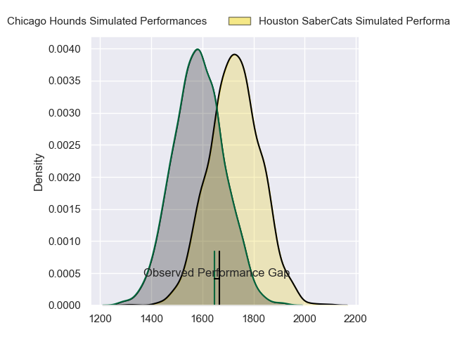
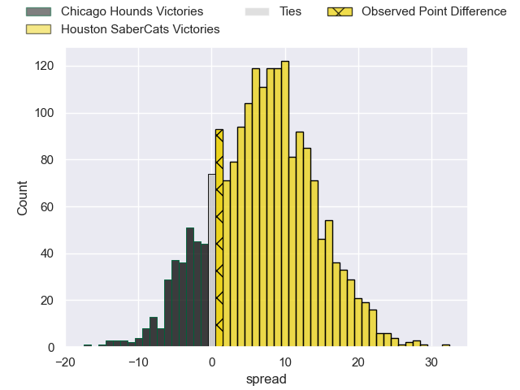
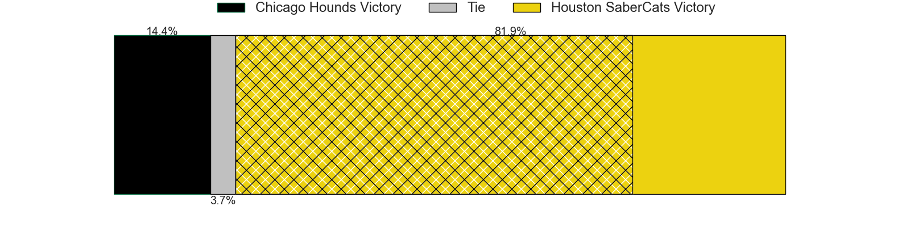
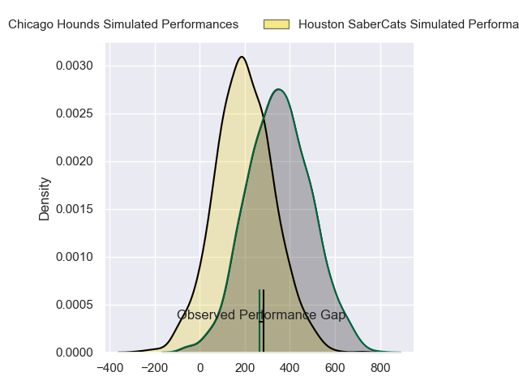
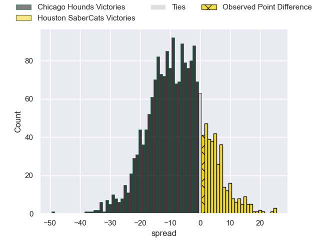
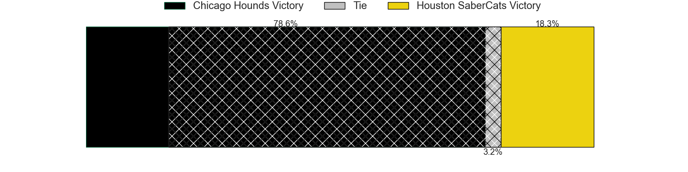

---  
layout: page  
title: Chicago Hounds at Houston SaberCats; 22-23  
date: 2024-05-18 18:00:00 -0500  
categories: "Major League Rugby 2024" match review  
---
# Chicago Hounds at Houston SaberCats; 22-23

# Club Level Predictions

The first set of predictions treats a club as the smallest object, as the club develops its members, organizes a gameplan, and deploys its players as needed for each match. This club model has a prediction of 0.687, which translates to predicting Houston SaberCats to win by 7.1.

Our Over/Under is 58.5 - and combined with the spread above, we have a predicted scoreline of 26 to 33

Each club has a rating and a rating deviation (similar to a Glicko rating), and expected performances can be generated. This allows for simulated matches and spreads like the ones below.
## Projected Performances - Club Model

## Projected Spreads - Club Model

## Projected Results - Club Model

# Player Level Predictions

Treating teams instead as an entity made up of the currently active players, I have ratings for each player in an altogether different system. These can be combined to form team ratings once teamsheets are announced, weighting starters a bit higher than the reserves. After the match is played, players can be weighted by their minutes on the field, allowing for an accurate measure of the team's composition. With these compiled team ratings, we can make predictions, measure inaccuracy, and update the individual player ratings.
## Prediction without Player Minutes: Chicago Hounds by 6.1

Chicago Hounds by 8.8 on a neutral pitch

## Projected Performances - Player Model

## Projected Spreads - Player Model

## Projected Results - Player Model

|   Away Minutes | Away Player             |   Away Percentile |   Number |   Home Percentile | Home Player        |   Home Minutes |
|---------------:|:------------------------|------------------:|---------:|------------------:|:-------------------|---------------:|
|             80 | Charlie Abel            |             69.44 |        1 |             84.76 | Ezekiel Lindenmuth |             80 |
|             80 | Dylan Fawsitt           |             99.02 |        2 |             47.05 | Pita Anae Ah-Sue   |             80 |
|             80 | Paddy Ryan              |             51.51 |        3 |             57.86 | Maks Van Dyk       |             80 |
|             80 | George Merrick          |             39.72 |        4 |             72.44 | Johan Momsen       |             80 |
|             80 | James Scott             |             80.04 |        5 |             63.83 | Nathan Den Hoedt   |             80 |
|             80 | Ben Landry              |             73.43 |        6 |             69    | Marno Redelinghuys |             80 |
|             80 | Maclean Jones           |             67.81 |        7 |             71.06 | Keni Nasoqeqe      |             80 |
|             80 | Conall Boomer           |             50.63 |        8 |             77.82 | Ronan Murphy       |             80 |
|             80 | Nick McCarthy           |             60.38 |        9 |             72.08 | André Riaan Warner |             80 |
|             80 | Adriaan Carelse         |             66.24 |       10 |             70.49 | Aj Alatimu         |             80 |
|             80 | Julián Dominguez Widmer |             49.52 |       11 |             77.98 | Line Latu          |             80 |
|             80 | Bryce Campbell          |             56.45 |       12 |             75.13 | Sam Hill           |             80 |
|             80 | Mark O'Keeffe           |             34    |       13 |             62.01 | Dominic Akina      |             80 |
|             80 | Nate Augspurger         |             99.23 |       14 |             68.37 | Seimou Smith       |             80 |
|             80 | Luke Carty              |             25.64 |       15 |             64.32 | David Coetzer      |             80 |
|              0 | Janus Venter            |            nan    |       16 |             82.95 | Tiaan Erasmus      |              0 |
|              0 | Fred Apulu              |            nan    |       17 |            nan    | Larome White       |              0 |
|              0 | Ignacio Peculo          |             90.87 |       18 |            nan    | Pono Davis         |              0 |
|              0 | Mason Flesch            |              4.82 |       19 |             65.16 | Emmanuel Albert    |              0 |
|              0 | Brad Tucker             |            nan    |       20 |             31.17 | Tomiwa Agbongbon   |              0 |
|              0 | Dave Kearney            |             45.51 |       21 |            nan    | Carlo De Nysschen  |              0 |
|              0 | Cassh Maluia            |             25.71 |       22 |            nan    | Max Schumacher     |              0 |
|              0 | Luke White              |             14.64 |       23 |             53.65 | Jeremy Misailegalu |              0 |

