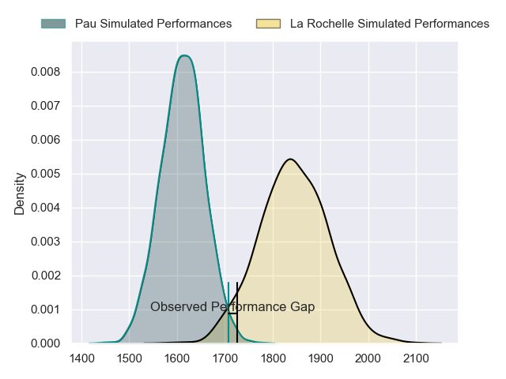
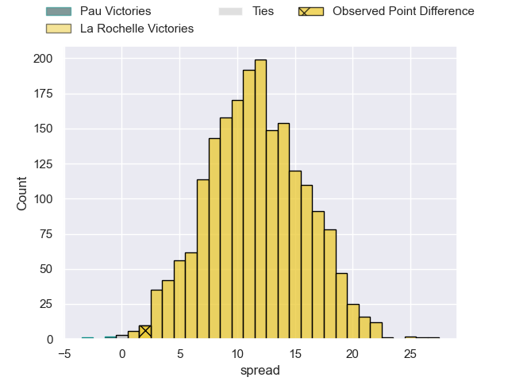
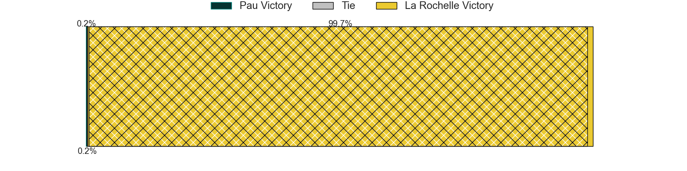
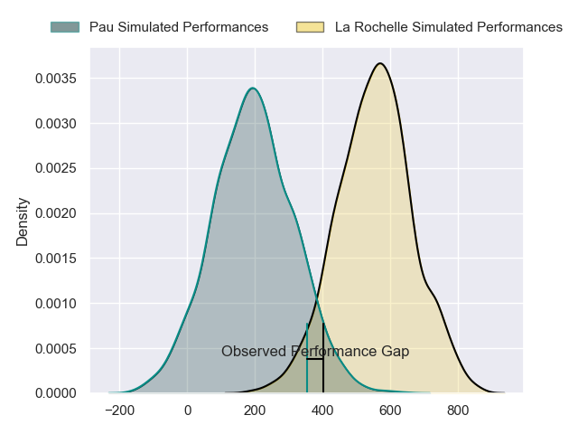
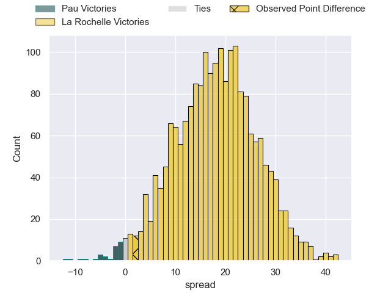
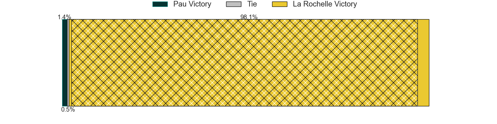

---  
layout: page  
title: Pau at La Rochelle; 23-25  
date: 2024-05-18 18:00:00 -0500  
categories: "Top 14 Orange 2023" match review  
---
# Pau at La Rochelle; 23-25

# Club Level Predictions

The first set of predictions treats a club as the smallest object, as the club develops its members, organizes a gameplan, and deploys its players as needed for each match. This club model has a prediction of 0.789, which translates to predicting La Rochelle to win by 11.6.

Our Over/Under is 50.5 - and combined with the spread above, we have a predicted scoreline of 20 to 31

Each club has a rating and a rating deviation (similar to a Glicko rating), and expected performances can be generated. This allows for simulated matches and spreads like the ones below.
## Projected Performances - Club Model

## Projected Spreads - Club Model

## Projected Results - Club Model

# Player Level Predictions

Treating teams instead as an entity made up of the currently active players, I have ratings for each player in an altogether different system. These can be combined to form team ratings once teamsheets are announced, weighting starters a bit higher than the reserves. After the match is played, players can be weighted by their minutes on the field, allowing for an accurate measure of the team's composition. With these compiled team ratings, we can make predictions, measure inaccuracy, and update the individual player ratings.
## Prediction without Player Minutes: La Rochelle by 18.4

La Rochelle by 11.2 on a neutral pitch

## Projected Performances - Player Model

## Projected Spreads - Player Model

## Projected Results - Player Model

|   Away Minutes | Away Player          |   Away Percentile |   Number |   Home Percentile | Home Player           |   Home Minutes |
|---------------:|:---------------------|------------------:|---------:|------------------:|:----------------------|---------------:|
|             38 | Ignacio Calles       |             54.2  |        1 |             27.71 | Louis Penverne        |             45 |
|             47 | Romain Ruffenach     |             71.64 |        2 |             69.02 | Quentin Lespiaucq     |             45 |
|             51 | Nicolas Corato       |             13.28 |        3 |             99.27 | Uini Atonio           |             49 |
|             48 | Samuel Whitelock     |             99.19 |        4 |             89.87 | Thomas Lavault        |             61 |
|             81 | Lekima Tagitagivalu  |             74.06 |        5 |             98.48 | Will Skelton          |             74 |
|             63 | Sacha Zegueur        |             31.99 |        6 |             17.22 | Judicael Cancoriet    |             81 |
|             54 | Thibaut Hamonou      |             37.11 |        7 |             24.21 | Oscar Jegou           |             61 |
|             81 | Beka Gorgadze        |             74.69 |        8 |             97.49 | Gregory Alldritt      |             81 |
|             61 | Thibault Daubagna    |             92.84 |        9 |             78.53 | Thomas Berjon         |             67 |
|             72 | Joe Simmonds         |             85.77 |       10 |             37.79 | Ihaia West            |             70 |
|             74 | Elliot Roudil        |             22.6  |       11 |             97.98 | Dillyn Leyds          |             81 |
|             81 | Nathan Decron        |             74.61 |       12 |             28.96 | Simeli Daunivucu      |             49 |
|             81 | Emilien Gailleton    |             70.3  |       13 |             77.23 | Jules Favre           |             81 |
|             81 | Theo Attissogbe      |             24.04 |       14 |             95.58 | Jack Nowell           |             81 |
|             81 | Jack Maddocks        |             85.26 |       15 |             45.09 | Antoine Hastoy        |             81 |
|             34 | Youri Delhommel      |             52.95 |       16 |             90.82 | Tolu Latu             |             36 |
|             43 | Simon-Pierre Chauvac |             45.31 |       17 |             96.82 | Reda Wardi            |             36 |
|             33 | Guillaume Ducat      |             19.15 |       18 |             64.03 | Remi Picquette        |             20 |
|             18 | Martin Puech         |             76.08 |       19 |             51.18 | Matthias Haddad       |             27 |
|             27 | Reece Hewat          |             78.94 |       20 |             71.76 | Yoan Tanga            |             32 |
|             29 | Dan Robson           |             97.91 |       21 |            nan    | Mathis Brunet         |             14 |
|              7 | Axel Desperes        |             80.04 |       22 |             45.01 | Hugo Reus             |             11 |
|             30 | Siate Tokolahi       |             84.11 |       23 |              3.75 | Georges-Henri Colombe |             32 |

