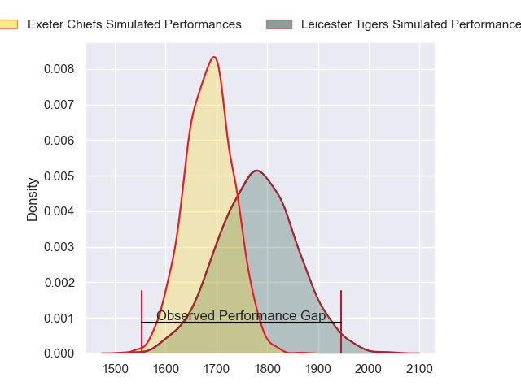
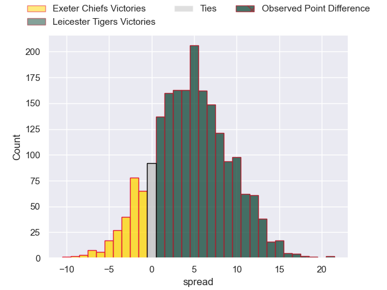
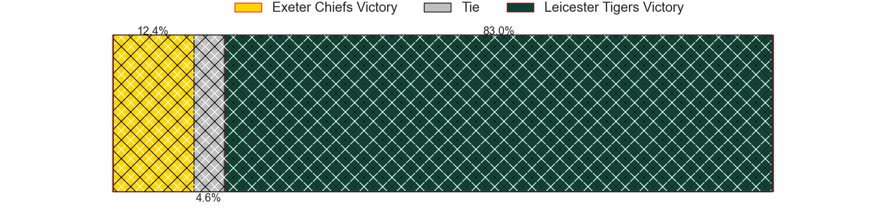
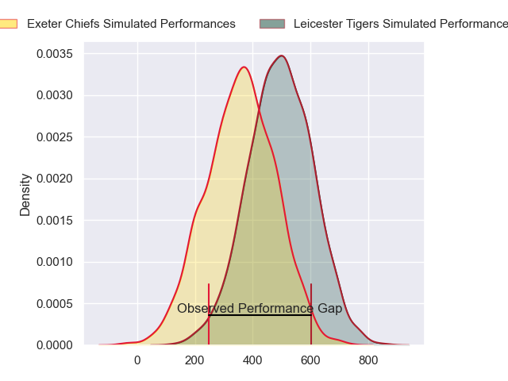
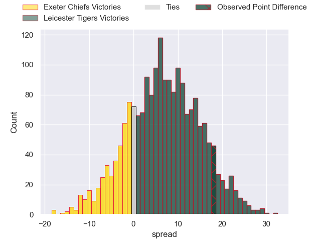
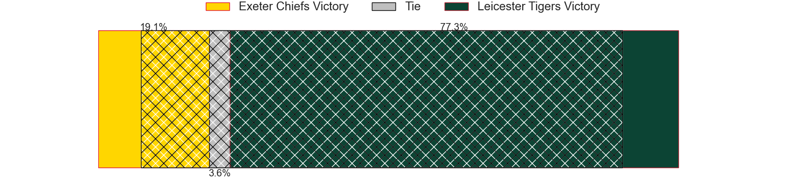

---  
layout: page  
title: Exeter Chiefs at Leicester Tigers; 22-40  
date: 2024-05-18 18:00:00 -0500  
categories: "Gallagher Premiership 2023" match review  
---
# Exeter Chiefs at Leicester Tigers; 22-40

# Club Level Predictions

The first set of predictions treats a club as the smallest object, as the club develops its members, organizes a gameplan, and deploys its players as needed for each match. This club model has a prediction of 0.629, which translates to predicting Leicester Tigers to win by 4.7.

Our Over/Under is 57.5 - and combined with the spread above, we have a predicted scoreline of 26 to 31

Each club has a rating and a rating deviation (similar to a Glicko rating), and expected performances can be generated. This allows for simulated matches and spreads like the ones below.
## Projected Performances - Club Model

## Projected Spreads - Club Model

## Projected Results - Club Model

# Player Level Predictions

Treating teams instead as an entity made up of the currently active players, I have ratings for each player in an altogether different system. These can be combined to form team ratings once teamsheets are announced, weighting starters a bit higher than the reserves. After the match is played, players can be weighted by their minutes on the field, allowing for an accurate measure of the team's composition. With these compiled team ratings, we can make predictions, measure inaccuracy, and update the individual player ratings.
## Prediction without Player Minutes: Leicester Tigers by 8.7

Leicester Tigers by 0.5 on a neutral pitch

## Projected Performances - Player Model

## Projected Spreads - Player Model

## Projected Results - Player Model

|   Away Minutes | Away Player          |   Away Percentile |   Number |   Home Percentile | Home Player           |   Home Minutes |
|---------------:|:---------------------|------------------:|---------:|------------------:|:----------------------|---------------:|
|             49 | Scott Sio            |             98.29 |        1 |             86.8  | Francois van Wyk      |             55 |
|             49 | Max Norey            |             84.1  |        2 |             95.08 | Julian Montoya        |             59 |
|             49 | Marcus Street        |             47.76 |        3 |             47.68 | Dan Cole              |             47 |
|             48 | Jack Dunne           |             52.48 |        4 |             85.31 | Harry Wells           |             70 |
|             82 | Dafydd Jenkins       |             93.92 |        5 |             93.21 | George Martin         |             82 |
|             55 | Ethan Roots          |             87.01 |        6 |             93.5  | Hanro Liebenberg      |             82 |
|             82 | Jacques Vermeulen    |             90.65 |        7 |             86.71 | Tommy Reffell         |             59 |
|             82 | Greg Fisilau         |             80.96 |        8 |             84.31 | Jasper Wiese          |             82 |
|             55 | Tom Cairns           |             86.56 |        9 |             76.27 | Jack van Poortvliet   |             62 |
|             82 | Harvey Skinner       |             67.73 |       10 |             89.6  | Handre Pollard        |             55 |
|             82 | Olly Woodburn        |             93.75 |       11 |             84.04 | Ollie Hassell-Collins |             82 |
|             55 | Joe Hawkins          |             57.08 |       12 |             89.19 | Dan Kelly             |             55 |
|             82 | Henry Slade          |             98.01 |       13 |             89.82 | Matt Scott            |             82 |
|             82 | Immanuel Feyi-Waboso |             89.04 |       14 |             95.38 | Mike Brown            |             82 |
|             82 | Dan John             |             60.47 |       15 |             40.17 | Freddie Steward       |             82 |
|             33 | Dan Frost            |             90    |       16 |              8.36 | Charlie Clare         |             23 |
|             33 | Billy Keast          |            nan    |       17 |             89.81 | James Cronin          |             27 |
|             33 | Ehren Painter        |             70.17 |       18 |             89.57 | Joe Heyes             |             35 |
|             34 | Christ Tshiunza      |             49.11 |       19 |             83.07 | Finn Carnduff         |             12 |
|             27 | Ross Vintcent        |             79.08 |       20 |             37.01 | Olly Cracknell        |             23 |
|             27 | Niall Armstrong      |            nan    |       21 |             63.87 | Tom Whiteley          |             20 |
|              0 | Will Haydon-Wood     |            nan    |       22 |            nan    | Kieran Wilkinson      |             27 |
|             27 | Zack Wimbush         |             53.2  |       23 |             32.32 | Solomone Kata         |             27 |

