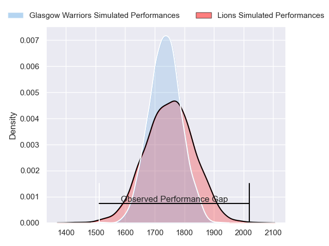
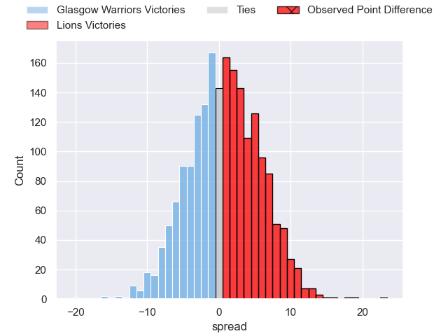
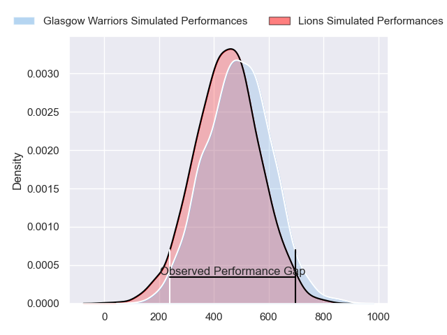
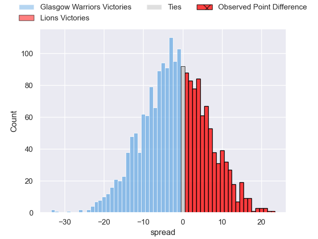
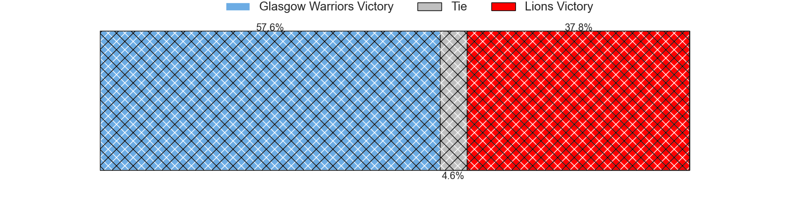

---  
layout: page  
title: Glasgow Warriors at Lions; 21-44  
date: 2024-05-18 18:00:00 -0500  
categories: "United Rugby Championship 2023" match review  
---
# Glasgow Warriors at Lions; 21-44

# Club Level Predictions

The first set of predictions treats a club as the smallest object, as the club develops its members, organizes a gameplan, and deploys its players as needed for each match. This club model has a prediction of 0.524, which translates to predicting Lions to win by 0.8.

Our Over/Under is 63.5 - and combined with the spread above, we have a predicted scoreline of 32 to 32

Each club has a rating and a rating deviation (similar to a Glicko rating), and expected performances can be generated. This allows for simulated matches and spreads like the ones below.
## Projected Performances - Club Model

## Projected Spreads - Club Model

## Projected Results - Club Model

# Player Level Predictions

Treating teams instead as an entity made up of the currently active players, I have ratings for each player in an altogether different system. These can be combined to form team ratings once teamsheets are announced, weighting starters a bit higher than the reserves. After the match is played, players can be weighted by their minutes on the field, allowing for an accurate measure of the team's composition. With these compiled team ratings, we can make predictions, measure inaccuracy, and update the individual player ratings.
## Prediction without Player Minutes: Glasgow Warriors by 0.3

Glasgow Warriors by 4.2 on a neutral pitch

## Projected Performances - Player Model

## Projected Spreads - Player Model

## Projected Results - Player Model

|   Away Minutes | Away Player       |   Away Percentile |   Number |   Home Percentile | Home Player          |   Home Minutes |
|---------------:|:------------------|------------------:|---------:|------------------:|:---------------------|---------------:|
|             34 | Oli Kebble        |             95.68 |        1 |             61.7  | Morgan Naude         |             53 |
|             33 | Angus Fraser      |             35.08 |        2 |             89.67 | PJ Botha             |             65 |
|             34 | Murphy Walker     |             39.04 |        3 |             82.23 | Asenathi Ntlabakanye |             53 |
|             45 | Gregor Brown      |             52.58 |        4 |             94.02 | Willem Alberts       |             62 |
|             80 | Scott Cummings    |             97.57 |        5 |             70.62 | Ruan Delport         |             80 |
|             68 | Euan Ferrie       |             48.52 |        6 |             90.16 | JC Pretorius         |             80 |
|             48 | Rory Darge        |             80.22 |        7 |             76.48 | Emmanuel Tshituka    |             10 |
|             80 | Henco Venter      |             96.44 |        8 |             99.79 | Francke Horn         |             75 |
|             62 | George Horne      |             99.13 |        9 |             92.67 | Morne van den Berg   |             80 |
|             36 | Tom Jordan        |             38.85 |       10 |             83.44 | Gianni Lombard       |             49 |
|             80 | Kyle Rowe         |             81.15 |       11 |             94.42 | Edwill van der Merwe |             80 |
|             80 | Sione Tuipulotu   |             55.09 |       12 |             77.33 | Jordan Hendrikse     |             76 |
|             80 | Stafford McDowall |             90.77 |       13 |             25.29 | Erich Cronje         |             80 |
|             80 | Kyle Steyn        |             95.29 |       14 |             85.96 | Rabz Maxwane         |             80 |
|             80 | Josh McKay        |             52.56 |       15 |             94.87 | Quan Horn            |             80 |
|             47 | Johnny Matthews   |             23.77 |       16 |             74.92 | Jaco Visagie         |             15 |
|             46 | Jamie Bhatti      |             95.19 |       17 |             82.97 | Jean-Pierre Smith    |             27 |
|             46 | Zander Fagerson   |             99.43 |       18 |             98.86 | Ruan Dreyer          |             27 |
|             35 | Max Williamson    |             48.02 |       19 |             92.1  | Reinhard Nothnagel   |             18 |
|             12 | Matt Fagerson     |             96.65 |       20 |             87.3  | Ruan Venter          |             70 |
|             32 | Jack Dempsey      |             37.87 |       21 |             95.4  | Hanru Sirgel         |              5 |
|             18 | Jamie Dobie       |             76.44 |       22 |             94.9  | Sanele Nohamba       |             31 |
|             44 | Duncan Weir       |             82.8  |       23 |             27.6  | Manuel Rass          |              4 |

