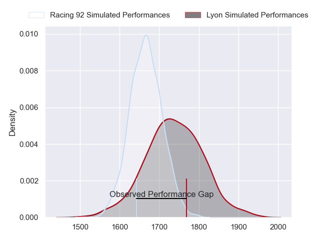
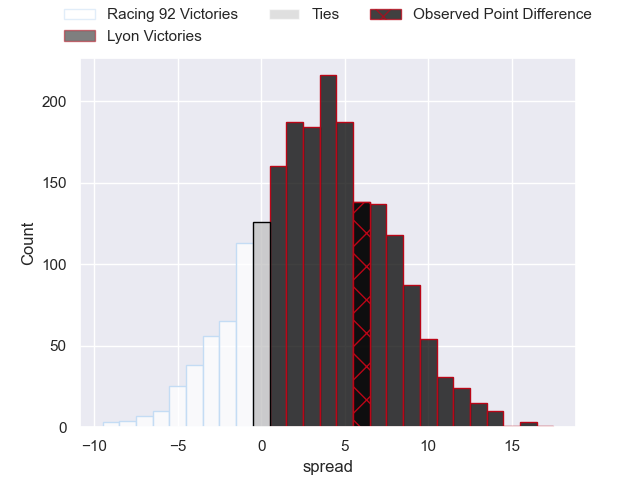
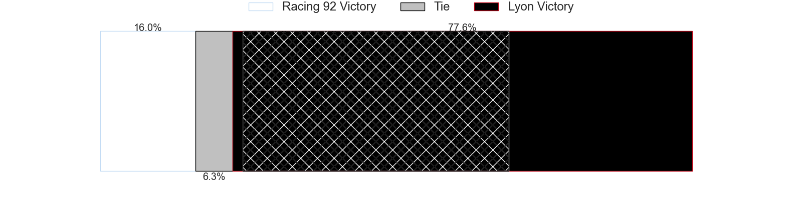
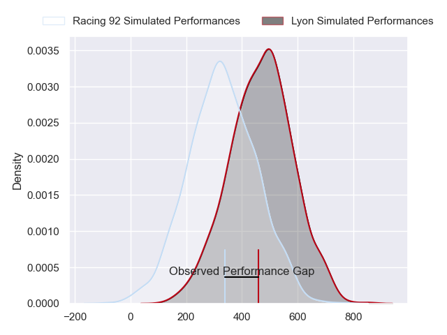
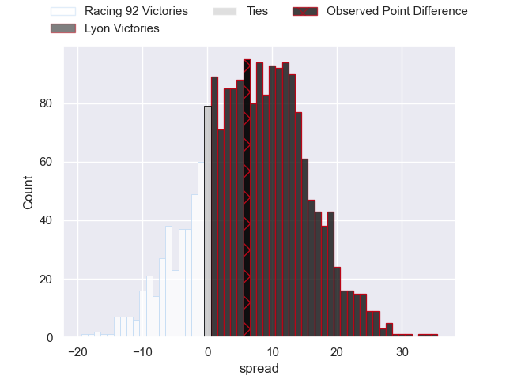
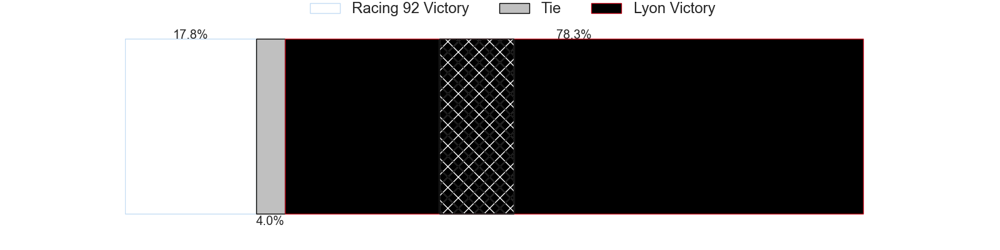

---  
layout: page  
title: Racing 92 at Lyon; 14-20  
date: 2024-05-18 18:00:00 -0500  
categories: "Top 14 Orange 2023" match review  
---
# Racing 92 at Lyon; 14-20

# Club Level Predictions

The first set of predictions treats a club as the smallest object, as the club develops its members, organizes a gameplan, and deploys its players as needed for each match. This club model has a prediction of 0.6, which translates to predicting Lyon to win by 3.5.

Our Over/Under is 48.5 - and combined with the spread above, we have a predicted scoreline of 22 to 26

Each club has a rating and a rating deviation (similar to a Glicko rating), and expected performances can be generated. This allows for simulated matches and spreads like the ones below.
## Projected Performances - Club Model

## Projected Spreads - Club Model

## Projected Results - Club Model

# Player Level Predictions

Treating teams instead as an entity made up of the currently active players, I have ratings for each player in an altogether different system. These can be combined to form team ratings once teamsheets are announced, weighting starters a bit higher than the reserves. After the match is played, players can be weighted by their minutes on the field, allowing for an accurate measure of the team's composition. With these compiled team ratings, we can make predictions, measure inaccuracy, and update the individual player ratings.
## Prediction without Player Minutes: Lyon by 7.5

Racing 92 by 0.1 on a neutral pitch

## Projected Performances - Player Model

## Projected Spreads - Player Model

## Projected Results - Player Model

|   Away Minutes | Away Player         |   Away Percentile |   Number |   Home Percentile | Home Player          |   Home Minutes |
|---------------:|:--------------------|------------------:|---------:|------------------:|:---------------------|---------------:|
|             50 | Guram Gogichashvili |             52.45 |        1 |             33.28 | Jerome Rey           |             50 |
|             50 | Camille Chat        |             92.79 |        2 |             23.44 | Guillaume Marchand   |             50 |
|             50 | Cedate Gomes Sa     |             77.32 |        3 |             92.82 | Demba Bamba          |             59 |
|             70 | Cameron Woki        |             91.89 |        4 |             85.9  | Felix Lambey         |             81 |
|             81 | Will Rowlands       |             32.76 |        5 |             51.42 | Romain Taofifenua    |             69 |
|             69 | Ibrahim Diallo      |             16.83 |        6 |             66.24 | Joel Kpoku           |             70 |
|             81 | Siya Kolisi         |             86.02 |        7 |             69.78 | Liam Allen           |             57 |
|             50 | Jordan Joseph       |             73.64 |        8 |             68.2  | Mickael Guillard     |             71 |
|             81 | Nolann Le Garrec    |             81.68 |        9 |             93.54 | Baptiste Couilloud   |             66 |
|             81 | Antoine Gibert      |             90.45 |       10 |             75.8  | Leo Berdeu           |             71 |
|             58 | Vinaya Habosi       |             30.48 |       11 |             98.08 | Monty Ioane          |             81 |
|             81 | Josua Tuisova       |             95.07 |       12 |             14.47 | Josiah Maraku        |             81 |
|             81 | Gael Fickou         |             97.27 |       13 |             99.79 | Semi Radradra        |             81 |
|             10 | Donovan Taofifenua  |             70.38 |       14 |             68.94 | Ethan Dumortier      |             75 |
|             81 | Max Spring          |             18.8  |       15 |             89.96 | Davit Niniashvili    |             81 |
|             31 | Janick Tarrit       |             32.62 |       16 |             87.21 | Liam Coltman         |             31 |
|             31 | Trevor Nyakane      |             76.75 |       17 |             17.86 | Sebastien Taofifenua |             31 |
|             23 | Boris Palu          |             77.08 |       18 |             23.53 | Killian Geraci       |              7 |
|             31 | Maxime Baudonne     |             55.41 |       19 |             28.15 | Theo William         |             24 |
|              0 | Clovis Le Bail      |             19.2  |       20 |             81.15 | Martin Page-Relo     |             25 |
|             71 | Martin Meliande     |              7.86 |       21 |             95.87 | Vincent Rattez       |              6 |
|             23 | Henry Chavancy      |             98.53 |       22 |             92.68 | Jordan Taufua        |             26 |
|             31 | Thomas Laclayat     |             81.16 |       23 |              6.36 | Hamza Kaabeche       |             22 |

