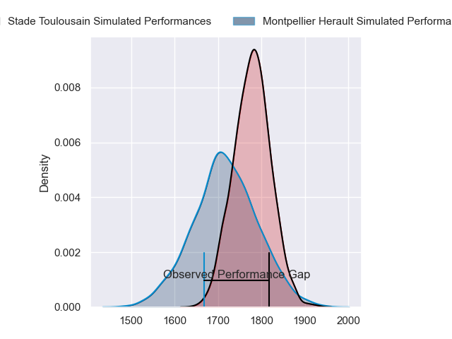
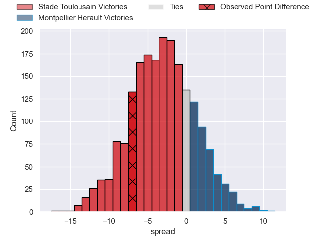
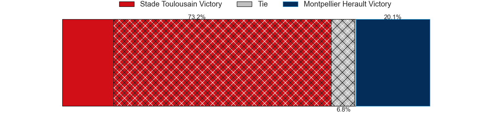
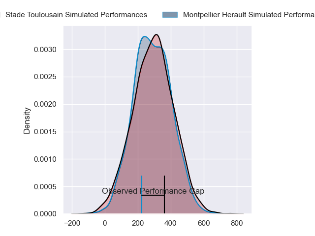
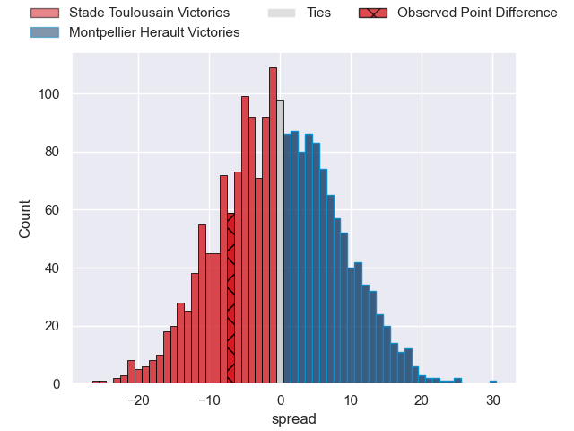
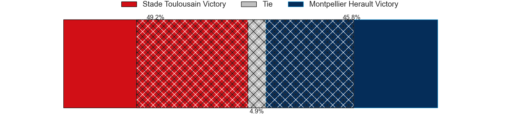

---  
layout: page  
title: Stade Toulousain at Montpellier Herault; 29-22  
date: 2024-05-18 18:00:00 -0500  
categories: "Top 14 Orange 2023" match review  
---
# Stade Toulousain at Montpellier Herault; 29-22

# Club Level Predictions

The first set of predictions treats a club as the smallest object, as the club develops its members, organizes a gameplan, and deploys its players as needed for each match. This club model has a prediction of 0.412, which translates to predicting Stade Toulousain to win by 3.1.

Our Over/Under is 31.5 - and combined with the spread above, we have a predicted scoreline of 17 to 14

Each club has a rating and a rating deviation (similar to a Glicko rating), and expected performances can be generated. This allows for simulated matches and spreads like the ones below.
## Projected Performances - Club Model

## Projected Spreads - Club Model

## Projected Results - Club Model

# Player Level Predictions

Treating teams instead as an entity made up of the currently active players, I have ratings for each player in an altogether different system. These can be combined to form team ratings once teamsheets are announced, weighting starters a bit higher than the reserves. After the match is played, players can be weighted by their minutes on the field, allowing for an accurate measure of the team's composition. With these compiled team ratings, we can make predictions, measure inaccuracy, and update the individual player ratings.
## Prediction without Player Minutes: Montpellier Herault by 1.3

Stade Toulousain by 6.2 on a neutral pitch

## Projected Performances - Player Model

## Projected Spreads - Player Model

## Projected Results - Player Model

|   Away Minutes | Away Player          |   Away Percentile |   Number |   Home Percentile | Home Player         |   Home Minutes |
|---------------:|:---------------------|------------------:|---------:|------------------:|:--------------------|---------------:|
|             47 | Marco Trauth         |             53.14 |        1 |              2.2  | Baptiste Erdocio    |             52 |
|             62 | Guillaume Cramont    |             83.77 |        2 |             91.31 | Christopher Tolofua |             49 |
|             52 | Joel Merkler         |             82.72 |        3 |             74.33 | Luka Japaridze      |             52 |
|             54 | Clement Verge        |             77    |        4 |             55.52 | Florian Verhaeghe   |             41 |
|             76 | Piula Fa'asalele     |             75.08 |        5 |             78.93 | Bastien Chalureau   |             60 |
|             60 | Mathis Castro        |             77.85 |        6 |             48.13 | Lenni Nouchi        |             74 |
|             56 | Joshua Brennan       |             81.99 |        7 |             59.94 | Sam Simmonds        |             80 |
|             80 | Theo Ntamack         |             58.37 |        8 |             88.91 | Marco Tauleigne     |             61 |
|             72 | Baptiste Germain     |             12.04 |        9 |             90.92 | Cobus Reinach       |             71 |
|             16 | Valentin Delpy       |             42.89 |       10 |             43.95 | Leo Coly            |             70 |
|             80 | Setareki Bituniyata  |             80.1  |       11 |             92.88 | George Bridge       |             61 |
|             80 | Pierre-Louis Barassi |             89.93 |       12 |             78.38 | Jan Serfontein      |             80 |
|             80 | Dimitri Delibes      |             81.22 |       13 |             14.06 | Auguste Cadot       |             80 |
|             68 | Arthur Retiere       |             94.62 |       14 |              3.17 | Gabriel Ngandebe    |             80 |
|             80 | Ange Capuozzo        |             95.09 |       15 |             52.99 | Julien Tisseron     |             77 |
|             18 | Ian Boubila          |             15.41 |       16 |            nan    | Lyam Akrab          |             31 |
|             33 | Benjamin Bertrand    |            nan    |       17 |             12.8  | Gregory Fichten     |             28 |
|             26 | Richie Arnold        |             79.03 |       18 |             54.61 | Tyler Duguid        |             39 |
|             28 | Clement Sentubery    |            nan    |       19 |             22.74 | Clement Doumenc     |              6 |
|             20 | Lomig Jouanny        |            nan    |       20 |             22.05 | Alexandre Becognee  |             39 |
|             64 | Kalvin Gourgues      |             48.37 |       21 |             49.53 | Arthur Vincent      |             22 |
|             20 | Lucas Tauzin         |             79.33 |       22 |             17.63 | Thomas Darmon       |             19 |
|             28 | David Ainu'u         |             94.13 |       23 |             56.56 | Titi Lamositele     |             28 |

