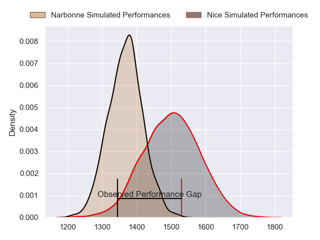
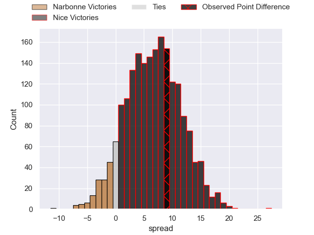
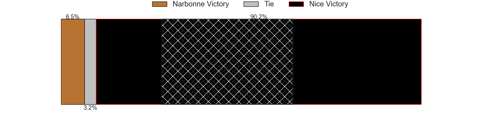
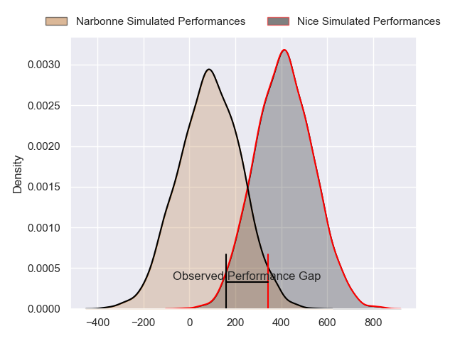
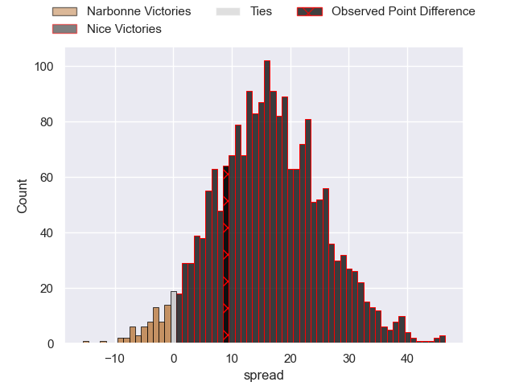
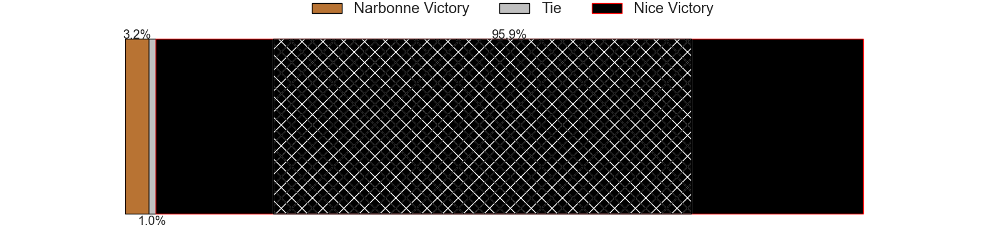

---  
layout: page  
title: Narbonne at Nice; 30-39  
date: 2024-05-18 18:00:00 -0500  
categories: "Nationale 2023" match review  
---
# Narbonne at Nice; 30-39

# Club Level Predictions

The first set of predictions treats a club as the smallest object, as the club develops its members, organizes a gameplan, and deploys its players as needed for each match. This club model has a prediction of 0.678, which translates to predicting Nice to win by 6.5.

Our Over/Under is 38.5 - and combined with the spread above, we have a predicted scoreline of 16 to 23

Each club has a rating and a rating deviation (similar to a Glicko rating), and expected performances can be generated. This allows for simulated matches and spreads like the ones below.
## Projected Performances - Club Model

## Projected Spreads - Club Model

## Projected Results - Club Model

# Player Level Predictions

Treating teams instead as an entity made up of the currently active players, I have ratings for each player in an altogether different system. These can be combined to form team ratings once teamsheets are announced, weighting starters a bit higher than the reserves. After the match is played, players can be weighted by their minutes on the field, allowing for an accurate measure of the team's composition. With these compiled team ratings, we can make predictions, measure inaccuracy, and update the individual player ratings.
## Prediction without Player Minutes: Nice by 18.1

Nice by 15.3 on a neutral pitch

## Projected Performances - Player Model

## Projected Spreads - Player Model

## Projected Results - Player Model

|   Away Minutes | Away Player            |   Away Percentile |   Number |   Home Percentile | Home Player              |   Home Minutes |
|---------------:|:-----------------------|------------------:|---------:|------------------:|:-------------------------|---------------:|
|             80 | Théo Castinel          |             86.39 |        1 |              4.73 | Jules Martinez           |             80 |
|             80 | Clément Esteriola      |             18.2  |        2 |             82.79 | Sione Anga'aelangi       |             80 |
|             80 | Jamie Hagan            |             60.23 |        3 |             67.48 | Luvuyo Pupuma            |             80 |
|             80 | Marius Antonescu       |              9.63 |        4 |             44.38 | Yann Tivoli              |             80 |
|             80 | Leva Fifita            |             10.74 |        5 |             99.59 | Tom Murday               |             80 |
|             80 | Baptiste Abescat-Leroy |             81.79 |        6 |             98.52 | Louis Suaud              |             80 |
|             80 | Paul Belzons           |              9.15 |        7 |             67.22 | Arthur Vignolles         |             80 |
|             80 | Charles Malet          |              3.14 |        8 |              8.37 | Ramiha Tarrel Tia Smiler |             80 |
|             80 | Pierrick Nova          |             73.12 |        9 |             92.15 | Jules Solinas            |             80 |
|             80 | Gilles Bosch           |              5.94 |       10 |             56.9  | Mathis Viard             |             80 |
|             80 | Pierre-Hugo Ducom      |              8.27 |       11 |             97.02 | Andrzej Charlat          |             80 |
|             80 | Peter Betham           |             99.9  |       12 |             10.91 | Luca Cutayar             |             80 |
|             80 | Pierre Nueno           |             43.65 |       13 |             87.72 | Nathan Courtade          |             80 |
|             80 | Ambrose Curtis         |             72.02 |       14 |             93.56 | Simon Delas              |             80 |
|             80 | Paul Auradou           |             88.89 |       15 |             92.52 | David Odiete             |             80 |

