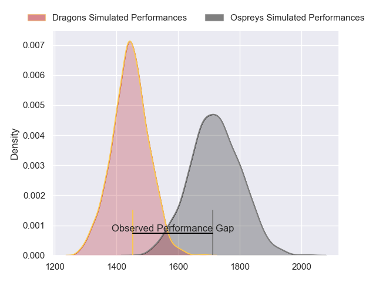
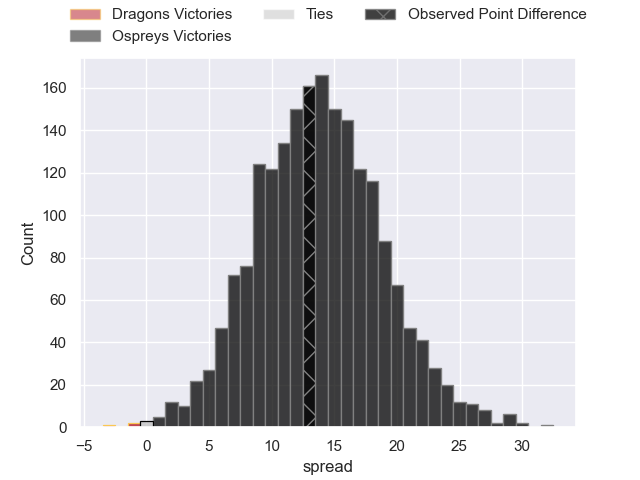
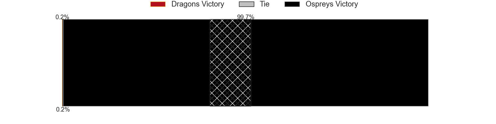
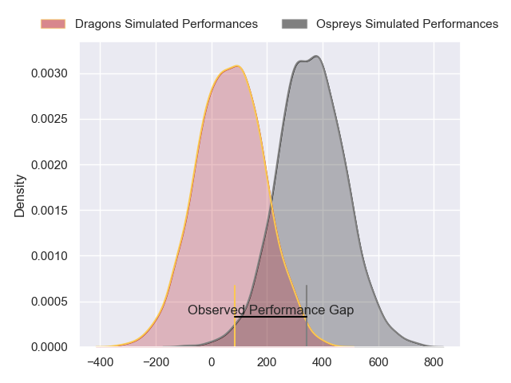
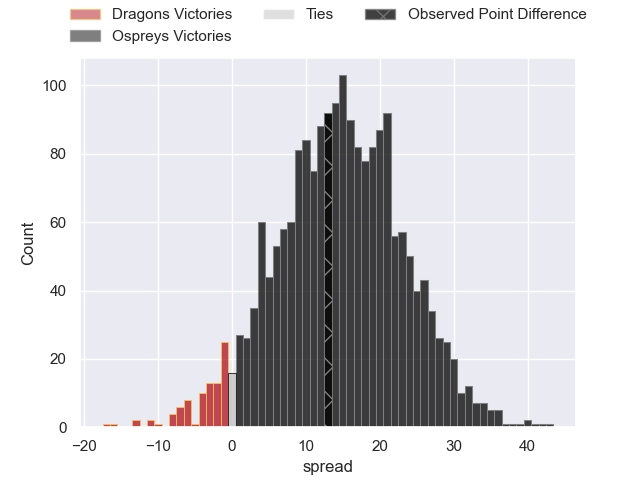

---  
layout: page  
title: Dragons at Ospreys; 13-26  
date: 2024-05-18 18:00:00 -0500  
categories: "United Rugby Championship 2023" match review  
---
# Dragons at Ospreys; 13-26

# Club Level Predictions

The first set of predictions treats a club as the smallest object, as the club develops its members, organizes a gameplan, and deploys its players as needed for each match. This club model has a prediction of 0.827, which translates to predicting Ospreys to win by 13.8.

Our Over/Under is 64.5 - and combined with the spread above, we have a predicted scoreline of 25 to 39

Each club has a rating and a rating deviation (similar to a Glicko rating), and expected performances can be generated. This allows for simulated matches and spreads like the ones below.
## Projected Performances - Club Model

## Projected Spreads - Club Model

## Projected Results - Club Model

# Player Level Predictions

Treating teams instead as an entity made up of the currently active players, I have ratings for each player in an altogether different system. These can be combined to form team ratings once teamsheets are announced, weighting starters a bit higher than the reserves. After the match is played, players can be weighted by their minutes on the field, allowing for an accurate measure of the team's composition. With these compiled team ratings, we can make predictions, measure inaccuracy, and update the individual player ratings.
## Prediction without Player Minutes: Ospreys by 16.9

Ospreys by 11.0 on a neutral pitch

## Projected Performances - Player Model

## Projected Spreads - Player Model

## Projected Results - Player Model

|   Away Minutes | Away Player        |   Away Percentile |   Number |   Home Percentile | Home Player            |   Home Minutes |
|---------------:|:-------------------|------------------:|---------:|------------------:|:-----------------------|---------------:|
|             45 | Rhodri Jones       |              2.61 |        1 |             77.02 | Nicky Smith            |             68 |
|             48 | Elliot Dee         |             91.15 |        2 |             52.3  | Dewi Lake              |             60 |
|             59 | Chris Coleman      |             26.81 |        3 |             80.52 | Tom Botha              |             55 |
|             80 | Ben Carter         |             29.89 |        4 |             79.64 | James Ratti            |             71 |
|             66 | Matthew Screech    |              0.61 |        5 |             65.35 | Huw Owen-Sutton        |             80 |
|             45 | Harrison Keddie    |              1.08 |        6 |             93.9  | Jac Morgan             |             61 |
|             80 | Taine Basham       |             27.95 |        7 |             97.74 | Justin Tipuric         |             80 |
|             80 | Aaron Wainwright   |             87.24 |        8 |             13.39 | Morgan Morris          |             80 |
|             70 | Dane Blacker       |              6.46 |        9 |             79.06 | Reuben Morgan-Williams |             78 |
|             80 | Will Reed          |             25.9  |       10 |             63.48 | Dan Edwards            |             80 |
|             80 | Christopher Hollis |             46.92 |       11 |             14.81 | Keelan Giles           |             80 |
|             52 | Aneurin Owen       |             60.55 |       12 |             87.3  | Keiran Williams        |             75 |
|             59 | Steffan Hughes     |             80.06 |       13 |             39.77 | Tom Florence           |             71 |
|             80 | Rio Dyer           |             32.4  |       14 |             22.4  | Luke Morgan            |             80 |
|             80 | Ewan Rosser        |             41.45 |       15 |             72.65 | Jack Walsh             |             80 |
|             32 | Brodie Coghlan     |             39.02 |       16 |             75.25 | Sam Parry              |             20 |
|             35 | Rodrigo Martinez   |             63.08 |       17 |             64.3  | Gareth Thomas          |             12 |
|             21 | Dimitri Arhip      |            nan    |       18 |             87.69 | Rhys Henry             |             25 |
|             14 | Sean Lonsdale      |             16.93 |       19 |             72.64 | Victor Sekekete        |              9 |
|             35 | Ryan Woodman       |            nan    |       20 |             87.8  | Harri Deaves           |             19 |
|             10 | Morgan Lloyd       |            nan    |       21 |             64.57 | Luke Davies            |              2 |
|             21 | Joe Westwood       |             33.47 |       22 |            nan    | Luke Scully            |              9 |
|             28 | Sio Tomkinson      |             86.46 |       23 |             81.2  | Max Nagy               |              5 |

