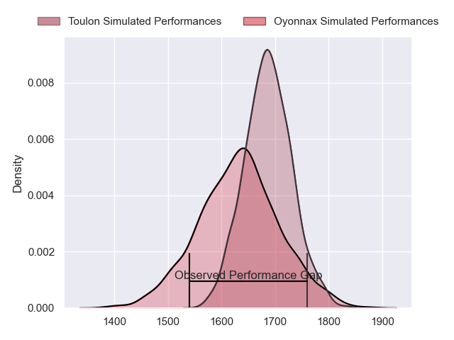
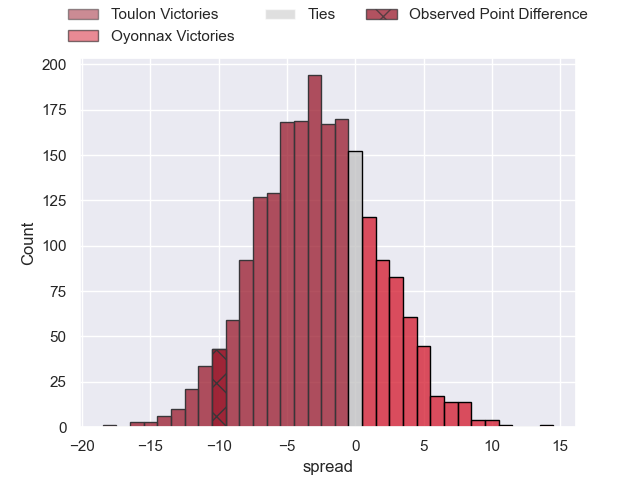
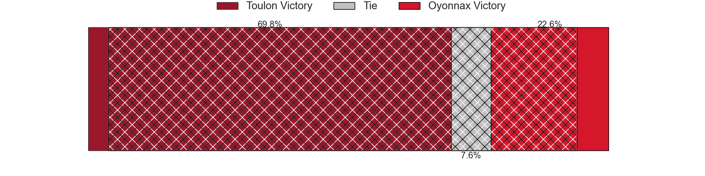
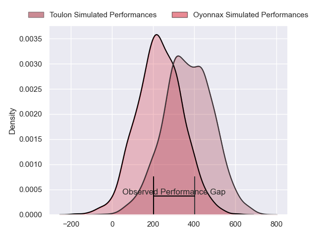
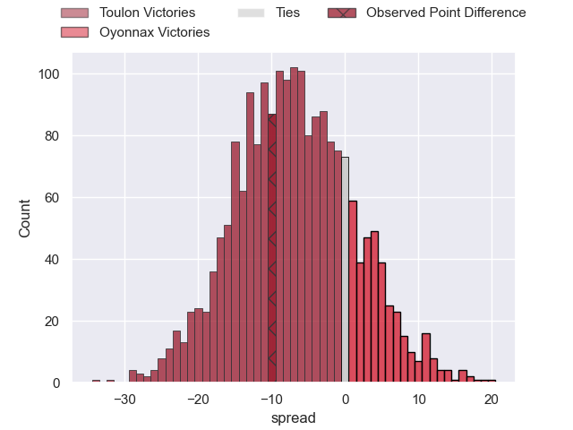
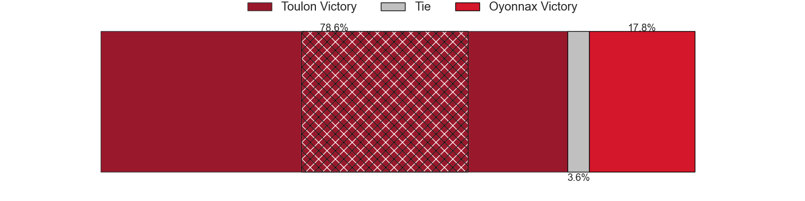

---  
layout: page  
title: Toulon at Oyonnax; 27-17  
date: 2024-05-18 18:00:00 -0500  
categories: "Top 14 Orange 2023" match review  
---
# Toulon at Oyonnax; 27-17

# Club Level Predictions

The first set of predictions treats a club as the smallest object, as the club develops its members, organizes a gameplan, and deploys its players as needed for each match. This club model has a prediction of 0.421, which translates to predicting Toulon to win by 2.8.

Our Over/Under is 38.5 - and combined with the spread above, we have a predicted scoreline of 21 to 18

Each club has a rating and a rating deviation (similar to a Glicko rating), and expected performances can be generated. This allows for simulated matches and spreads like the ones below.
## Projected Performances - Club Model

## Projected Spreads - Club Model

## Projected Results - Club Model

# Player Level Predictions

Treating teams instead as an entity made up of the currently active players, I have ratings for each player in an altogether different system. These can be combined to form team ratings once teamsheets are announced, weighting starters a bit higher than the reserves. After the match is played, players can be weighted by their minutes on the field, allowing for an accurate measure of the team's composition. With these compiled team ratings, we can make predictions, measure inaccuracy, and update the individual player ratings.
## Prediction without Player Minutes: Toulon by 8.3

Toulon by 16.0 on a neutral pitch

## Projected Performances - Player Model

## Projected Spreads - Player Model

## Projected Results - Player Model

|   Away Minutes | Away Player        |   Away Percentile |   Number |   Home Percentile | Home Player        |   Home Minutes |
|---------------:|:-------------------|------------------:|---------:|------------------:|:-------------------|---------------:|
|             48 | Dany Priso         |             93.32 |        1 |             43.03 | Antoine Abraham    |             52 |
|             48 | Teddy Baubigny     |             65.9  |        2 |             17.54 | Benjamin Geledan   |             46 |
|             48 | Beka Gigashvili    |             80.03 |        3 |              8.39 | Christopher Vaotoa |             64 |
|             80 | David Ribbans      |             90.98 |        4 |             50.35 | Ewan Johnson       |             62 |
|             67 | Brian Alainu'uese  |             91.69 |        5 |             61.7  | Hugo Fabregue      |             64 |
|             77 | Cornell du Preez   |             88.29 |        6 |             34.84 | Kevin Lebreton     |             80 |
|             80 | Jules Coulon       |             48.43 |        7 |             21.46 | Hugo Hermet        |             46 |
|             51 | Charles Ollivon    |             98.12 |        8 |              2.93 | Loic Godener       |             61 |
|             51 | Ben White          |             85.51 |        9 |              9.42 | Vasil Lobzhanidze  |             61 |
|             51 | Dan Biggar         |             98.09 |       10 |              5.31 | Justin Bouraux     |             80 |
|             80 | Gael Drean         |             18.08 |       11 |             67.02 | Daniel Ikpefan     |             80 |
|             80 | Mathieu Smaili     |             15.11 |       12 |             58.45 | Lucas Mensa        |             80 |
|             62 | Seta Tuicuvu       |             69.15 |       13 |             71.14 | Theo Millet        |             80 |
|             80 | Jiuta Wainiqolo    |             90.19 |       14 |             29.23 | Enzo Reybier       |             80 |
|             80 | Melvyn Jaminet     |             89.1  |       15 |             66.03 | Darren Sweetnam    |             19 |
|             32 | Jack Singleton     |             92.95 |       16 |              6.07 | Teddy Durand       |             34 |
|             32 | Jean-Baptiste Gros |             97.07 |       17 |             84.03 | Tommy Raynaud      |             28 |
|             13 | Matthias Halagahu  |             35.06 |       18 |            nan    | Kevin Kornath      |             34 |
|             32 | Selevasio Tolofua  |             83.96 |       19 |             37.6  | Loic Credoz        |             34 |
|             29 | Paolo Garbisi      |             84.71 |       20 |             94.07 | Jonathan Ruru      |             19 |
|             29 | Baptiste Serin     |             96.68 |       21 |             87.26 | Domingo Miotti     |             61 |
|             18 | Jeremy Sinzelle    |            nan    |       22 |            nan    | David Odiase       |             19 |
|             32 | Kieran Brookes     |             21.68 |       23 |             39.45 | Thibault Berthaud  |             16 |

