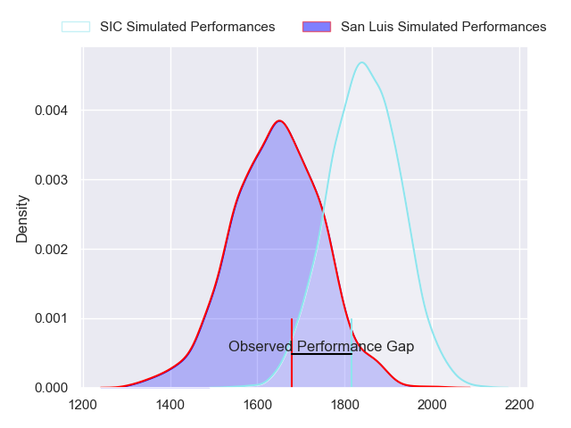
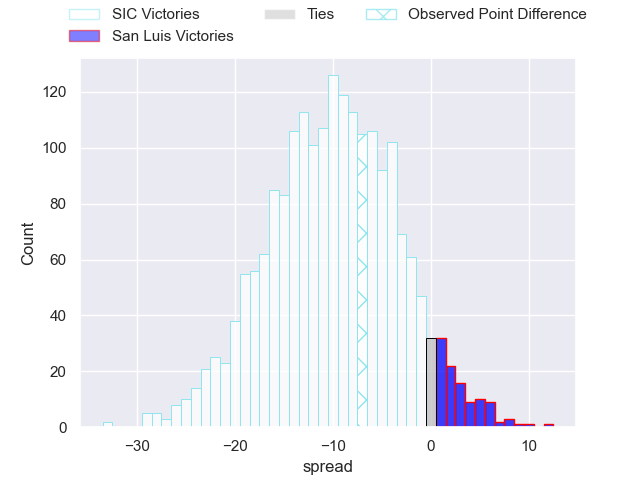
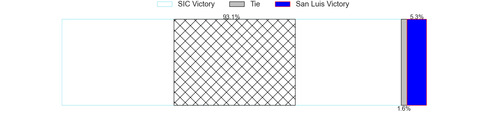
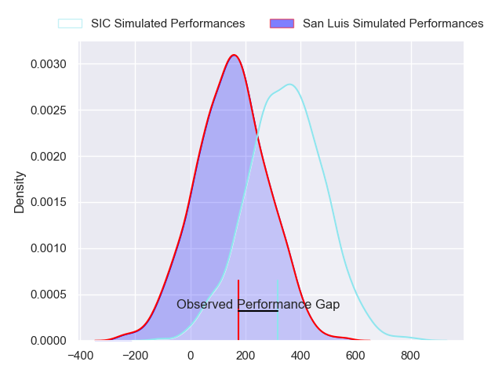
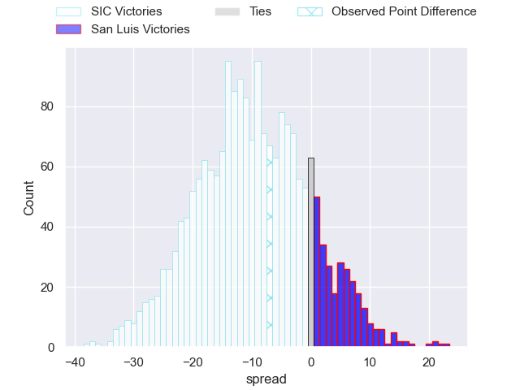
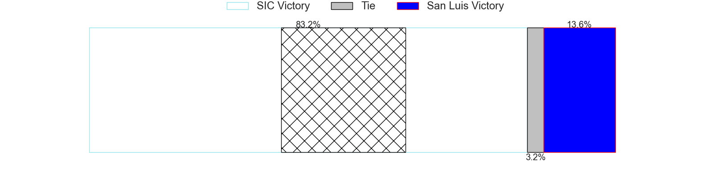

---  
layout: page  
title: SIC at San Luis; 28-21  
date: 2024-05-18 18:00:00 -0500  
categories: "URBA Top 12 2024" match review  
---
# SIC at San Luis; 28-21

# Club Level Predictions

The first set of predictions treats a club as the smallest object, as the club develops its members, organizes a gameplan, and deploys its players as needed for each match. This club model has a prediction of 0.25, which translates to predicting SIC to win by 9.9.

Our Over/Under is 45.5 - and combined with the spread above, we have a predicted scoreline of 28 to 18

Each club has a rating and a rating deviation (similar to a Glicko rating), and expected performances can be generated. This allows for simulated matches and spreads like the ones below.
## Projected Performances - Club Model

## Projected Spreads - Club Model

## Projected Results - Club Model

# Player Level Predictions

Treating teams instead as an entity made up of the currently active players, I have ratings for each player in an altogether different system. These can be combined to form team ratings once teamsheets are announced, weighting starters a bit higher than the reserves. After the match is played, players can be weighted by their minutes on the field, allowing for an accurate measure of the team's composition. With these compiled team ratings, we can make predictions, measure inaccuracy, and update the individual player ratings.
## Prediction without Player Minutes: SIC by 8.6

SIC by 12.9 on a neutral pitch

## Projected Performances - Player Model

## Projected Spreads - Player Model

## Projected Results - Player Model

|   Away Minutes | Away Player                  |   Away Percentile |   Number |   Home Percentile | Home Player                |   Home Minutes |
|---------------:|:-----------------------------|------------------:|---------:|------------------:|:---------------------------|---------------:|
|             81 | Marcos Piccinini             |             84.5  |        1 |             64.68 | Alexis Uvieda              |             81 |
|             81 | Ricardo Alberto Macchiavello |             45.9  |        2 |             43.44 | Franco Cantalupo           |             81 |
|             81 | Benjamin Chiappe             |             80.18 |        3 |             52.37 | Facundo Suarez             |             81 |
|             81 | Bautista Viero               |             81.14 |        4 |             43.71 | Ramiro Bruni               |             81 |
|             81 | Tomas Borghi                 |             76.27 |        5 |             44.93 | Santiago Canal             |             81 |
|             81 | Andrea Panzarini             |             75.69 |        6 |             52.76 | Manuel Gnecco              |             81 |
|             81 | Franco Delger                |             77.95 |        7 |             44.69 | Felipe Piatti              |             81 |
|             81 | Tomas Meyrelles              |             73.43 |        8 |             29.71 | Facundo Alvarez Amado      |             81 |
|             81 | Felipe Sascaro               |             78.18 |        9 |             31.59 | Martin Aereboe             |             81 |
|             81 | Santiago Pavlovsky           |             76.86 |       10 |             35.67 | Isidro Lazzarini           |             81 |
|             81 | Jacinto Campbell             |             79.04 |       11 |             47.31 | Wilmer Ramirez             |             81 |
|             81 | Santos Rubio                 |             75.79 |       12 |             53.46 | Segundo Fresco             |             81 |
|             81 | Nicanor Acosta               |             65.83 |       13 |             37.84 | Benjamin Marban            |             81 |
|             81 | Lucas Albanese               |             45.58 |       14 |             43.94 | Eduardo Ruesta             |             81 |
|             81 | Franco Moneta                |             76.07 |       15 |             52.14 | Felipe Crispo              |             81 |
|              0 | Segundo Rubio                |            nan    |       16 |            nan    | Santiago Gibert            |              0 |
|              0 | Lucas Rocha                  |             84.59 |       17 |             20.88 | Alejo Garcia               |              0 |
|              0 | Ignacio Noel                 |            nan    |       18 |            nan    | Lahuen Argemi              |              0 |
|              0 | Pedro Georgalo               |            nan    |       19 |            nan    | Agustin Fitzsimons Herrera |              0 |
|              0 | Ciro Ploruti                 |            nan    |       20 |             33.27 | Nahuel Curti               |              0 |
|              0 | Agustin Sascaro              |            nan    |       21 |            nan    | Luka Gullo                 |              0 |
|              0 | Ramon Martinez Tomietto      |            nan    |       22 |             45.65 | Felipe Campodonico         |              0 |
|              0 | Felipe Rubio                 |            nan    |       23 |            nan    | Lautaro Grys Arana         |              0 |

