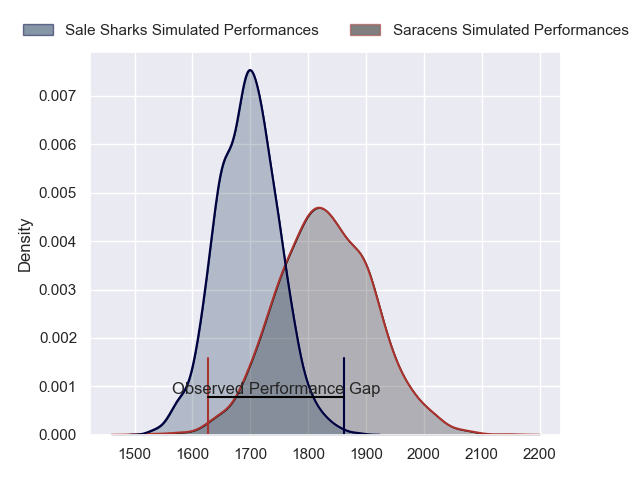
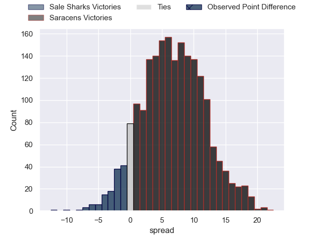
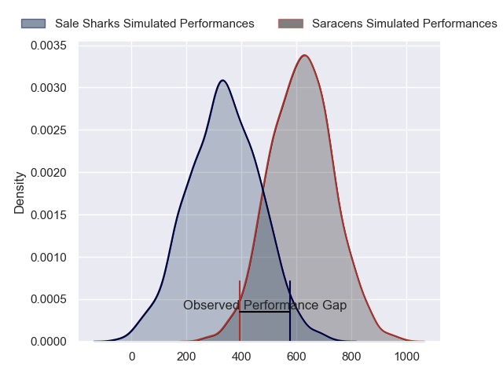
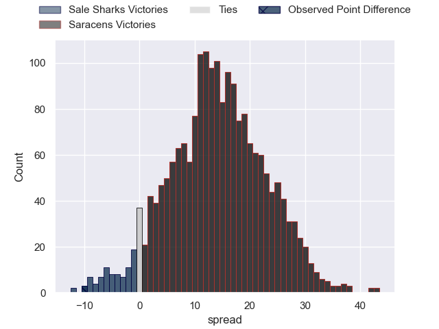
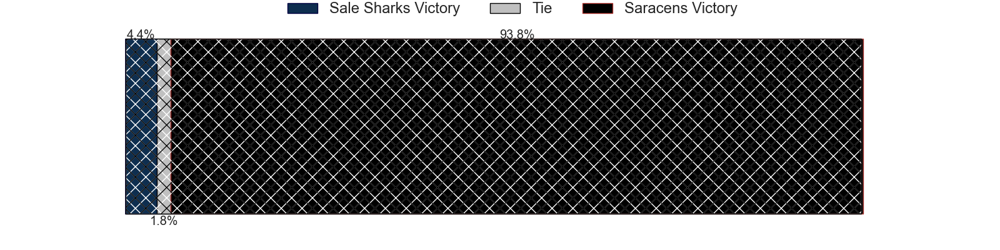

---  
layout: page  
title: Sale Sharks at Saracens; 20-10  
date: 2024-05-18 18:00:00 -0500  
categories: "Gallagher Premiership 2023" match review  
---
# Sale Sharks at Saracens; 20-10

# Club Level Predictions

The first set of predictions treats a club as the smallest object, as the club develops its members, organizes a gameplan, and deploys its players as needed for each match. This club model has a prediction of 0.68, which translates to predicting Saracens to win by 6.7.

Our Over/Under is 59.5 - and combined with the spread above, we have a predicted scoreline of 26 to 33

Each club has a rating and a rating deviation (similar to a Glicko rating), and expected performances can be generated. This allows for simulated matches and spreads like the ones below.
## Projected Performances - Club Model

## Projected Spreads - Club Model

## Projected Results - Club Model

# Player Level Predictions

Treating teams instead as an entity made up of the currently active players, I have ratings for each player in an altogether different system. These can be combined to form team ratings once teamsheets are announced, weighting starters a bit higher than the reserves. After the match is played, players can be weighted by their minutes on the field, allowing for an accurate measure of the team's composition. With these compiled team ratings, we can make predictions, measure inaccuracy, and update the individual player ratings.
## Prediction without Player Minutes: Saracens by 15.8

Saracens by 8.9 on a neutral pitch

## Projected Performances - Player Model

## Projected Spreads - Player Model

## Projected Results - Player Model

|   Away Minutes | Away Player       |   Away Percentile |   Number |   Home Percentile | Home Player          |   Home Minutes |
|---------------:|:------------------|------------------:|---------:|------------------:|:---------------------|---------------:|
|             52 | Bevan Rodd        |             94.78 |        1 |             99.76 | Mako Vunipola        |             53 |
|             52 | Luke Cowan-Dickie |             92.3  |        2 |             98.52 | Jamie George         |             53 |
|             52 | James Harper      |             19    |        3 |             57.91 | Christian Judge      |             41 |
|             61 | Cobus Wiese       |             93.51 |        4 |             94.52 | Maro Itoje           |             80 |
|             53 | Hyron Andrews     |             41.18 |        5 |             58.01 | Hugh Tizard          |             53 |
|             80 | Ben Curry         |             65.06 |        6 |             94.78 | Juan Martin Gonzalez |             53 |
|             80 | Sam Dugdale       |             29.82 |        7 |             97.15 | Ben Earl             |             80 |
|             80 | Jean-Luc du Preez |             99.37 |        8 |             24.9  | Tom Willis           |             57 |
|             53 | Gus Warr          |             40.49 |        9 |             75.74 | Ivan van Zyl         |             70 |
|             80 | George Ford       |             96.6  |       10 |             98.94 | Owen Farrell         |             80 |
|             80 | Tom O'Flaherty    |             96.25 |       11 |             92.79 | Tom Parton           |             80 |
|             18 | Manu Tuilagi      |             98.74 |       12 |             98.22 | Nick Tompkins        |             80 |
|             80 | Robert du Preez   |             79.35 |       13 |             58.18 | Lucio Cinti          |             53 |
|             76 | Tom Roebuck       |             85    |       14 |             48.65 | Alex Lewington       |             80 |
|             80 | Joe Carpenter     |             12.61 |       15 |             82.91 | Elliot Daly          |             80 |
|             28 | Tommy Taylor      |             12.62 |       16 |             53.11 | Theo Dan             |             27 |
|             28 | Simon McIntyre    |             92.66 |       17 |             79.28 | Eroni Mawi           |             27 |
|             28 | WillGriff John    |            nan    |       18 |             63.7  | Marco Riccioni       |             39 |
|             19 | Ben Bamber        |             14.4  |       19 |             89.35 | Nick Isiekwe         |             27 |
|             27 | Ernst van Rhyn    |             85.73 |       20 |             32.15 | Theo McFarland       |             27 |
|             27 | Raffi Quirke      |             71.55 |       21 |             97.91 | Billy Vunipola       |             23 |
|             62 | Sam James         |             84.19 |       22 |             78.71 | Aled Davies          |             10 |
|              4 | Arron Reed        |             80.48 |       23 |             86.11 | Alex Goode           |             27 |

