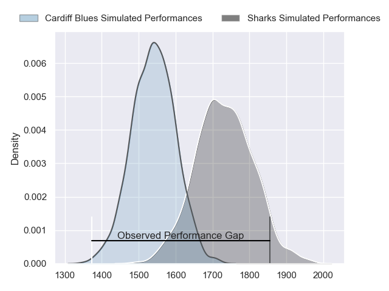
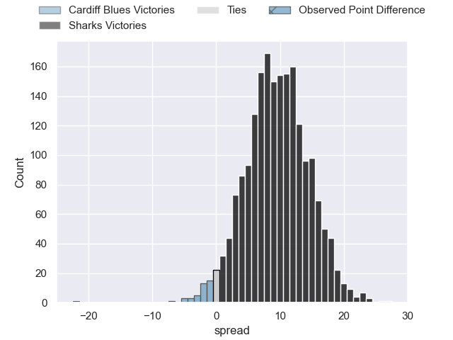
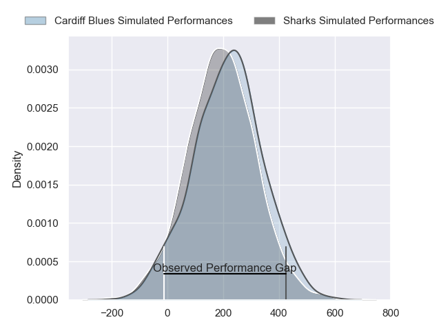
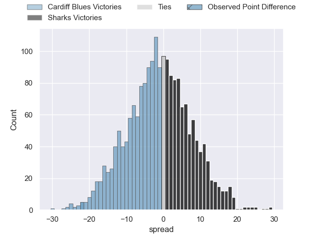
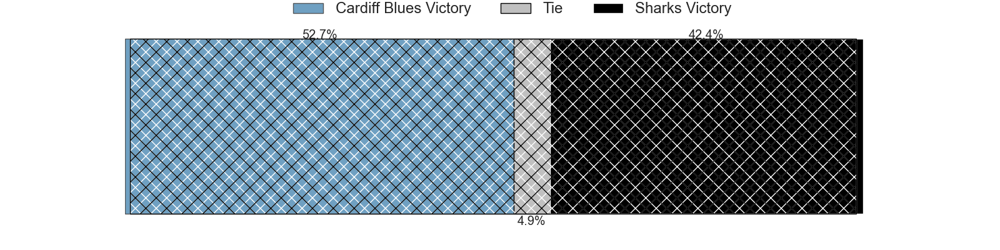

---  
layout: page  
title: Cardiff Blues at Sharks; 36-14  
date: 2024-05-18 18:00:00 -0500  
categories: "United Rugby Championship 2023" match review  
---
# Cardiff Blues at Sharks; 36-14

# Club Level Predictions

The first set of predictions treats a club as the smallest object, as the club develops its members, organizes a gameplan, and deploys its players as needed for each match. This club model has a prediction of 0.749, which translates to predicting Sharks to win by 9.6.

Our Over/Under is 52.5 - and combined with the spread above, we have a predicted scoreline of 21 to 31

Each club has a rating and a rating deviation (similar to a Glicko rating), and expected performances can be generated. This allows for simulated matches and spreads like the ones below.
## Projected Performances - Club Model

## Projected Spreads - Club Model

## Projected Results - Club Model

# Player Level Predictions

Treating teams instead as an entity made up of the currently active players, I have ratings for each player in an altogether different system. These can be combined to form team ratings once teamsheets are announced, weighting starters a bit higher than the reserves. After the match is played, players can be weighted by their minutes on the field, allowing for an accurate measure of the team's composition. With these compiled team ratings, we can make predictions, measure inaccuracy, and update the individual player ratings.
## Prediction without Player Minutes: Cardiff Blues by 2.8

Cardiff Blues by 7.2 on a neutral pitch

## Projected Performances - Player Model

## Projected Spreads - Player Model

## Projected Results - Player Model

|   Away Minutes | Away Player        |   Away Percentile |   Number |   Home Percentile | Home Player        |   Home Minutes |
|---------------:|:-------------------|------------------:|---------:|------------------:|:-------------------|---------------:|
|             50 | Corey Domachowski  |             90.14 |        1 |             25.67 | Dian Bleuler       |             52 |
|             61 | Liam Belcher       |             79.18 |        2 |             20.49 | Dylan Richardson   |             60 |
|             50 | Rhys Litterick     |             43.44 |        3 |             59.74 | Khwezi Mona        |             52 |
|             80 | Shane Lewis-Hughes |             12.06 |        4 |             41.84 | Corne Rahl         |             60 |
|             80 | Rory Thornton      |              7.6  |        5 |             21.68 | Reniel Hugo        |             80 |
|             50 | Ben Donnell        |             95.67 |        6 |             27.36 | Tinotenda Mavesere |             80 |
|             80 | James Botham       |             85.14 |        7 |             29.82 | Simon Miller       |             47 |
|             56 | Alun Lawrence      |             88.49 |        8 |             25.73 | Sikhumbuzo Notshe  |             80 |
|             80 | Ellis Bevan        |             68.41 |        9 |             31.41 | Tiaan Fourie       |             56 |
|             80 | Ben Thomas         |             70.7  |       10 |             25.69 | Lionel Cronje      |             80 |
|             80 | Gabriel Hamer-Webb |             91.92 |       11 |              2.21 | Aphiwe Dyantyi     |             80 |
|             56 | Uilisi Halaholo    |             93.7  |       12 |             29.8  | Eduan Keyter       |             80 |
|             67 | Rey Lee-Lo         |             91.61 |       13 |             22.46 | Diego Appollis     |             80 |
|             80 | Josh Adams         |             81.44 |       14 |             27.12 | Yaw Penxe          |             80 |
|             71 | Cameron Winnett    |             34.83 |       15 |             41.03 | Boeta Chamberlain  |             52 |
|             19 | Evan Lloyd         |             43.28 |       16 |             49.34 | Dan Jooste         |             20 |
|             30 | Rhys Carré         |             12.96 |       17 |            nan    | Braam Reyneke      |             28 |
|             30 | Keiron Assiratti   |             29.58 |       18 |            nan    | IG Prinsloo        |             28 |
|             30 | Seb Davies         |             16.11 |       19 |            nan    | Thomas Dyer        |             20 |
|             24 | Mackenzie Martin   |             41.42 |       20 |             47.28 | Nick Hatton        |             33 |
|             24 | Tinus de Beer      |             66.45 |       21 |            nan    | Bradley Davids     |             24 |
|              9 | Jacob Beetham      |             13.89 |       22 |             88.11 | Curwin Bosch       |             28 |
|             13 | Mason Grady        |             82.69 |       23 |            nan    | Anthony Volmink    |              0 |

