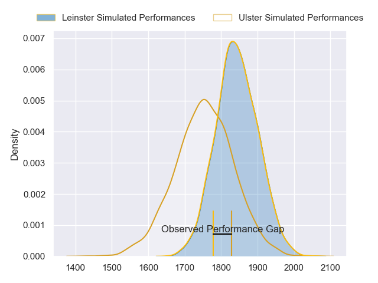
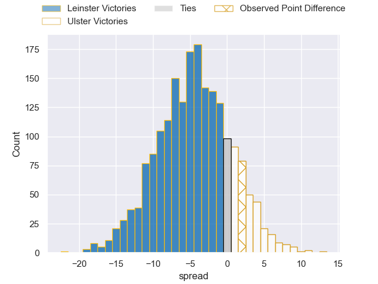
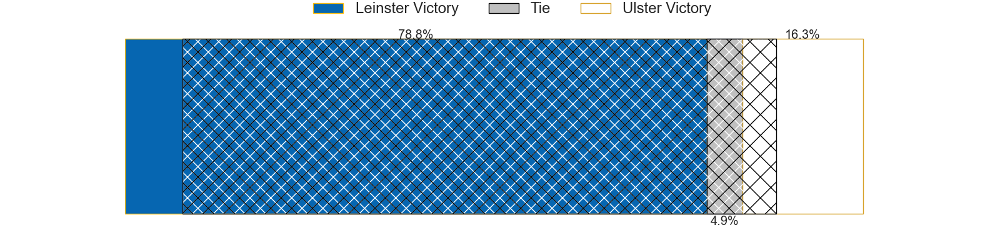
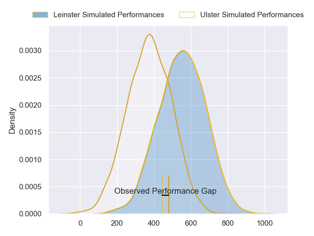
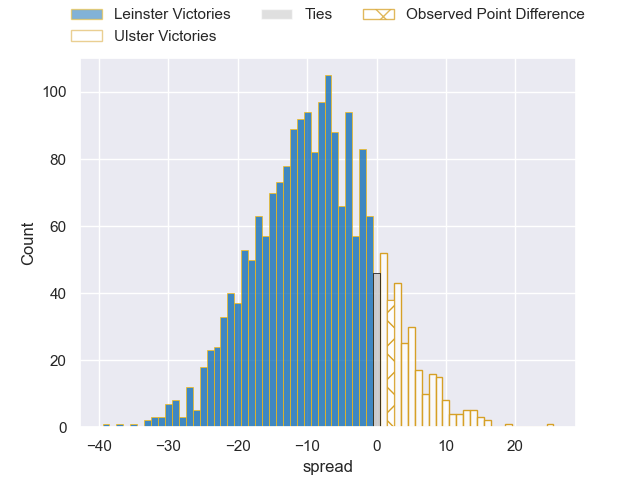
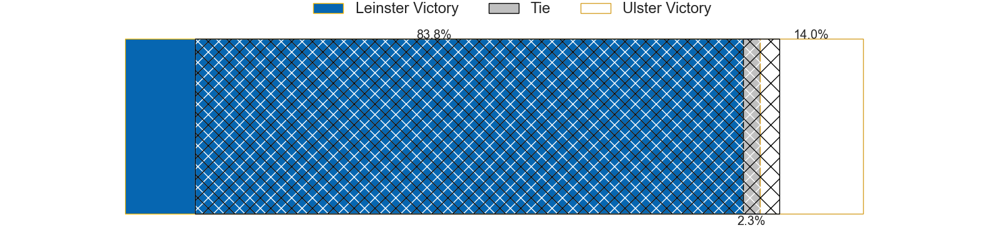

---  
layout: page  
title: Leinster at Ulster; 21-23  
date: 2024-05-18 18:00:00 -0500  
categories: "United Rugby Championship 2023" match review  
---
# Leinster at Ulster; 21-23

# Club Level Predictions

The first set of predictions treats a club as the smallest object, as the club develops its members, organizes a gameplan, and deploys its players as needed for each match. This club model has a prediction of 0.376, which translates to predicting Leinster to win by 4.5.

Our Over/Under is 43.5 - and combined with the spread above, we have a predicted scoreline of 24 to 19

Each club has a rating and a rating deviation (similar to a Glicko rating), and expected performances can be generated. This allows for simulated matches and spreads like the ones below.
## Projected Performances - Club Model

## Projected Spreads - Club Model

## Projected Results - Club Model

# Player Level Predictions

Treating teams instead as an entity made up of the currently active players, I have ratings for each player in an altogether different system. These can be combined to form team ratings once teamsheets are announced, weighting starters a bit higher than the reserves. After the match is played, players can be weighted by their minutes on the field, allowing for an accurate measure of the team's composition. With these compiled team ratings, we can make predictions, measure inaccuracy, and update the individual player ratings.
## Prediction without Player Minutes: Leinster by 6.5

Leinster by 13.2 on a neutral pitch

## Projected Performances - Player Model

## Projected Spreads - Player Model

## Projected Results - Player Model

|   Away Minutes | Away Player        |   Away Percentile |   Number |   Home Percentile | Home Player        |   Home Minutes |
|---------------:|:-------------------|------------------:|---------:|------------------:|:-------------------|---------------:|
|             61 | Cian Healy         |             92.99 |        1 |             86.55 | Eric O'Sullivan    |             55 |
|             61 | Ronan Kelleher     |             93.28 |        2 |             94.75 | Rob Herring        |             49 |
|             61 | Michael Ala'alatoa |             94.46 |        3 |             73.59 | Tom O'Toole        |             65 |
|             55 | Brian Deeny        |             43.26 |        4 |             71.12 | Kieran Treadwell   |             69 |
|             80 | James Ryan         |             95.64 |        5 |             81.56 | Alan O'Connor      |             80 |
|             80 | Max Deegan         |             91.04 |        6 |             64.57 | Cormac Izuchukwu   |             62 |
|             66 | Will Connors       |             83.56 |        7 |             80.51 | David McCann       |             80 |
|             80 | Jack Conan         |             98.54 |        8 |             88.08 | Nick Timoney       |             80 |
|             80 | Cormac Foley       |             45.2  |        9 |             93.37 | John Cooney        |             80 |
|             74 | Harry Byrne        |             87.05 |       10 |             62.85 | Billy Burns        |             74 |
|             80 | Rob Russell        |             65.29 |       11 |             57.79 | Jacob Stockdale    |             80 |
|             26 | Charlie Ngatai     |             88.35 |       12 |             83.84 | Stuart McCloskey   |             74 |
|             80 | Jimmy O'Brien      |             90.35 |       13 |             89.72 | Will Addison       |             80 |
|             37 | Tommy O'Brien      |             50.29 |       14 |             62.12 | Mike Lowry         |             80 |
|             80 | Hugo Keenan        |             99.36 |       15 |             80.98 | Ethan McIlroy      |             55 |
|             19 | John McKee         |             68.69 |       16 |              3.93 | Tom Stewart        |             31 |
|             19 | Michael Milne      |             68.79 |       17 |             10.76 | Andrew Warwick     |             25 |
|             19 | Thomas Clarkson    |             81.09 |       18 |             70.9  | Scott Wilson       |             15 |
|             25 | Ross Molony        |             94.73 |       19 |             87.44 | Harry Sheridan     |             11 |
|             14 | Scott Penny        |             82.68 |       20 |             68.31 | Matty Rea          |             18 |
|             43 | Luke McGrath       |             98.78 |       21 |             23.73 | Nathan Doak        |              6 |
|              6 | Sam Prendergast    |             32.91 |       22 |             87.39 | Stewart Moore      |             25 |
|             54 | Ben Brownlee       |             26.02 |       23 |             59.29 | Jude Postlethwaite |              6 |

