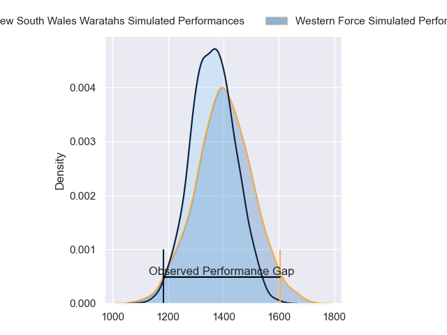
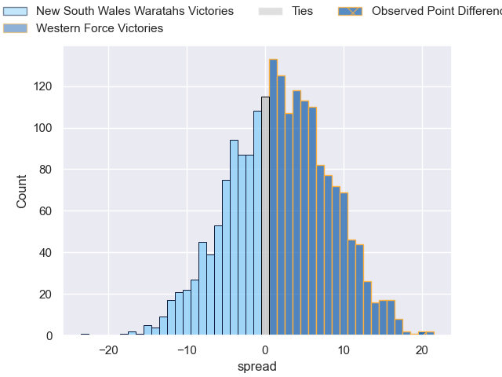
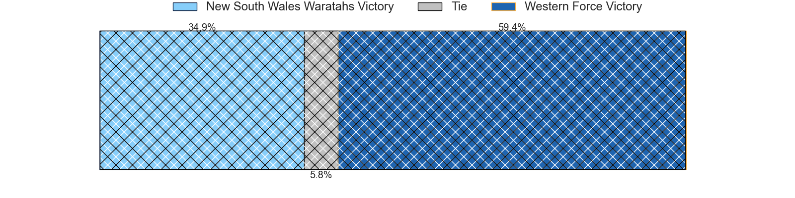
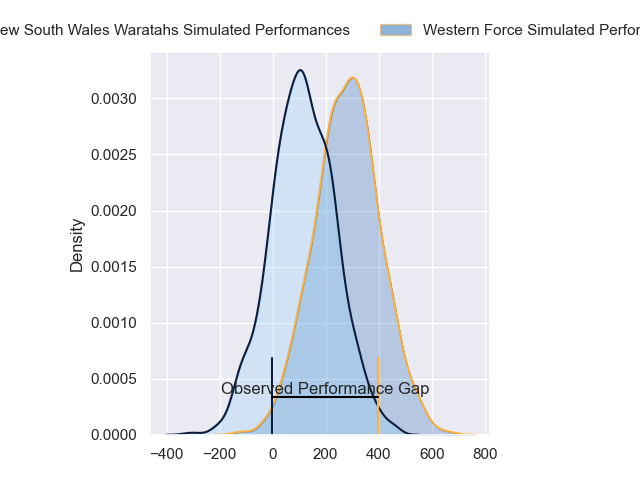
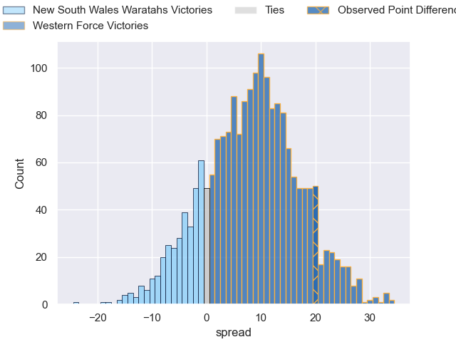
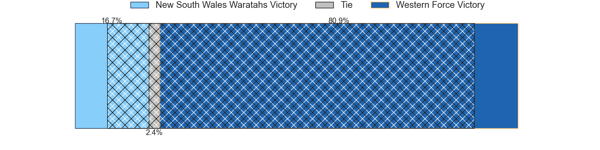

---  
layout: page  
title: New South Wales Waratahs at Western Force; 7-27  
date: 2024-05-18 18:00:00 -0500  
categories: "Super Rugby Pacific 2024" match review  
---
# New South Wales Waratahs at Western Force; 7-27

# Club Level Predictions

The first set of predictions treats a club as the smallest object, as the club develops its members, organizes a gameplan, and deploys its players as needed for each match. This club model has a prediction of 0.557, which translates to predicting Western Force to win by 2.1.

Our Over/Under is 45.5 - and combined with the spread above, we have a predicted scoreline of 22 to 24

Each club has a rating and a rating deviation (similar to a Glicko rating), and expected performances can be generated. This allows for simulated matches and spreads like the ones below.
## Projected Performances - Club Model

## Projected Spreads - Club Model

## Projected Results - Club Model

# Player Level Predictions

Treating teams instead as an entity made up of the currently active players, I have ratings for each player in an altogether different system. These can be combined to form team ratings once teamsheets are announced, weighting starters a bit higher than the reserves. After the match is played, players can be weighted by their minutes on the field, allowing for an accurate measure of the team's composition. With these compiled team ratings, we can make predictions, measure inaccuracy, and update the individual player ratings.
## Prediction without Player Minutes: Western Force by 10.3

Western Force by 6.3 on a neutral pitch

## Projected Performances - Player Model

## Projected Spreads - Player Model

## Projected Results - Player Model

|   Away Minutes | Away Player         |   Away Percentile |   Number |   Home Percentile | Home Player           |   Home Minutes |
|---------------:|:--------------------|------------------:|---------:|------------------:|:----------------------|---------------:|
|             51 | Lewis Ponini        |             30.97 |        1 |             51.92 | Harry Hoopert         |             45 |
|             65 | Jay Fonokalafi      |             45.74 |        2 |             70.66 | Tom Horton            |             70 |
|             76 | Enrique Pieretto    |             35.7  |        3 |             14.51 | Santiago Medrano      |             55 |
|             58 | Fergus Lee-Warner   |             17.43 |        4 |             30.6  | Jeremy Williams       |             80 |
|             37 | Miles Amatosero     |              3.34 |        5 |             90.68 | Izack Rodda           |             73 |
|             80 | Lachlan Swinton     |             10.63 |        6 |             78.54 | Will Harris           |             50 |
|             65 | Charlie Gamble      |             66.24 |        7 |             21.06 | Carlo Tizzano         |             80 |
|             80 | Jed Holloway        |             19.04 |        8 |             89.54 | Reed Prinsep          |             80 |
|             65 | Jake Gordon         |             84.99 |        9 |             99.65 | Nic White             |             70 |
|             50 | Will Harrison       |              3.18 |       10 |             62.63 | Ben Donaldson         |             80 |
|             80 | Dylan Pietsch       |             77.12 |       11 |             83.08 | Chase Tiatia          |             55 |
|             50 | Lalakai Foketi      |             71.25 |       12 |             87.09 | Hamish Stewart        |             80 |
|             80 | Joey Walton         |             79.12 |       13 |              9.34 | Bayley Kuenzle        |             80 |
|             80 | Triston Reilly      |             50.38 |       14 |             69.52 | George Poolman        |             80 |
|             80 | Mark Nawaqanitawase |             17.95 |       15 |             96.58 | Kurtley Beale         |             80 |
|             15 | Ben Sugars          |            nan    |       16 |             22.62 | Feleti Kaitu'u        |             10 |
|             29 | George Thornton     |            nan    |       17 |             40.26 | Marley Pearce         |             35 |
|             15 | Bradley Amituanai   |            nan    |       18 |            nan    | Tiaan Tauakipulu      |             25 |
|             26 | Hugh Sinclair       |             11.65 |       19 |             17.22 | Lopeti Faifua         |              7 |
|             43 | Langi Gleeson       |             64.02 |       20 |              1.57 | Michael Wells         |             30 |
|             15 | Jack Grant          |            nan    |       21 |             34.9  | Issak Fines-Leleiwasa |             10 |
|             30 | Tane Edmed          |             31    |       22 |             23.4  | Sam Spink             |             25 |
|             30 | Izaia Perese        |             31.69 |       23 |            nan    | Henry O'Donnell       |              0 |

