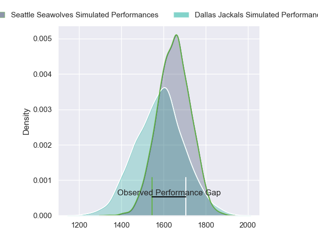
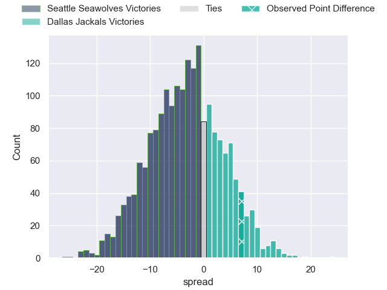
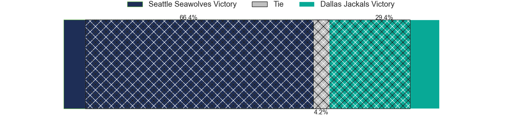
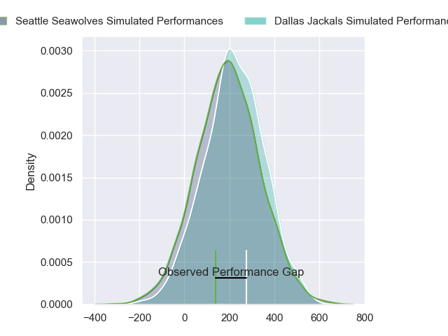
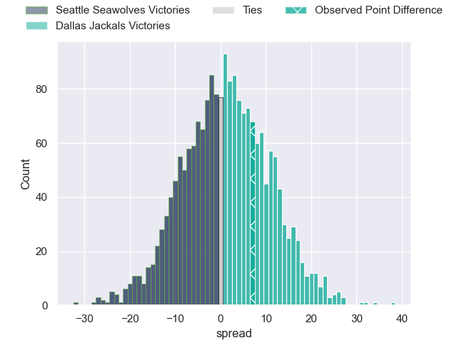

---  
layout: page  
title: Seattle Seawolves at Dallas Jackals; 7-14  
date: 2024-05-19 18:00:00 -0500  
categories: "Major League Rugby 2024" match review  
---
# Seattle Seawolves at Dallas Jackals; 7-14

# Club Level Predictions

The first set of predictions treats a club as the smallest object, as the club develops its members, organizes a gameplan, and deploys its players as needed for each match. This club model has a prediction of 0.413, which translates to predicting Seattle Seawolves to win by 3.1.

Our Over/Under is 48.5 - and combined with the spread above, we have a predicted scoreline of 26 to 23

Each club has a rating and a rating deviation (similar to a Glicko rating), and expected performances can be generated. This allows for simulated matches and spreads like the ones below.
## Projected Performances - Club Model

## Projected Spreads - Club Model

## Projected Results - Club Model

# Player Level Predictions

Treating teams instead as an entity made up of the currently active players, I have ratings for each player in an altogether different system. These can be combined to form team ratings once teamsheets are announced, weighting starters a bit higher than the reserves. After the match is played, players can be weighted by their minutes on the field, allowing for an accurate measure of the team's composition. With these compiled team ratings, we can make predictions, measure inaccuracy, and update the individual player ratings.
## Prediction without Player Minutes: Dallas Jackals by 1.5

Seattle Seawolves by 0.8 on a neutral pitch

## Projected Performances - Player Model

## Projected Spreads - Player Model

## Projected Results - Player Model

|   Away Minutes | Away Player       |   Away Percentile |   Number |   Home Percentile | Home Player         |   Home Minutes |
|---------------:|:------------------|------------------:|---------:|------------------:|:--------------------|---------------:|
|             80 | Cameron Orr       |             38.79 |        1 |             68.7  | Joaquín Horcada     |             80 |
|             80 | Dewald Donald     |             61.8  |        2 |             51.97 | Dewald Kotze        |             80 |
|             80 |                   |             37.73 |        3 |             57.78 | Kyle Steeves        |             80 |
|             80 | Rhyno Herbst      |             57.14 |        4 |             38.5  | Daemon Torres       |             80 |
|             80 | Jean Droste       |             55.62 |        5 |             61.5  | Lucas Bur           |             80 |
|             80 | Reid Davis        |             33.76 |        6 |             52.95 | Jero Gomez Vara     |             80 |
|             80 | Huw Taylor        |             36.71 |        7 |             50.89 | Makeen Alikhan      |             80 |
|             80 | Riekert Hattingh  |             52.72 |        8 |             56.69 | Ronan Foley         |             80 |
|             80 | Jp Smith          |             56.2  |        9 |             46.07 | Pit Imhoff          |             80 |
|             80 | Mack Mason        |             52.87 |       10 |             50.96 | Martin Elias        |             80 |
|             80 | Toni Pulu         |             54.9  |       11 |             60.1  | Nic Benn            |             80 |
|             80 | Dan Kriel         |             49.63 |       12 |             38.61 | Tomás Cubilla       |             80 |
|             80 | Tavite Lopeti     |             91.19 |       13 |             61.07 | Mitchell Richardson |             80 |
|             80 | Conner Mooneyham  |             60.38 |       14 |             55    | Tomy Malanos        |             80 |
|             80 | Divan Rossouw     |             29.49 |       15 |             47.86 | Nazareno Valentini  |             80 |
|              0 | Daquan Perry      |             51.8  |       16 |            nan    | Connor Grindal      |              0 |
|              0 | Chance Wenglewski |            nan    |       17 |            nan    | Tomás Bekerman      |              0 |
|              0 | Oli Kilifi        |             45.72 |       18 |              0.08 | Liam Murray         |              0 |
|              0 | Taylor Krumrei    |             50.86 |       19 |            nan    | Kyle Breytenbach    |              0 |
|              0 | Pago Haini        |            nan    |       20 |            nan    | Marques Fuala'Au    |              0 |
|              0 | Ryan Rees         |             49.74 |       21 |            nan    | Brock Gallagher     |              0 |
|              0 | Sam Windsor       |             47.13 |       22 |            nan    | Manuel Covella      |              0 |
|              0 | Jade Stighling    |             47.5  |       23 |            nan    | Jarek Szopinski     |              0 |

