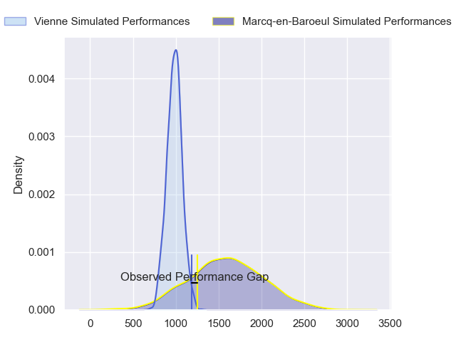
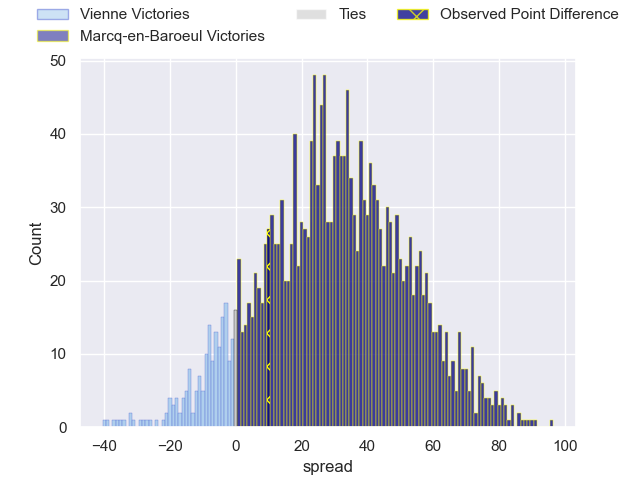
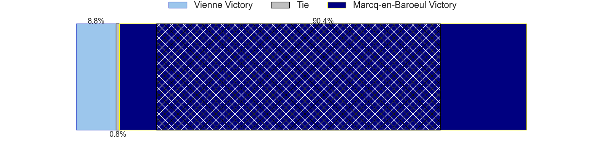
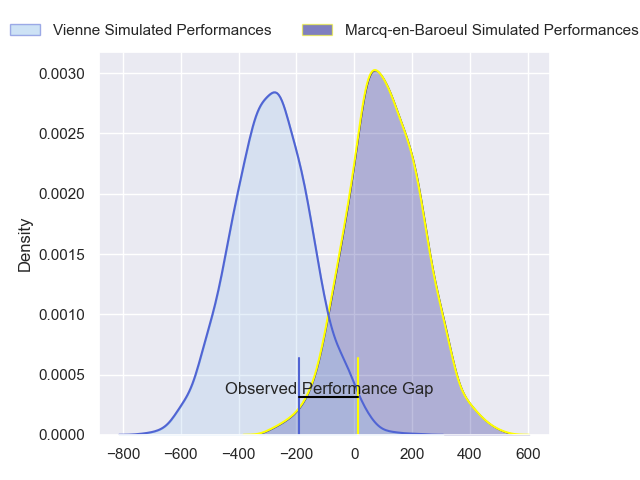
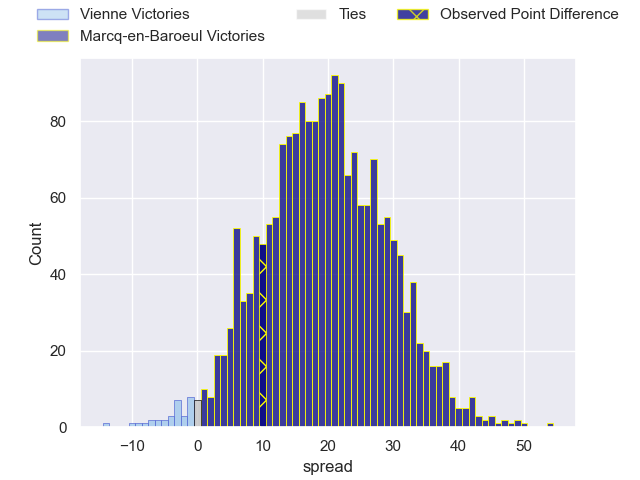
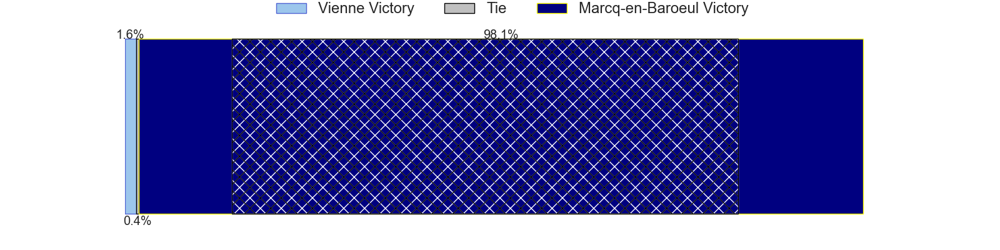

---  
layout: page  
title: Vienne at Marcq-en-Baroeul; 24-34  
date: 2024-05-19 18:00:00 -0500  
categories: "Nationale 2023" match review  
---
# Vienne at Marcq-en-Baroeul; 24-34

# Club Level Predictions

The first set of predictions treats a club as the smallest object, as the club develops its members, organizes a gameplan, and deploys its players as needed for each match. This club model has a prediction of 0.967, which translates to predicting Marcq-en-Baroeul to win by 30.4.

Our Over/Under is 46.5 - and combined with the spread above, we have a predicted scoreline of 8 to 38

Each club has a rating and a rating deviation (similar to a Glicko rating), and expected performances can be generated. This allows for simulated matches and spreads like the ones below.
## Projected Performances - Club Model

## Projected Spreads - Club Model

## Projected Results - Club Model

# Player Level Predictions

Treating teams instead as an entity made up of the currently active players, I have ratings for each player in an altogether different system. These can be combined to form team ratings once teamsheets are announced, weighting starters a bit higher than the reserves. After the match is played, players can be weighted by their minutes on the field, allowing for an accurate measure of the team's composition. With these compiled team ratings, we can make predictions, measure inaccuracy, and update the individual player ratings.
## Prediction without Player Minutes: Marcq-en-Baroeul by 20.0

Marcq-en-Baroeul by 17.9 on a neutral pitch

## Projected Performances - Player Model

## Projected Spreads - Player Model

## Projected Results - Player Model

|   Away Minutes | Away Player      |   Away Percentile |   Number |   Home Percentile | Home Player                  |   Home Minutes |
|---------------:|:-----------------|------------------:|---------:|------------------:|:-----------------------------|---------------:|
|             80 | Benjamin Robin   |              8.07 |        1 |             38.3  | Charles-Édouard Ekwah Elimby |             80 |
|             80 | Dimitri Gibierge |              7.38 |        2 |             27.21 | Joseph Reynaud               |             80 |
|             80 | Guram Kavtidze   |              8.72 |        3 |             26.16 | Victor-Fy Balas Burel        |             80 |
|             80 | Pierre Chapelle  |              2.94 |        4 |             40.17 | Antoine Delaporte            |             80 |
|             80 | Ciaran O'Flynn   |              3.24 |        5 |             40.17 | Antoine Lefebvre             |             80 |
|             80 | Léon Peyrat      |              5.91 |        6 |             36.27 | Thomas Simonet               |             80 |
|             80 | Charles Massot   |              7.28 |        7 |             36.27 | Arthur Bruges                |             80 |
|             80 | Théo Minodier    |             21.76 |        8 |             37.03 | Aurélien Carvalho            |             80 |
|             80 | Malory Piet      |              1.57 |        9 |             50.44 | Geoffrey Cazanave            |             80 |
|             80 | Charles Hager    |             18.47 |       10 |             30.15 | Paul Decavel                 |             80 |
|             80 | Antoine Grange   |             17.21 |       11 |             39.23 | Hugues Crespo                |             80 |
|             80 | Matthias Giovale |              1.78 |       12 |             37.36 | Louis Decavel                |             80 |
|             80 | Pierre Mollard   |              1.15 |       13 |              5.77 | Hugo Detre                   |             80 |
|             80 | Théo Brunel      |             20.77 |       14 |              5.38 | Dany Antunes                 |             80 |
|             80 | Brandon Bellavia |              0.64 |       15 |             34.62 | Patrick Fleming Dewhirst     |             80 |

