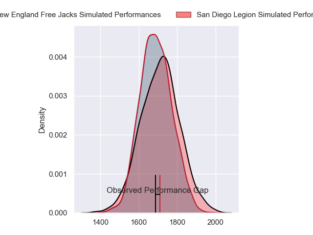
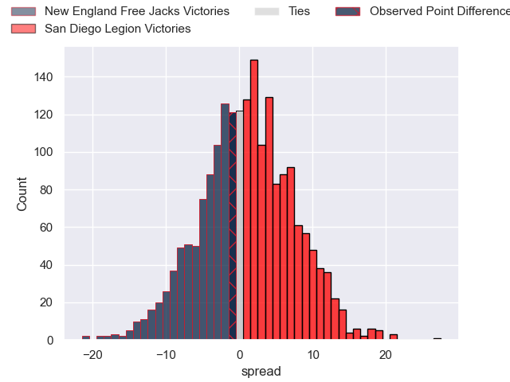
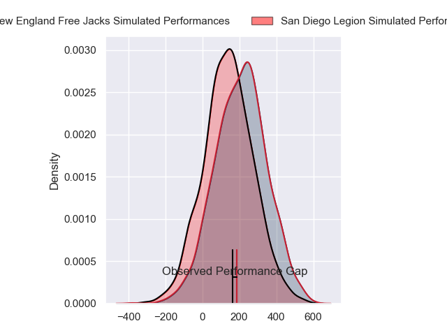
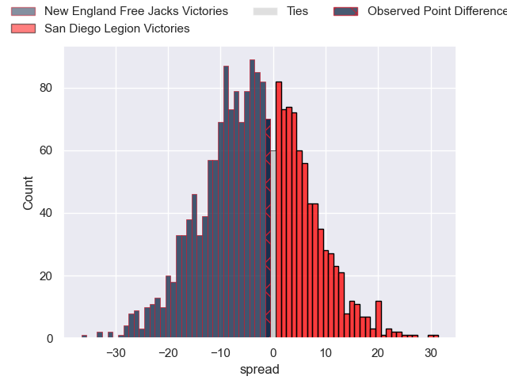

---  
layout: page  
title: New England Free Jacks at San Diego Legion; 24-23  
date: 2024-05-19 18:00:00 -0500  
categories: "Major League Rugby 2024" match review  
---
# New England Free Jacks at San Diego Legion; 24-23

# Club Level Predictions

The first set of predictions treats a club as the smallest object, as the club develops its members, organizes a gameplan, and deploys its players as needed for each match. This club model has a prediction of 0.532, which translates to predicting San Diego Legion to win by 1.2.

Our Over/Under is 44.5 - and combined with the spread above, we have a predicted scoreline of 22 to 23

Each club has a rating and a rating deviation (similar to a Glicko rating), and expected performances can be generated. This allows for simulated matches and spreads like the ones below.
## Projected Performances - Club Model

## Projected Spreads - Club Model

## Projected Results - Club Model

# Player Level Predictions

Treating teams instead as an entity made up of the currently active players, I have ratings for each player in an altogether different system. These can be combined to form team ratings once teamsheets are announced, weighting starters a bit higher than the reserves. After the match is played, players can be weighted by their minutes on the field, allowing for an accurate measure of the team's composition. With these compiled team ratings, we can make predictions, measure inaccuracy, and update the individual player ratings.
## Prediction without Player Minutes: New England Free Jacks by 3.5

New England Free Jacks by 6.2 on a neutral pitch

## Projected Performances - Player Model

## Projected Spreads - Player Model

## Projected Results - Player Model

|   Away Minutes | Away Player             |   Away Percentile |   Number |   Home Percentile | Home Player          |   Home Minutes |
|---------------:|:------------------------|------------------:|---------:|------------------:|:---------------------|---------------:|
|             80 | Kyle Ciquera            |             40.86 |        1 |             49.1  | Payton Telea-Ilalio  |             80 |
|             80 | Sean Ralph              |             57.38 |        2 |             60.82 | Hugh Roach           |             80 |
|             80 | John-Roy Jenkinson      |             53.83 |        3 |             52.28 | Darcy Breen          |             80 |
|             80 | Josh Larsen             |             63.49 |        4 |             51.62 | Jay Tuivaiti         |             80 |
|             80 | Conor Keys              |             86.11 |        5 |              9.03 | Greg Peterson        |             80 |
|             80 | Piers Von Dadelszen     |             54.33 |        6 |             46.26 | Christian Poidevin   |             80 |
|             80 | Seta Baker              |             62.7  |        7 |             56.79 | Blair Cowan          |             80 |
|             80 | Cam Davidowicz          |             44.14 |        8 |             51.88 | Tupou Ma'Afu-Afungia |             80 |
|             80 | Cameron Nordli-Kelemeti |             69.63 |        9 |             56.72 | Connor Tupai         |             80 |
|             80 | Danyon Morgan-Puterangi |             59.24 |       10 |             46.07 | Matt Giteau          |             80 |
|             80 | Paula Balekana          |             55.38 |       11 |             66.54 | Ryan James           |             80 |
|             80 | Wayne Van Der Bank      |             55.56 |       12 |             56.29 | Ma'A Nonu            |             80 |
|             80 | Ben LeSage              |             65.2  |       13 |             50.94 | Marcel Brache        |             80 |
|             80 | Zach Bastres            |             53.75 |       14 |             55.67 | Tomas Aoake          |             80 |
|             80 | Mitch Wilson            |             63.03 |       15 |             51.71 | Alex Horan           |             80 |
|              0 | Mason Koch              |            nan    |       16 |             43.93 | Cyrille Cama         |              0 |
|              0 | Foster Dewitt           |            nan    |       17 |             42.17 | Djustice Sears-Duru  |              0 |
|              0 | Kaleb Geiger            |             69.09 |       18 |             47.55 | Luke Green           |              0 |
|              0 | Kyle Baillie            |             60.14 |       19 |             61.71 | Vili Helu            |              0 |
|              0 | Ethan Fryer             |            nan    |       20 |             56.07 | Tevita Tameilau      |              0 |
|              0 | Holden Yungert          |            nan    |       21 |            nan    | Nick Boyer           |              0 |
|              0 | Le Roux Malan           |             91.4  |       22 |             58.17 | Lincoln Mcclutchie   |              0 |
|              0 | Isaac Olson             |             40.19 |       23 |             22.22 | Mikey Te'O           |              0 |

