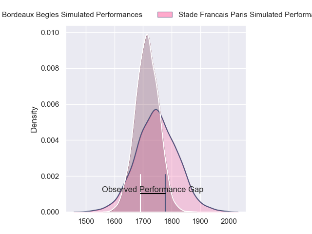
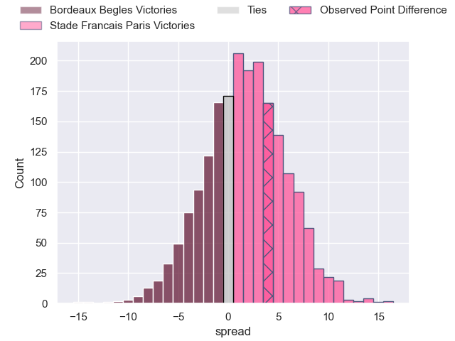
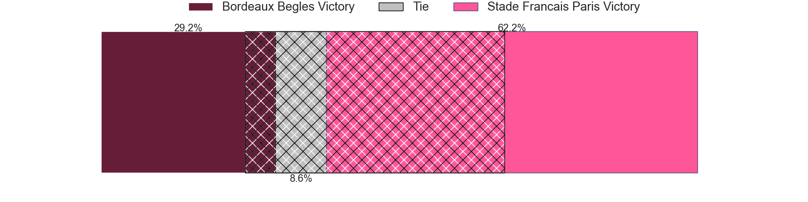
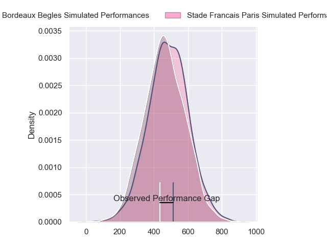
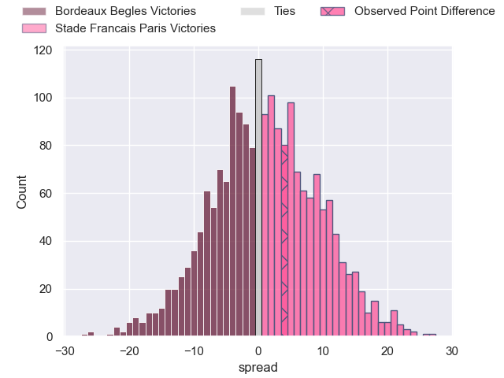

---  
layout: page  
title: Bordeaux Begles at Stade Francais Paris; 18-22  
date: 2024-05-19 18:00:00 -0500  
categories: "Top 14 Orange 2023" match review  
---
# Bordeaux Begles at Stade Francais Paris; 18-22

# Club Level Predictions

The first set of predictions treats a club as the smallest object, as the club develops its members, organizes a gameplan, and deploys its players as needed for each match. This club model has a prediction of 0.552, which translates to predicting Stade Francais Paris to win by 1.8.

Our Over/Under is 49.5 - and combined with the spread above, we have a predicted scoreline of 24 to 26

Each club has a rating and a rating deviation (similar to a Glicko rating), and expected performances can be generated. This allows for simulated matches and spreads like the ones below.
## Projected Performances - Club Model

## Projected Spreads - Club Model

## Projected Results - Club Model

# Player Level Predictions

Treating teams instead as an entity made up of the currently active players, I have ratings for each player in an altogether different system. These can be combined to form team ratings once teamsheets are announced, weighting starters a bit higher than the reserves. After the match is played, players can be weighted by their minutes on the field, allowing for an accurate measure of the team's composition. With these compiled team ratings, we can make predictions, measure inaccuracy, and update the individual player ratings.
## Prediction without Player Minutes: Stade Francais Paris by 4.1

Bordeaux Begles by 4.1 on a neutral pitch

## Projected Performances - Player Model

## Projected Spreads - Player Model

## Projected Results - Player Model

|   Away Minutes | Away Player               |   Away Percentile |   Number |   Home Percentile | Home Player             |   Home Minutes |
|---------------:|:--------------------------|------------------:|---------:|------------------:|:------------------------|---------------:|
|             61 | Ugo Boniface              |             92.01 |        1 |             74.06 | Moses Alo-Emile         |             51 |
|             51 | Romain Latterrade         |             13.77 |        2 |             95.25 | Mickael Ivaldi          |             51 |
|             57 | Ben Tameifuna             |             97.88 |        3 |             91.27 | Paul Alo-Emile          |             67 |
|             51 | Kane Douglas              |             77.48 |        4 |             41.08 | Paul Gabrillagues       |             80 |
|             80 | Cyril Cazeaux             |             93.1  |        5 |             80.83 | Baptiste Pesenti        |             80 |
|             80 | Bastien Vergnes Taillefer |             80.91 |        6 |              3.25 | Mathieu Hirigoyen       |             80 |
|             51 | Mahamadou Diaby           |             82.28 |        7 |             96.56 | Sekou Macalou           |             70 |
|             60 | Tevita Tatafu             |             87.45 |        8 |             88.28 | Giovanni Habel-Kueffner |             80 |
|             76 | Maxime Lucu               |             99.3  |        9 |             98.95 | Rory Kockott            |             69 |
|             80 | Matthieu Jalibert         |             97.24 |       10 |             79.83 | Joris Segonds           |             80 |
|             80 | Madosh Tambwe             |             93.27 |       11 |             88.08 | Lester Etien            |             60 |
|             57 | Ben Tapuai                |             57.44 |       12 |             84.91 | Jeremy Ward             |             74 |
|             80 | Yoram Moefana             |             83.44 |       13 |             87.42 | Joe Marchant            |             80 |
|             80 | Damian Penaud             |             96.92 |       14 |             62.02 | Kylan Hamdaoui          |             77 |
|             80 | Louis Bielle-Biarrey      |             80.13 |       15 |             69.02 | Leo Barre               |             80 |
|             29 | Maxime Lamothe            |             69.18 |       16 |             19.34 | Lucas Peyresblanques    |             29 |
|             19 | Toma'akino Taufa          |             40.7  |       17 |             22.43 | Sergo Abramishvili      |             29 |
|             29 | Alexandre Ricard          |             58.72 |       18 |             87.93 | JJ van der Mescht       |              0 |
|             29 | Pierre Bochaton           |             86.81 |       19 |              7.19 | Ryan Chapuis            |             10 |
|             20 | Pete Samu                 |             91.83 |       20 |             97.03 | Brad Weber              |             11 |
|              4 | Paul Abadie               |              2.27 |       21 |             51.47 | Pierre Boudehent        |              6 |
|             23 | Pablo Uberti              |             10.29 |       22 |             51.35 | Peniasi Dakuwaqa        |             23 |
|             23 | Carlu Sadie               |             38.17 |       23 |             92.41 | Giorgi Melikidze        |             13 |

