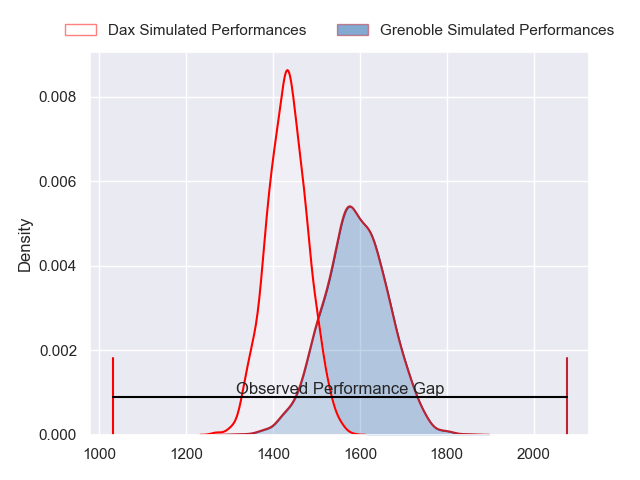
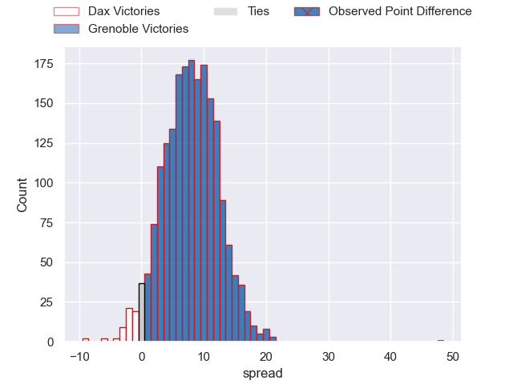
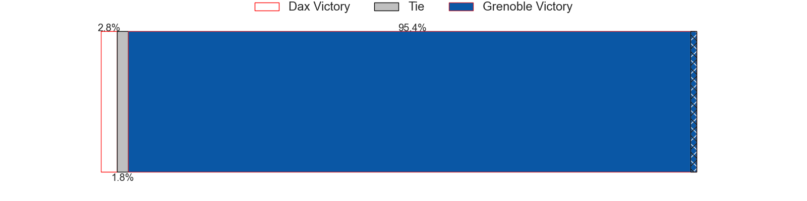
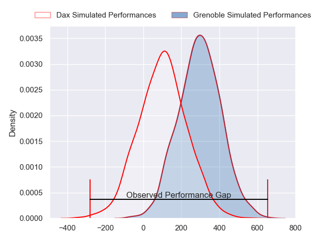
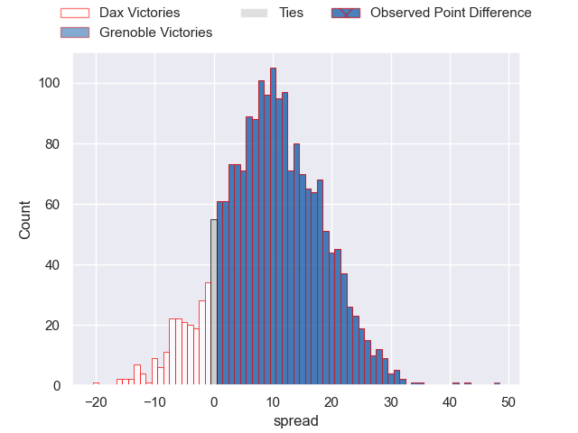
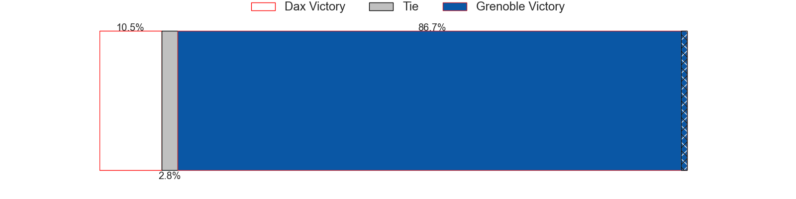

---  
layout: page  
title: Dax at Grenoble; 10-58  
date: 2024-05-23 18:00:00 -0500  
categories: "Pro D2 2023" match review  
---
# Dax at Grenoble; 10-58

# Club Level Predictions

The first set of predictions treats a club as the smallest object, as the club develops its members, organizes a gameplan, and deploys its players as needed for each match. This club model has a prediction of 0.711, which translates to predicting Grenoble to win by 7.9.

Our Over/Under is 39.5 - and combined with the spread above, we have a predicted scoreline of 16 to 24

Each club has a rating and a rating deviation (similar to a Glicko rating), and expected performances can be generated. This allows for simulated matches and spreads like the ones below.
## Projected Performances - Club Model

## Projected Spreads - Club Model

## Projected Results - Club Model

# Player Level Predictions

Treating teams instead as an entity made up of the currently active players, I have ratings for each player in an altogether different system. These can be combined to form team ratings once teamsheets are announced, weighting starters a bit higher than the reserves. After the match is played, players can be weighted by their minutes on the field, allowing for an accurate measure of the team's composition. With these compiled team ratings, we can make predictions, measure inaccuracy, and update the individual player ratings.
## Prediction without Player Minutes: Grenoble by 9.6

Grenoble by 1.7 on a neutral pitch

## Projected Performances - Player Model

## Projected Spreads - Player Model

## Projected Results - Player Model

|   Away Minutes | Away Player          |   Away Percentile |   Number |   Home Percentile | Home Player          |   Home Minutes |
|---------------:|:---------------------|------------------:|---------:|------------------:|:---------------------|---------------:|
|             40 | Louis Mary           |             34.29 |        1 |             45.26 | Luka Goginava        |             50 |
|             40 | Maxime Delonca       |             37.4  |        2 |             30.02 | Barnabé Massa        |             53 |
|             40 | Nephi Leatigaga      |             34.29 |        3 |             49.31 | Régis Montagne       |             50 |
|             80 | Brice Ferrer         |             35.95 |        4 |             50.65 | Thomas Lainault      |             70 |
|             40 | Mat Luamanu          |             39.23 |        5 |             81.53 | Giorgi Javakhia      |             66 |
|             80 | Arnaud Aletti        |             24.49 |        6 |             92.35 | Jose Madeira         |             80 |
|             67 | Paul Arnaud Ausset   |             30.98 |        7 |             41.63 | Steeve Blanc-Mappaz  |             69 |
|             80 | Sam Wasley           |             24.43 |        8 |             46.17 | Pio Muarua           |             48 |
|             62 | Sylvère Réteau       |             28.97 |        9 |             46.38 | Eric Escande         |             58 |
|             50 | Hugo Cerisier        |             30.1  |       10 |             48.87 | Sam Davies           |             62 |
|             80 | Jope Naseara (2)     |             27.59 |       11 |             56.7  | Nathan Farissier     |             80 |
|             58 | Ilikena Bolakoro     |             28.05 |       12 |             40.74 | Romain Trouilloud    |             80 |
|             68 | Bastien Daguerre     |             24.77 |       13 |             44.63 | Romain Fusier        |             74 |
|             80 | Maxime Oltmann       |             27.59 |       14 |             42.64 | Geoffrey Cros        |             52 |
|             80 | Théo Duprat          |             21.38 |       15 |             51.99 | Hugo Trouilloud      |             80 |
|             40 | Iban Hiriart-Urruty  |            nan    |       16 |             34.83 | Mathis Sarragallet   |             30 |
|             40 | David Lolohea        |             19.03 |       17 |            nan    | Éli Églaine          |             30 |
|             40 | Joshua Furno         |             38.93 |       18 |             33.96 | Pierce Phillips      |             24 |
|             13 | Ratu Nacika          |            nan    |       19 |             29.4  | Thibaut Martel       |             40 |
|             18 | Simon Garrouteigt    |            nan    |       20 |            nan    | Barnabé Couilloud    |             22 |
|             30 | Romuald Séguy        |            nan    |       21 |             33.4  | Max Clément          |             18 |
|             34 | Benjamin Puntous     |            nan    |       22 |             29.68 | Bautista Ezcurra     |             34 |
|             40 | Diogo Hasse Ferreira |             12.96 |       23 |             30.28 | Irakli Aptsiauri (2) |              0 |

