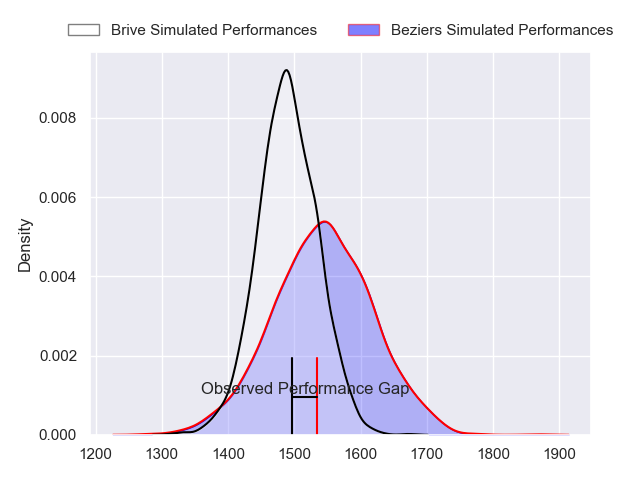
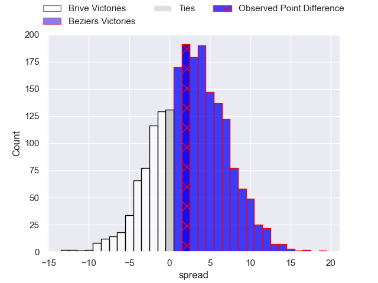
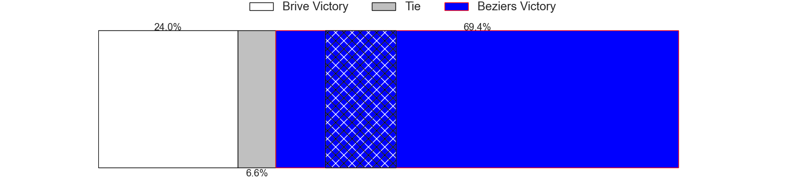
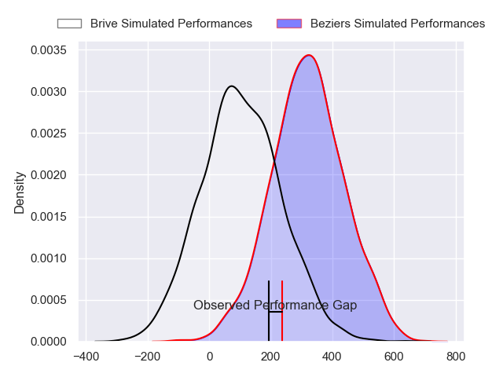
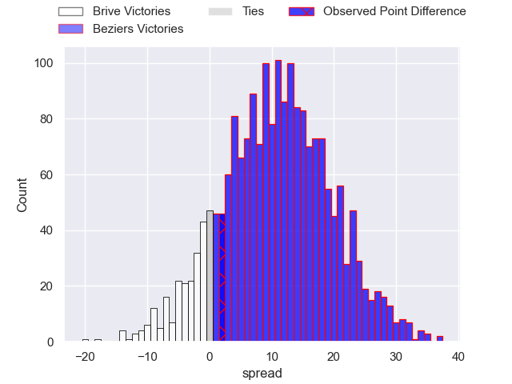
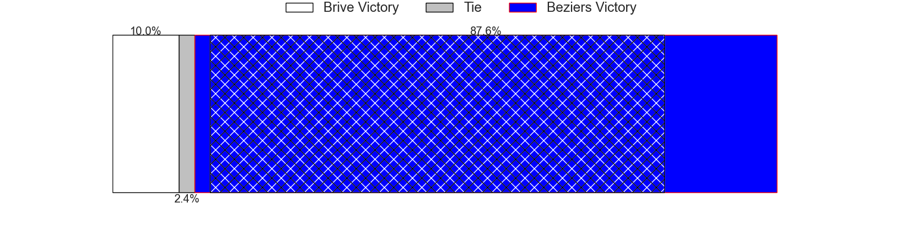

---  
layout: page  
title: Brive at Beziers; 31-33  
date: 2024-05-24 18:00:00 -0500  
categories: "Pro D2 2023" match review  
---
# Brive at Beziers; 31-33

# Club Level Predictions

The first set of predictions treats a club as the smallest object, as the club develops its members, organizes a gameplan, and deploys its players as needed for each match. This club model has a prediction of 0.58, which translates to predicting Beziers to win by 2.8.

Our Over/Under is 43.5 - and combined with the spread above, we have a predicted scoreline of 20 to 23

Each club has a rating and a rating deviation (similar to a Glicko rating), and expected performances can be generated. This allows for simulated matches and spreads like the ones below.
## Projected Performances - Club Model

## Projected Spreads - Club Model

## Projected Results - Club Model

# Player Level Predictions

Treating teams instead as an entity made up of the currently active players, I have ratings for each player in an altogether different system. These can be combined to form team ratings once teamsheets are announced, weighting starters a bit higher than the reserves. After the match is played, players can be weighted by their minutes on the field, allowing for an accurate measure of the team's composition. With these compiled team ratings, we can make predictions, measure inaccuracy, and update the individual player ratings.
## Prediction without Player Minutes: Beziers by 10.9

Beziers by 2.4 on a neutral pitch

## Projected Performances - Player Model

## Projected Spreads - Player Model

## Projected Results - Player Model

|   Away Minutes | Away Player               |   Away Percentile |   Number |   Home Percentile | Home Player         |   Home Minutes |
|---------------:|:--------------------------|------------------:|---------:|------------------:|:--------------------|---------------:|
|             46 | Daniel Brennan            |             58.3  |        1 |             10.2  | Francisco Fernandes |             51 |
|             51 | Lucas Da Silva            |             62.6  |        2 |             36.12 | Wilmar Arnoldi      |             58 |
|             43 | Marcel Van Der Merwe      |             57.81 |        3 |             51.42 | Jon Zabala          |             80 |
|             65 | Renger Van Eerten         |             65.44 |        4 |             35.75 | Hans N'Kinsi        |             80 |
|             51 | Tevita Ratuva             |             61.27 |        5 |             37.74 | John Madigan        |             58 |
|             80 | Retief Marais             |             63.6  |        6 |             23.81 | William Van Bost    |             66 |
|             59 | Ross Moriarty             |             59.83 |        7 |             27.49 | Clément Ancely      |             80 |
|             72 | Taniela Sadrugu           |             52.59 |        8 |             31.68 | Otunuku Pauta       |             80 |
|             80 | Léo Carbonneau            |             48.62 |        9 |             87.59 | Samuel Marques      |             80 |
|             80 | Tom Raffy                 |             50.93 |       10 |             33.2  | Charly Malié        |             80 |
|             80 | Arthur Bonneval           |             65.05 |       11 |             27.83 | Nicolas Plazy       |             80 |
|             65 | Sam Johnson               |             57.83 |       12 |             39    | Watisoni Votu       |              7 |
|             80 | Georges Shvelidze         |             59.47 |       13 |             88.33 | Tim Nanai-Williams  |             80 |
|             80 | Asaeli Tuivuaka           |             55.56 |       14 |             31.34 | Pierre Courtaud     |             40 |
|             80 | Nic Krone (2)             |             59.54 |       15 |             28.72 | Gabin Lorre         |             80 |
|             29 | Benjamin Boudou           |            nan    |       16 |             33.55 | Yanis Boulassel     |             22 |
|             34 | Nathan Fraissenon         |            nan    |       17 |             38.26 | Youssef Amrouni     |             29 |
|             15 | Julien Delannoy           |            nan    |       18 |             38.83 | Pierre Gayraud      |             22 |
|             29 | Asier Usarraga            |            nan    |       19 |             36.25 | Gillian Benoy       |              3 |
|             29 | Matthieu Voisin           |            nan    |       20 |             34.83 | Mitch Short         |              0 |
|              0 | Julien Blanc              |            nan    |       21 |             33.81 | Victor Dreuille     |             40 |
|             15 | Guillaume Galletier       |            nan    |       22 |            nan    | Taleta Tupuola      |             73 |
|             37 | Francisco Coria Marchetti |            nan    |       23 |             38.26 | Luka Tchelidze      |             11 |

